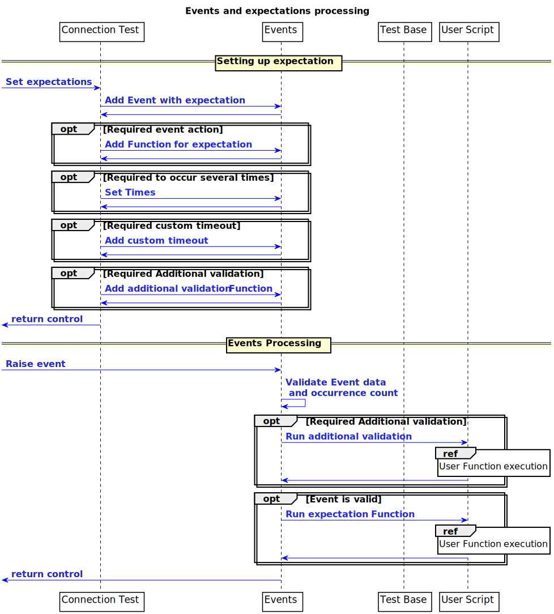

## 4.3. Component Interaction View

### 4.3.1. User Scripts Execution with ATF
**Behavior**:
	*User* starts ***C++ Core*** with a list of command line arguments.
	***C++ Core*** executable launches Lua interpreter, which executes first command line argument as a script with the rest of parameters.
	In case of passing ***Launch*** as a first parameter ***Launch*** parse configurable parameters and consecutively load ***User scripts***.
	After Loading all ***User Scripts** ***C++ Core*** execute Qt Meta-Object System, which starts Timers and Events processing.

|||
### User Scripts Execution with ATF

|||

### 4.3.2. User Script loading
**Behavior**:
	***User Script*** loads ***Connection Test*** as a testing and SDL manipulation API provider.
	***Connection Test*** loads components of *Transport*, *Protocol* and *Business* layers.
	***User Script*** loads *Function* from own source code.
	In case of loading *Function* with a first letter in upper case ***Test Base*** module interpreter it as a *Test* for further consecutive execution. All other ***User Script*** *Functions* are loaded in a common way and used as a support for *Test* functions.

|||
### User Script loading diagram

|||

### 4.3.3. User Function execution
**Behavior**:
	After loading ***User Script*** and ATF modules, ***Test Base*** starts consecutive list of User *Functions* execution.
	Each *Functions* has ability to manipulate SDL, HMI and Mobile connections with ***Connection Test*** API.
	**Note:** Some *Tests* do not require all options due to emulation SDL exception cases.
	For preparing consecutive test scenarios ***User Script***  able to emulate HMI, Mobile RPC and set SDL-result expectations.

|||
### User Function execution diagram

|||

### 4.3.4. Events and expectations processing
**Behavior**:
	Events and expectation processing procedure could be spited up for :
	*Setting up expectation* - ***User Script*** throw the ***Connection Test*** able to add some expectations for event and add timer for the event fail processing.
	*Events processing* - On raising specific event ***Events*** is responsible for calling exception *Function*, on time elapse ***C++ Core*** directly call User or other modules *Function*.

|||
### Events and expectations processing diagram

|||
