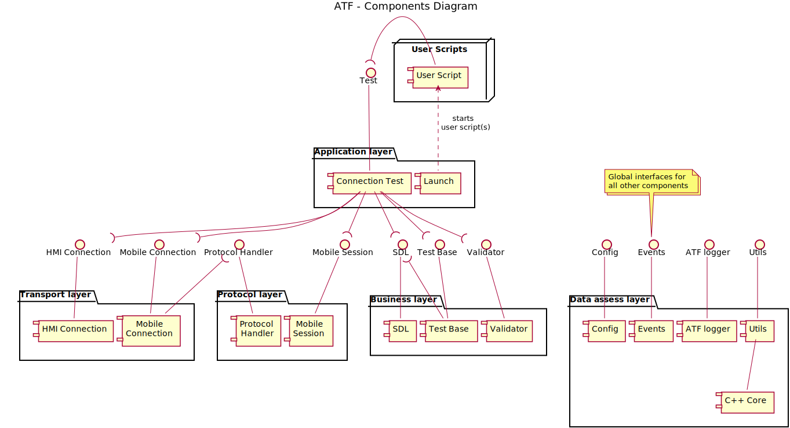

## 4.2. Components View

The view is represented by module and subsystem diagrams that show the system's export and import relationships. The Components View diagram and its elements description please see below.

|||
##### Component View diagram

|||

***Elements description***

#### User Script
  - *Responsibility:*
    - Contains automated test cases written by User
  - *Relations*
    - Composes ***Connection Test***
  - *Interfaces* 
    - Does not provide any external interfaces 
  - *Behavior* 
    - ***User Script*** implements SDL *Tests* by using ATF API.
  - *Constraints*
    - User scripts are not part of ATF delivering.

### Application layer:

#### Launch
  - *Responsibility* 
    - Declare a command line arguments
    - Start ***User Scripts*** list one by one
  - *Relations*
    - Starts ***User Scripts***
  - *Interfaces* 
    - Does not provide any external interfaces 
  - *Behavior* 
    - ***Launch*** declares command line arguments and execute all left parameters as ***User Scripts***
  - *Constraints* 
    - Need to be run by ***C++ Core***
    - *Note:* ATF provides *run_tests.sh* script for automation run ***Launch*** by ***C++ Core***

#### Connection Test
  - *Responsibility* 
    - Provides testing API:
      - Start and Stop SDL
      - Activation and Deactivation HMI
      - Starting mobile connection and session
      - Set up HMI and Mobile RPCs expectations
    - Composes all lower level components
  - *Relations*
    - Used by ***User Script*** for SDL manipulation
  - *Interfaces* 
    - Provides ***Test*** interface for ***User Script***
  - *Behavior* 
    - ***Connection Test*** works as a Facade for accumulation all ATF Functionality and providing Expectation wrappers for RPCs.
  - *Constraints* 
    - *N/A*

### Data assess layer:

#### Config
  - *Responsibility* 
    Provides configuration for:
      - setting up ATF behavior
      - SDL manipulation parameters
      - Emulating applications parameters
  - *Relations*
    - Used by all components
    - Is filled by ***Utils***
  - *Interfaces* 
    - Provides ***Config*** interface
  - *Behavior*
    - Contains a list of defined parameters for reading and modification.
  - *Constraints*
    - *N/A*

#### Events
  - *Responsibility* 
    - Global events and expectations subscription with a timeout
    - Global event notification
  - *Relations*
    - Used by all components.
  - *Interfaces* 
    - Provides ***Events*** interface
  - *Behavior*
    - Provides centralized mechanism for components synchronization and expectation subscription
  - *Constraints*
    - *N/A*

#### ATF logger
  - *Responsibility* 
    - Logging ATF internal information
    - Providing XML reports of ATF scripts execution results
  - *Relations*
    - Used by all components.
  - *Interfaces* 
    - Provides ***ATF logger*** interface
  - *Behavior*
    - ***ATF logger*** provides API for logging all internal information for further SDL issues analysis
  - *Constraints*
    - *N/A*

#### Utils
  - *Responsibility* 
    - Support methods implementation
    - Encapsulation system API calls.
    - Parsing command line arguments
  - *Relations*
    - Used by all components.
  - *Interfaces* 
    - Provides ***Utils*** interface
  - *Behavior*
    - ***Utils*** is wrapper for ***stdlib*** library and ***C++ Core*** methods
  - *Constraints*
    - *N/A*

#### C++ Core
  - *Responsibility* 
    - Providing additional Utility object, which could not be implemented with Native Lua API or ***stdlib***:
      - timer
      - Qt signal/slot system 
      - XML parsing
      - Web-Sockets
      - Tcp-Sockets
  - *Relations*
    -  Requires Qt Framework for signal/slots system, WebSocket implementation
    -  Require Lua Development Library Kit
  - *Interfaces* 
    - Provides set of Lua interfaces
  - *Behavior*
    - ***C++ Core*** wraps Qt and Posix API for ***Utils***
    - Provides executable for starting Lua scripts with additional Qt meta-system functionality.
    - ***C++ Core*** executable parses  with ***Launch*** as a first argument, all following parameters are passed to the ***Launch***.
  - *Constraints*
    - Require Qt 5.3+ for WebSocket support
    - Require Lua Development kit version 5.2

### Business layer:

#### SDL
  - *Responsibility* 
    - Start and stop SDL executable manipulation
    - SDL executable status monitoring
    - SDL log grab via telnet and save it to corresponding directory. 
  - *Relations*
    - Require ***Data assess layer*** interfaces
  - *Interfaces* 
    - Provides ***SDL*** interface
  - *Behavior*
    - Starts SDL binary and saves process id for further stop and status monitoring.
  - *Constraints*
    - Require POSIX system environment for bash script and calling OS commands like *cat*, *test*, *cat*, *sleep*

#### Test Base
  - *Responsibility* 
    - Test cases consecutive execution
    - Each test case verification check:
      - ***User Script*** expectation
      - SDL executable status monitoring
  - *Relations*
    -  Require ***SDL*** interface
    -  Require ***Events*** interface
  - *Interfaces* 
    - Provides ***Test Base*** interface
  - *Behavior*
    - ***User Script*** test cases are executing one by one with verifying all expectation.
  - *Constraints*
    - *N/A*

#### Validator
  - *Responsibility* 
    - RPCs structure and format validation
  - *Relations*
    - Require ***Data assess layer*** interfaces
  - *Interfaces* 
    - Provides ***Validator*** interface
  - *Behavior*
    - Dynamically loads *HMI_API.xml* and *MOBILE_API.xml* API for further validation income RPCs from SDL.
  - *Constraints*
    - Requires *HMI_API.xml* and *MOBILE_API.xml* files

### Protocol layer:

#### Protocol Handler
  - *Responsibility*
    - Control and business data distributing to appropriate sessions and service
    - Control message processing
    - Multi-frames assembling and disassembling
  - *Relations*
    - Require ***Data assess layer*** interfaces
  - *Interfaces*
    - Provides ***Protocol Handler*** interface
  - *Behavior*
    - Decodes income raw transport data and encodes outcome RPCs according to protocol specification.
  - *Constraints*
    - [SmartDeviceLink Protocol specification](https://github.com/smartdevicelink/protocol_spec/blob/master/README.md)

#### Mobile Session
  - *Responsibility* 
    - Sessions and services manipulation
    - Sending data to mobile services
    - Subscription to income mobile service data
    - Heartbeat functionality
  - *Relations*
    - Require ***Data assess layer*** interfaces
  - *Interfaces* 
    - Provides ***Mobile Session*** interface
  - *Behavior*
    - Accumulates API for session and services managing
  - *Constraints*
    - [SmartDeviceLink Protocol specification](https://github.com/smartdevicelink/protocol_spec/blob/master/README.md)

### Transport layer:

#### HMI connection
  - *Responsibility*
    - Establish HMI connection to SDL
    - Sending HMI-related data
    - Subscription to income HMI data
  - *Relations*
    - Require ***Data assess layer*** interfaces
  - *Interfaces* 
    - Provides ***HMI connection*** interface
  - *Behavior*
    - Wraps WebSocket connection to SDL
  - *Constraints*
    - WebSocket API provided by Qt throw ***Utils**

#### Mobile connection
  - *Responsibility* 
    - Establish Mobile connection to SDL
    - Sending Mobile related data
    - Subscription to income Mobile data
    - Outcome data caching to file before sending to SDL
  - *Relations*
    - Require ***Data assess layer*** interfaces
  - *Interfaces* 
    - Provides ***Mobile connection*** interface
  - *Behavior*
    - Wraps TCP connection to SDL and provides *caching to file* abstraction, which prevent ATF memory overflow
  - *Constraints*
    - TCP API provided by Qt throw ***Utils***
