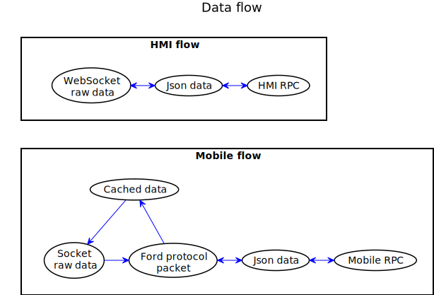

## 4.5. Data View

The Data View shows relations between separated data types and actors that perform information processing in the system. It depicts contents of saved information and also visualizes information sources, processors and destination.

The following Diagram shows relations between separated data types and actors that perform information processing in the SmartDeviceLink.

|||
##### Data flow diagram

|||

***Elements description*** 

#### General note:
All following type are lua tables due to language specifics.
For further information about lua tables type refer to [Lua Tables Tutorial](http://lua-users.org/wiki/TablesTutorial)

#### Socket raw data
  - *Summary:*
    - Binary data stream from Mobile socket connection
  - *Usage:*
    - Income and outcome data for *Transport* layer to OS or 3d-party library

#### WebSocket raw data
  - *Summary:*
    - Binary data stream from HMI WebSocket connection
  - *Usage:*
    - Income and outcome data for *Transport* layer to OS or 3d-party library
 
#### Ford protocol packet
  - *Summary:*
    - Protocol layer primitive with protocol related information
  - *Usage:*
    - Internally by *Protocol* layer for protocol header information prepossessing

#### Cached data
  - *Summary:*
    - Data for sending to Mobile side.
    - Used for avoiding flooding SDL by ATF
  - *Usage:*
    - Internally by *Transport* layer for Mobile-to-SDL messages
 
#### Json data
  - *Summary:*
    - String data of serialized RPC in Json format
  - *Usage:*
    - Internally by *Business* layer as a middle state between hi-level RPC abstractions and transport/protocol layers

#### HMI and Mobile RPC
  - *Summary:*
    - RPCs primitive types with all related fields and parameters 
  - *Usage:*
    - Internally by *Business* layer as for RPCs validation
    - By *User scripts* for request-response logic implementation