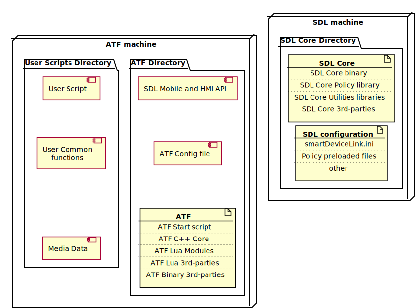

## 4.9. Deployment View

The deployment view takes into account the system's requirements such as system availability, reliability (fault tolerance), performance (throughput), and scalability. This view maps the various elements identified in the logical, process, and development views—networks, processes, tasks, and objects—onto the processing nodes.
The deployment diagram is used for modeling the static deployment view of a system.
The figure below depicts the deployment diagram for SDL system.

|||
##### Deployment View Diagram

|||

!!! MAY
ATF and SDL Core as a separate binaries could be deployed to different machines in case of using cross-machine transports (TCP, WebSockets).
This deployment schema is applicable for testing SDL Core on a real hardware.
!!!
!!! NOTE
In common case ATF and SDL Core could be deployed on the same machine.
!!!

***Elements description***

#### ATF Directory
  - *Short Description:*
    - Contains ATF, ATF configuration files and Mobile and HMI APIs, required for SDL Core validation.
    - Source code is available in <https://github.com/smartdevicelink/sdl_atf>
  - *Relations:*
    - Required for **User Scripts** execution.
  - *Requirements:*
    - System shall be compatible with Lua and Qt versions.

#### User Script Directory
  - *Short Description:*
    - Contains **User Scripts** with Test Cases and **User common functionality** related to a different **User Scripts**
    - Source code is available in <https://github.com/smartdevicelink/sdl_atf_test_scripts>
  - *Relations:*
    - Requires **ATF** and **SDL**.
  - *Requirements:*
    - N/A

#### SDL Core Directory
  - *Short Description:*
    - Contains SDL Core binaries, dependencies and configuration files
  - *Relations:*
    - Required for **User Scripts** execution.
  - *Requirements:*
    - See SDL Core deploy dependencies - <https://smartdevicelink.com/en/guides/core/software-architecture-document/deployment-view/>
