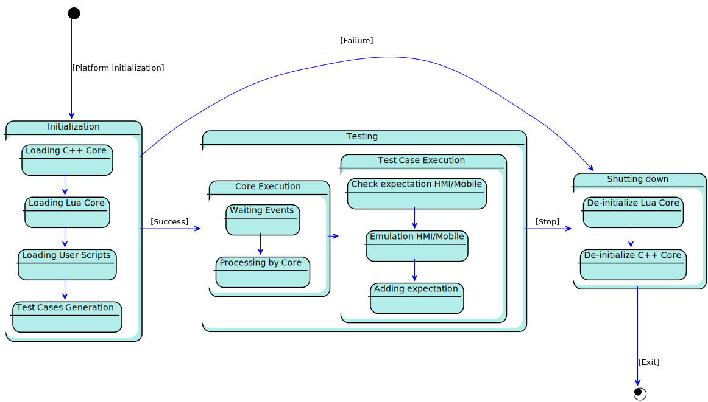

## 4.6. Process State View

The process State view shows the global ATF states according to system life cycle.

ATF states are related to **User Script** implementation and usually includes ATF waiting HMI and Mobile connections.
Following diagrams is focused on **ATF Core** component and shows to the **User Script** events processing.

|||
##### Life cycle states diagram

|||

***Elements description***

#### Initialization
  - *Behaviour:*
    - ATF initialize own components and load User Scripts 
  - *Relations:*
    - If all ATF subsystems and User Scripts successfully loaded, ATF starts processing Test Cases.
    - If failed, ATF is ***shutting down***. 
 
#### Testing
  - *Behaviour:*
    - ATF executes **User Scripts** test cases: emulates Mobile, HMI side, add and verifies expectations
    - ATF handles Events, proceeds according to own business requirements and provides to User Script verification.
  - *Relations:*
    - ATF starts shutdown procedure on getting stop signal and in case of Critical Test Case failure.

#### Shutting down
  - *Behaviour:*
    - ATF stores all disconnects from SDL and deinitializes all components.
  - *Relations:*
    - Finish ATF life cycle
