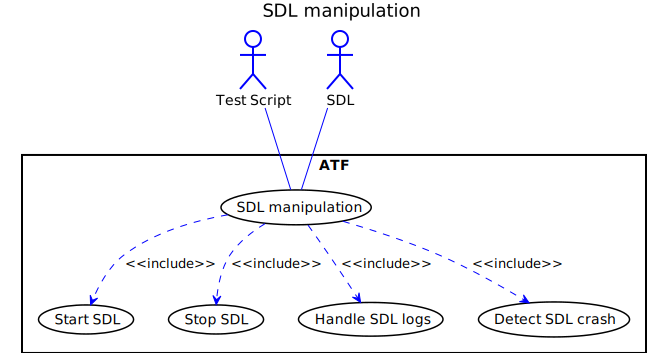
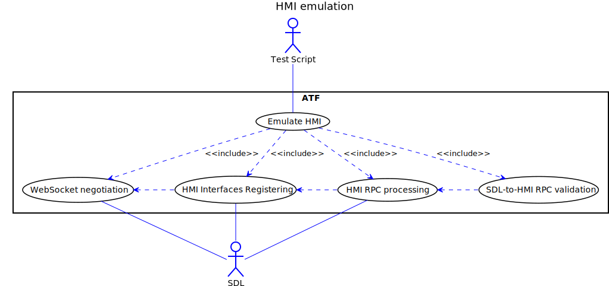
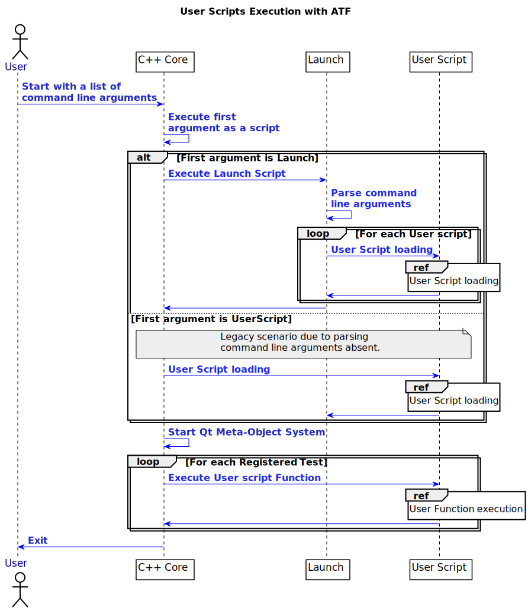

### 7.  References

1. SDL SW architecture - <https://smartdevicelink.com/en/guides/core/software-architecture-document/table-of-contents/>
2. SmartDeviceLink Protocol specification - <https://github.com/smartdevicelink/protocol_spec/blob/master/README.md>
3. ATF Developers guide - <https://adc.luxoft.com/svn/APPLINK/doc/technical/testing/AutomatedTestFramework/ATF_Versions/ATF2_DeveloperGuide.pdf>
4. ATF User guide - <https://adc.luxoft.com/svn/APPLINK/doc/technical/testing/AutomatedTestFramework/ATF_Versions/ATF2_UserManual.pdf>
5. SmartDeviceLink Protocol specification - <https://github.com/smartdevicelink/protocol_spec/blob/master/README.md>
6. Qt Framework Meta-Object System - <http://doc.qt.io/qt-5/metaobjects.html>
7. Lua documentation - <https://www.lua.org/manual/5.3/>
8. Lua Tables Tutorial - <http://lua-users.org/wiki/TablesTutorial>
9. Google C++ Style Guide -<https://google.github.io/styleguide/cppguide.html>
10. Lua Style Guide - <http://lua-users.org/wiki/LuaStyleGuide>

### 8.  List of Figures

|||
#### Deployment View

|||
|||
#### Life cycle states

|||
|||
#### Test domain Overview

|||
|||
#### ATF user script

|||
|||
#### Test script execution

|||
|||
#### SDL manipulation

|||
|||
#### Mobile emulation

|||
|||
#### HMI emulation

|||
|||
#### Component View

|||
|||
#### Launching user scripts

|||
|||
#### User Script loading

|||
|||
#### User Function execution

|||
|||
#### Events and expectations processing

|||
|||
#### Data flow

|||

#### 9.  Appendices

None
