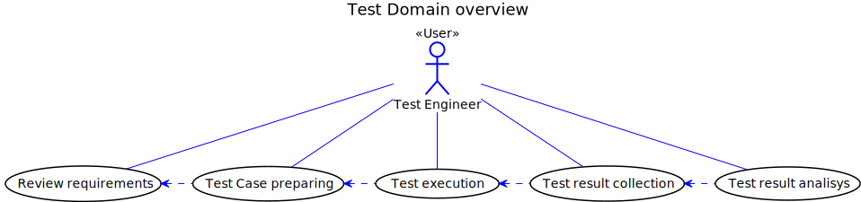
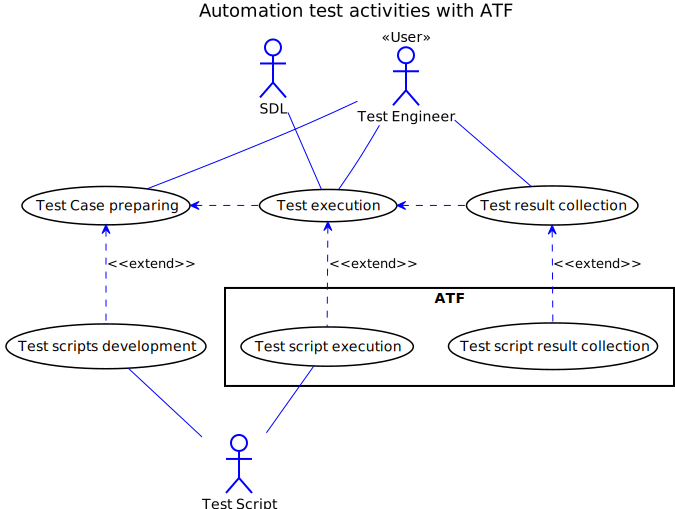
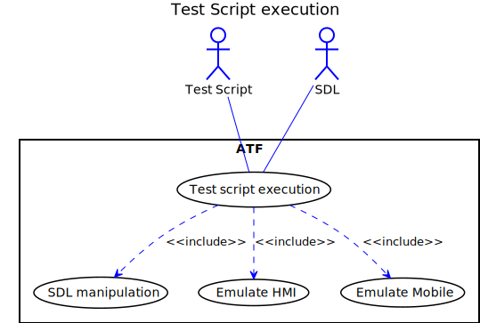
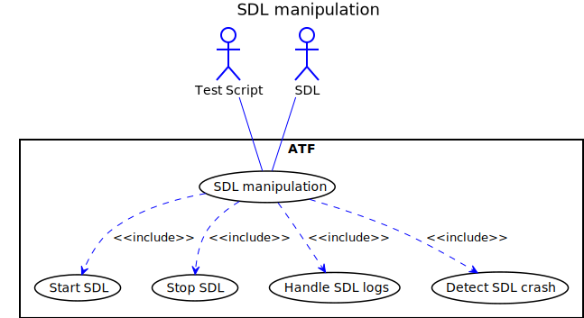
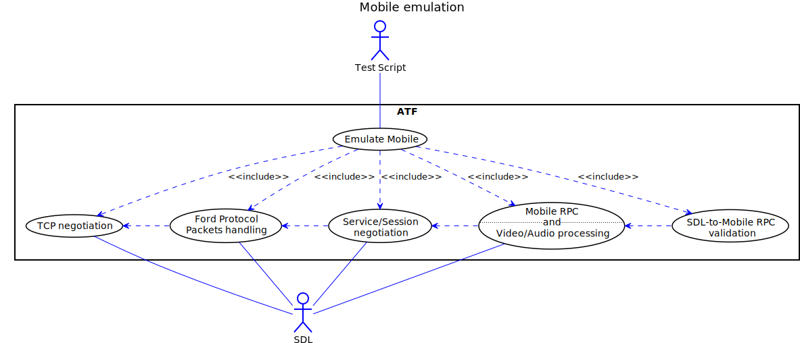
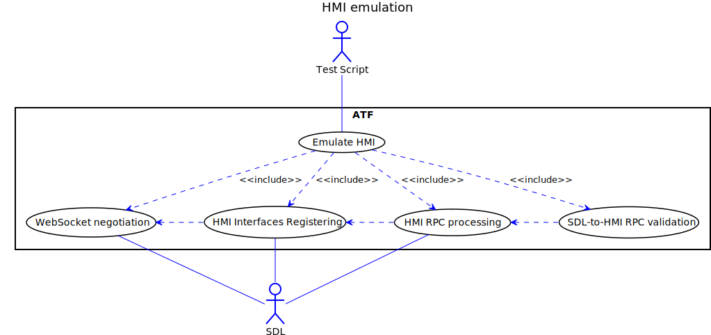

## 4.  Views

## 4.1. Use Case View

The following Use Case diagrams show the actors, the processes and their interactions within SDL System.

|||
#### Test domain Overview Use Case Diagram

|||

|||
#### Automation test activities Use Case Diagram

|||

|||
#### Test script execution Use Case Diagram

|||

|||
#### SDL manipulation Use Case Diagram

|||

|||
#### Mobile emulation Use Case Diagram

|||

|||
#### HMI emulation Use Case Diagram

|||