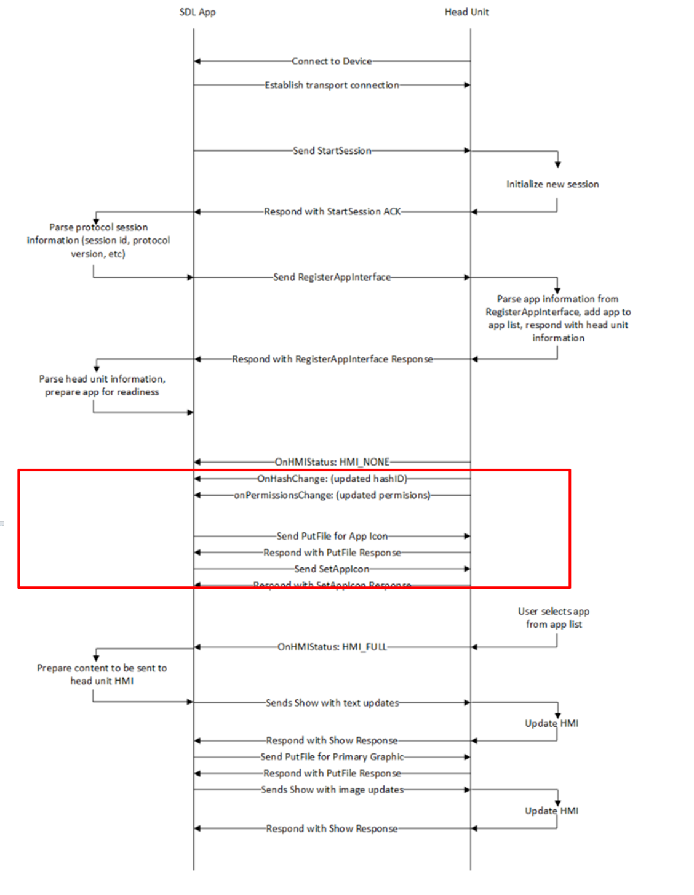
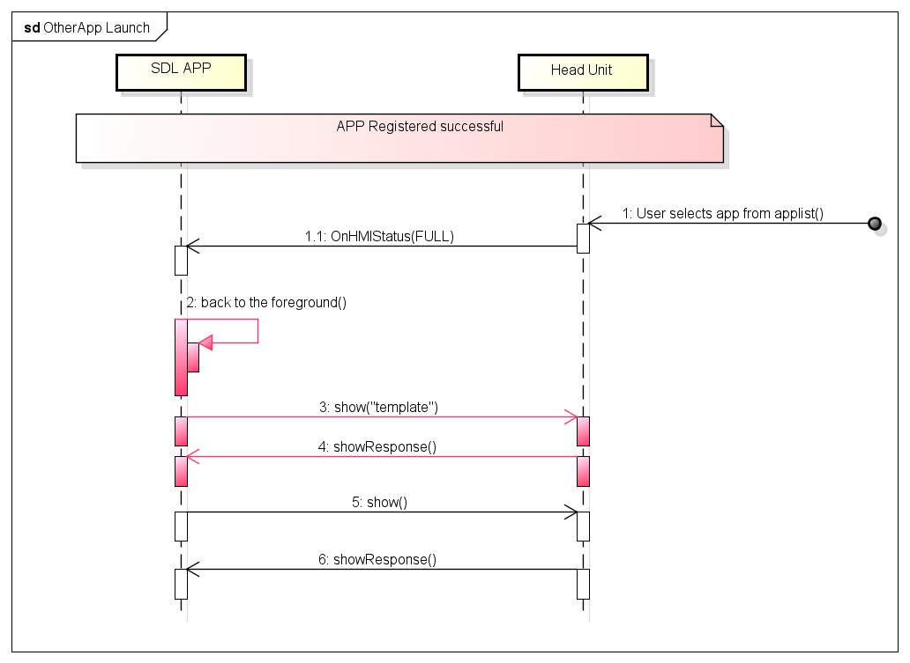
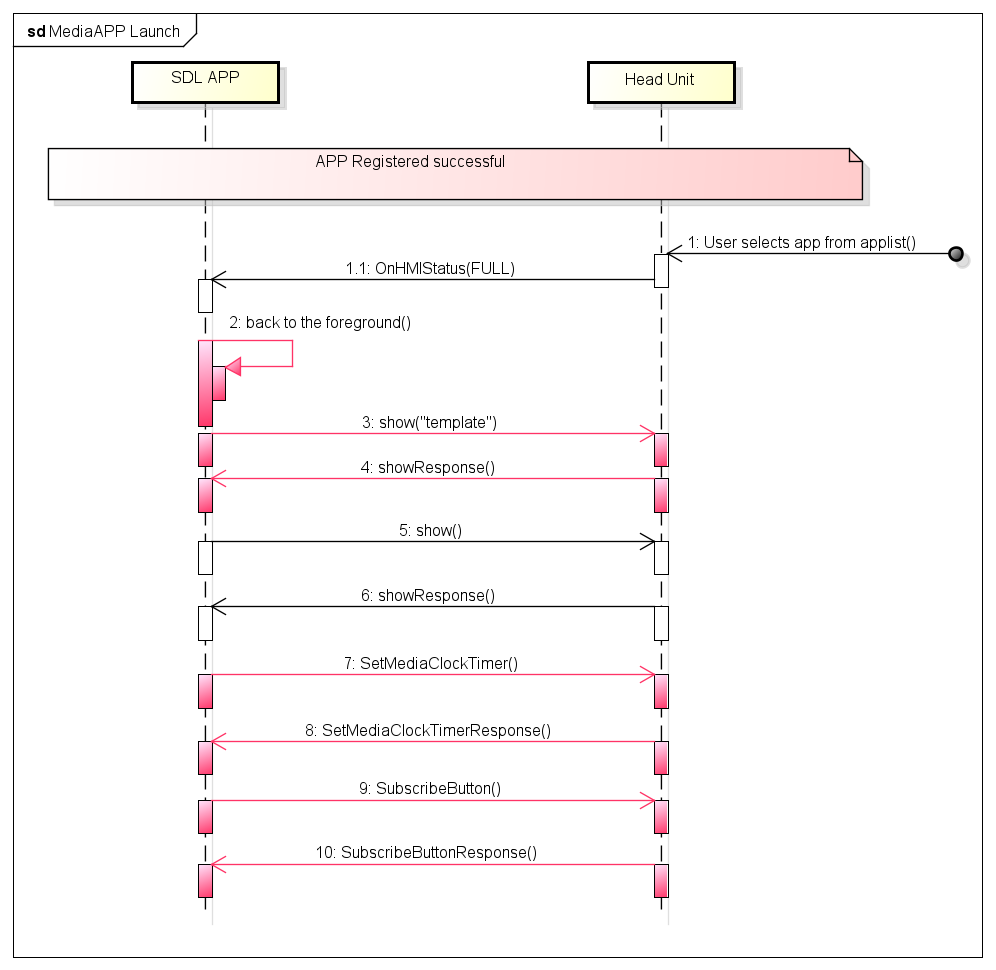
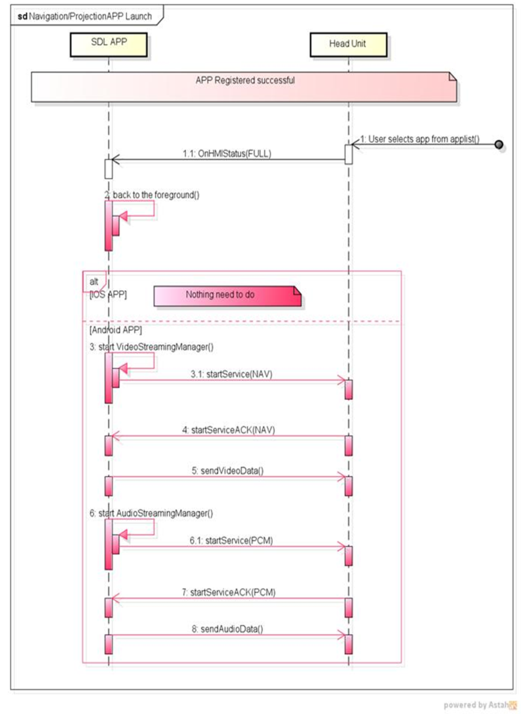

# 1.1. Establish Session

## 1. Overview
This chapter describes the launch sequence of normal type, MEDIA type and the NAVIGATION/PROJECTION type apps.
The application type (AppType) is determined by AppHMIType. AppHMIType for each AppType is shown below.

(1) Normal type App
- DEFAULT
- COMMUNICATION
- MESSAGING
- INFORMATION
- SOCIAL
- BACKGROUND_PROCESS
- TESTING
- SYSTEM
- REMOTE_CONTROL

(2) MEDIA type App
- MEDIA

(3) NAVIGATION / PROJECTION type App
- NAVIGATION
- PROJECTION

## 2. Background/Purpose/Reason for Standardization
Currently, the launch of SDL App is an SDL standard behavior.However, the SDL Standard Specification lacks definition for the following points:

&nbsp;(1) SDL App launching sequence of App side (especially RPC communication sequence) is not defined.
&nbsp;(2) The launch sequence for normal type SDL App is defined, while the launch sequence for MEDIA Type and NAVIGATION/PROJECTION Type are not.</ol>

Therefore, a misunderstanding might occur between App developers and HMI developers. The purpose of this document is to clarify the launch sequence of SDL Apps in order to be able to contribute to the SDL Ecosystem.

## 3. Function Details
### 3.1. Function Overview
The following startup sequences are to be clarified.
&nbsp;(1) Normal type App
&nbsp;(2) MEDIA type App
&nbsp;(3) NAVIGATION / PROJECTION type App

### 3.2 SDL App launch sequence in the SDL standard specification
The SDL App launch sequence in the SDL Standard Specification is below Figure1.

|||
**Figure1.** Sequence of SDL App launch provided in the SDL Standard specification

|||

To launch SDL App, additional communication is needed in the red frame of Figure1. However, currently that additional communication is not discribed. For details about "Connect to Device", please refer to the "Establishing a Transport" chapter of SDL Overview Guides on the SDLC official website. And since there is no lack of information (on the topics mentioned) , these topic will be omitted in this chapter.
Furthermore, the SDL website also provides information on how to establish a connection using AOA, BT and iAP. And since there is no lack of information (on the topics mentioned) , these topic will be omitted in this chapter.

### 3.3. Changes in the launch sequence of Normal type App
The following are additional behaviors required in the red frame of Figure1 in case of the normal type app will be launched.
When the SDL App receives `OnHMIStatus` with HMI Level FULL, the HMI displays the SDL App on foreground of the HU screen. After the App is displayed on the foreground, the SDL App sets the HMI template by sending `SetDisplaylayout`.

### 3.4. Changes in the launch sequence of MEDIA type App
The following are additional behaviors required in the red frame of Figure1 in case of the MEDIA type app will be launched.
When the SDL App receives `OnHMIStatus` with HMI Level FULL, the HMI displays the SDL App on foreground of the HU screen. After the app is displayed on the foreground, the SDL App sets the HMI template by sending `SetDisplaylayout`. Then, after the SDL App receives `showResponse`, it sets a progress bar on the HU screen by sending `SetMediaClockTimer`. The SDL App sends `SubscribeButton` and monitors the HMI Button event.

### 3.5. Changes in the launch sequence of NAVIGATION/PROJECTION type App
The following additional/excluded behaviores are required in the red frame of Figure1 in case the NAVIGATION/PROJECTION type app is launched.
When the SDL App receives `OnHMIStatus` with HMI Level FULL, the HMI displays the SDL App on foreground of the HU screen. After the App is displayed on the foreground, the SDL App does NOT send `show`.

<b>[The following applies only to the Android version of SDL App]</b>
After the app is displayed to the foreground, (the SDL App) starts VideoStreamingManager/AudioStreamingManager. Then, when VideoStreamingManager/AudioStreamingManager has started successfully, it sends the video/audio data to the HU.

## 4. Differences from the SDL standard specification
The red frame in Figure1, which is supposed to be an essential part of the sequence, is not explicitly defined in the SDL standard specification. Therefore, all of the contents describe in 3.3 - 3.4 differ from the existing SDL standard specification.

## 5. Sequence Diagrams
The three types of launch sequence are described based on the SDL App launch sequence (Figure1) published in the SDL Standard Specification.
&nbsp;(1) Normal type App launch sequence (Figure2)
&nbsp;(2) MEDIA type App launch sequence (Figure3)
&nbsp;(3) NAVIGATION / PROJECTION type App launch sequence (Figure4)

Additional sequence is added in the red frame of Figure1 for each App type. Parts other than the red frame are common to/shared by all App type, and there are no lack in the sequences. The sequence described in the red part refers to the RPC communication sequence; it is not described in the SDL standard specification.

|||
**Figure2.** Normal type App launch sequence

|||

|||
**Figure3.** MEDIA type App launch sequence

|||

|||
**Figure4.** NAVIGATION / PROJECTION type App launch sequence

|||

## 6. Impacted Platforms
Changes only affects the SDLC Guideline documents. There is no impact to the SDL Core and Proxy.

