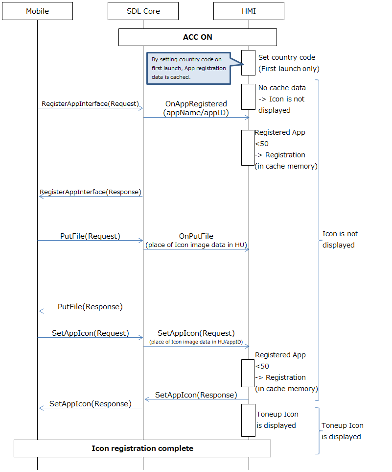
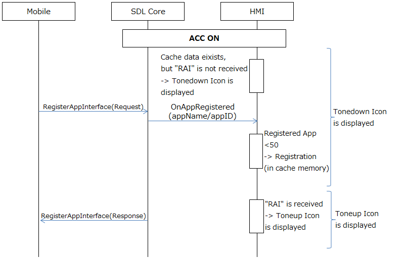
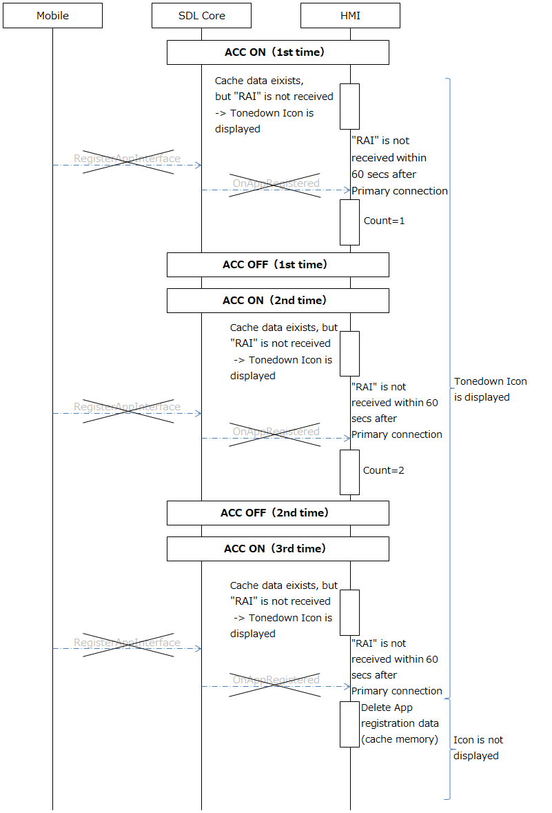
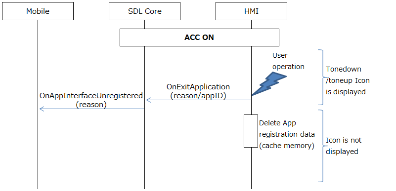
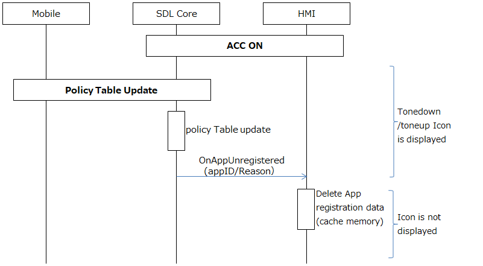
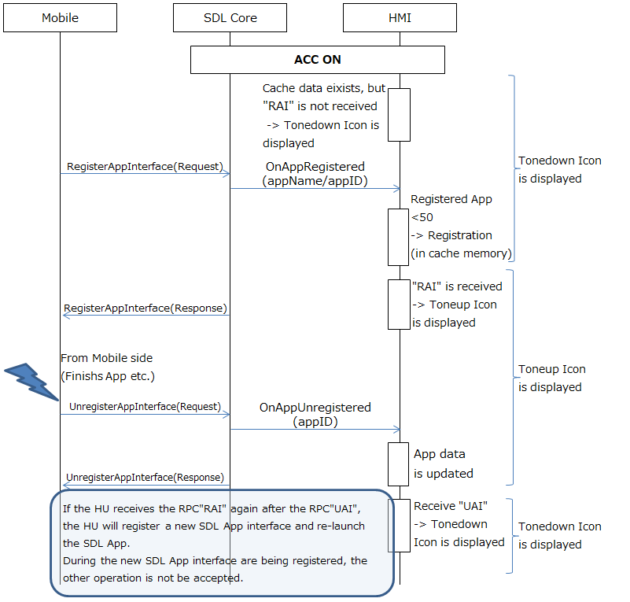

# 1.2. SDL App Icon Display

## 1. Overview
This chapter describes how the HU displays the SDL App Icon on the screen by the connecting Mobile to the HU.

## 2. Background/Purpose/Reason for Standardization
Currently, the SDL App Icon display is an SDL standard behavior, however there are some issues the following below:
- The position of SDL App Icon display changes every time it connects the Mobile.
- It takes time to display the SDL App Icon every time the system launches, because there is no internal memory to cache the SDL App information such as the SDL App Icon in the HU.
- The user can not recognize the SDL App state (the progress of launching app) because the SDL App Icon only has two display (SDL App Icon display ON/OFF).

Hence, the purpose of this document is to standardize such cases/issues using the TOYOTA specification, in order to be able to contribute to the SDL Ecosystem.

## 3. Function Details
### 3.1. Function Overview
The SDL App Icon and the title displayed in the HU are not kept in the HU in advance.
When it is received from the SDL App installed in the Mobile, the SDL App Icon will be displayed and cached in the memory by the HMI.

### 3.2. SDL App Icon
The HU can display the SDL App Icon that is allowed by the PolicyTable on the Menu screen.
Then, the SDL App Icons are sorted by priority; the AppHMIType as the 1st key, the order list in PolicyTable as the 2nd key.
The priority of AppHMIType is specified by the OEMs.
Regarding the order list in the PolicyTable, the default data is defined in the SDL Standard specification, but after once launching it is managed by the Policy server.

The SDL App Icons can be updated during the registration process of SDL Apps to the SDL Core from the SDL App.
Then, the updated SDL App Icon is notified to the HMI.
The SDL App Icon cached in the HMI is displayed.
The exceeded number of concurrent connections for the SDL Apps (max. 50) registered by the RPC`RegisterAppInterface`, the SDL App Icon that over registered will not be displayed on the menu screen.

The SDL App Icon image is sent by the RPC`PutFile` to the SDL Core from the SDL App, after it is registered by the RPC`RegisterAppInterface`.
Afterwards, the SDL App Icon file name(SDLFileName) is sent by the RPCPSetAppIcon` to the SDL Core from the SDL App.

### 3.3. Specification for the SDL App Icon Image
The specifications for the SDL App Icon image that the HU can display:
- Image date size : 70x70 pixel
- File type : PNG, JPEG, BMP

The HU creates a greyscale SDL App Icon with the SDL App Icon for Tonedown status display.
Also, depending on the display area, the SDL App Icon size is scaled to keep the aspect ratio by the HU.

### 3.4. Display Status for the SDL App Icon
The table below shows the status for each SDL App Icon display.

**Table1.** Status in each SDL App Icon status

|
 Icon Display 
|
 Description 
|
 Icon Status 
|
|:---|:---|:---:|
|
 Not displayed 
|
 If there is no SDL App Icon data in the cache. 
|
 - 
|
|
 Tonedown Icon  is displayed 
|
 There is SDL App Icon data in the cache. If the RPC `RegisterAppInterface` is not received or  the RPC`UnregisterAppInterface`  is received during Toneup SDL App Icon display. 
|
 Inactive 
|
|
 Toneup Icon  is displayed 
|
 If the RPC`RegisterAppInterface` is received. 
|
 Active 
|

### 3.5. SDL App Icon name
The SDL App Icons are given with the SDL App name.
The SDL App name changes in accordance to the langugage settings of the HU.
The SDL App name can be updated to the SDL core from the SDL App during the SDL App registration.
Afterwards, the updated SDL App name is notified to the HMI.
The HMI will keep the SDL App name, until it is updated again by the SDL App.

## 4. Differences from the SDL standard specification
The items 1-3 listed below differ from the existing SDL Standard Specification.

1. The parameters which defines the sort by priority 
Both are defined by OEM's own specification.
 - Priority of the AppHMIType 
 - The order list in the PolicyTable (corresponding to Policy server ) 

2. The display status of SDL App Icon
Two of the SDL App Icon display mode (ON/OFF) are already defined in the SDL Standard Specification.
However, the change of display SDL App Icon such as Tonedown display is not explicitly defined in the SDL Standard Specification. 

3. The details in the HMI process defined in the sequence diagrams of SDL App Icon display status below, is not explicitly specified in the SDL Standard Specifcation.
Thus, we have used TOYOTA Specifications as a reference information to define it.
There is no problem for OEMs to define the threshold value such as the number of registered SDL Apps by themselves.

## 5. Sequence Diagrams
The following tables below show the cases where the SDL App Icon display status changes.

**Table2.** SDL App Icon display status in each case
<table><tr><th>
 Cases where the SDL App Icon display status changes 
</th><th>
 Reference 
</th></tr><tr><td>
 When there is no cache (Normal case) 
</td><td>
 Figure1 
</td></tr><tr><td>
 When there is a cache (Normal case) 
</td><td>
 Figure2 
</td></tr><tr><td>
 When the "RPC`RegisterAppInterface` is not received within 60 seconds  after the primary connection." occurs three times from the same device 
</td><td>
 Figure3 
</td></tr><tr><td>
 During initialization(Deletion of the personal information) 
</td><td rowspan="2">
 Figure4 
</td></tr><tr><td>
 During change in the language 
</td></tr><tr><td>
 When the SDL App data is deleted from the PolicyTable 
</td><td>
 Figure5 
</td></tr><tr><td>
 When the RPC`UnregisterAppInterface` from the Mobile is received 
</td><td>
 Figure6 
</td></tr></table>

The Sequence Diagrams of change in the SDL App Icon display status is below:

|||
**Figure1.** SDL App Icon display status sequence(Normal case without cache)

|||
|||
**Figure2.** SDL App Icon display status sequence(Normal case with cache)

|||
|||
**Figure3.** SDL App Icon display status sequence(The "RPC`RegisterAppInterface`  is not received within 60 seconds after the primary connection." occurs three times from the same device)

|||
|||
**Figure4.** SDL App Icon display status sequence (Initialization (Deletion of the personal information), Change in the language)

|||
|||
**Figure5.** SDL App Icon display status sequence(Deletion from the PolicyTable)

|||
|||
**Figure6.** SDL App Icon display status sequence(Reception of the RPC`UnregisterAppInterface`)

|||

## 6. Impacted Platforms
Changes impact the following platform/s:
- HMI