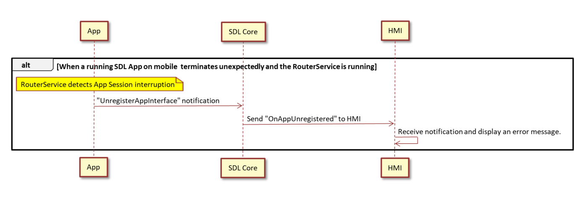
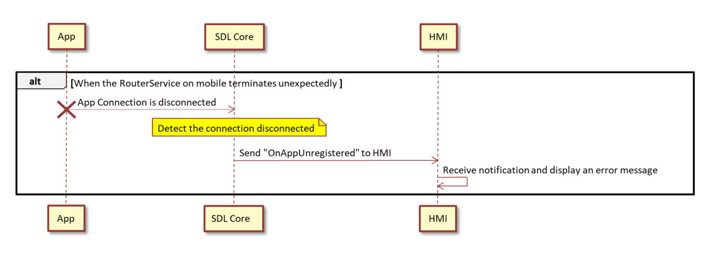

# 1.6. Behavior when the HU returns RPC Error

## 1. Overview
This chapter describes the behavior when the SDL App terminates unexpectedly.

## 2. Background/Purpose/Reason for Standardization
Currently, the process of SDL Apps during an unexpected termination is an SDL standard behavior.
However, the process itself is not explictly defined in the SDL standard specifications.
Hence, the purpose of this document is to standardize such cases/issues using the TOYOTA specification, in order to be able to contribute to the SDL Ecosystem.

## 3. Function Details
### 3.1 For iOS
If the SDL App that is running on mobile is terminated unexpectedly, the App Connection will be disconnected.
Then, the SDLCore on the HU detects that the connection has been disconnected, and sends RPC"UnregisterAppInterface" to the HMI.
The HMI receives the notification and displays an error message.

 
<b>Figure1.</b> When a running SDL App on mobile terminates unexpectedly 

### 3.2 For Android
1. If the SDL App that running on mobile has been terminated unexpectedly, but the RouterService has not,
  RouterService detects the interruption of SDL App session, and sends RPC"UnregisterAppInterface" to the HU.

 
<b>Figure2.</b> When a running SDL App on mobile terminates unexpectedly and the RouterService is running.
 
 
 

2. If the RouterService on mobile has been terminated unexpectedly, the SDLCore detects the disconnection and sends RPC"UnregisterAppInterface" to the HMI.
The HMI receives the notification and displays an error message.

 
<b>Figure3.</b> When the RouterService on mobile terminates unexpectedly

## 4. Impacted Platforms
There is no impact on any Platforms.
