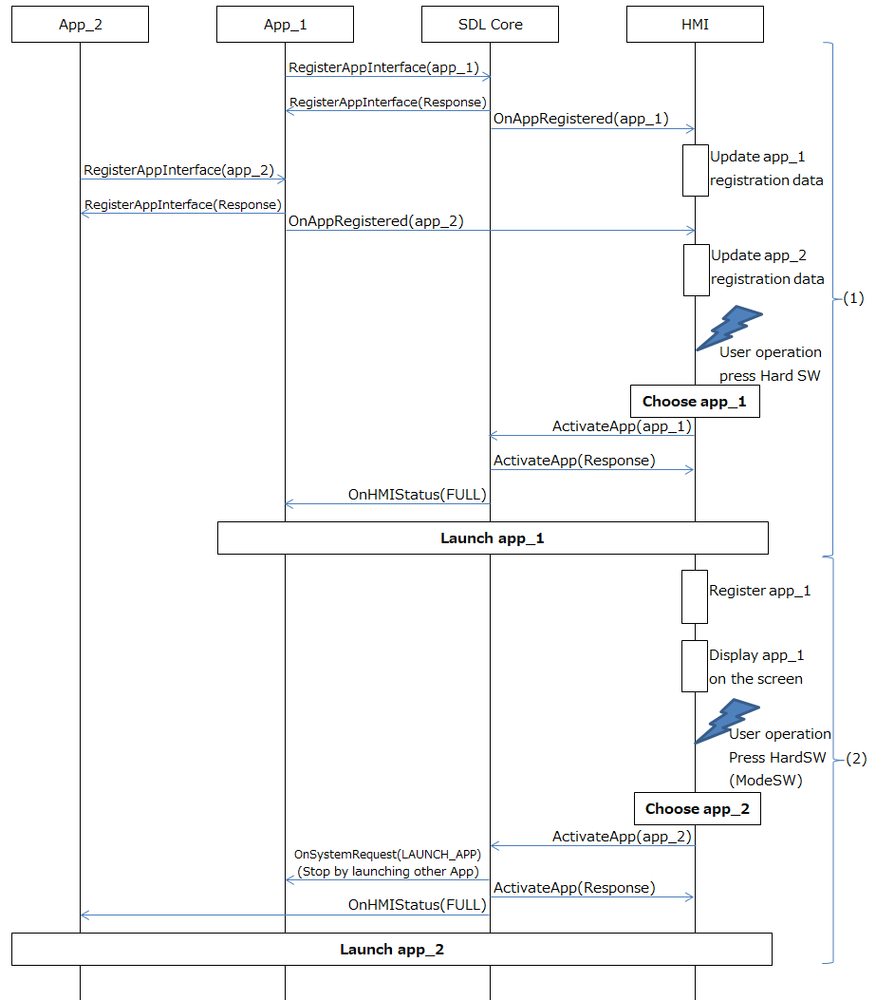

# 2.4. Launch by Hard SW

## 1. Overview
This chapter describes the launch of SDL App by pressing the Hard SW.
Some systems do not have the Hard SW, and set it as the Software SW in a fixed area on the screen.
In this chapter, all mentioned above will be treated synonymously as the Hard SW.

## 2. Background/Purpose/Reason for Standardization
Currently, the launch of SDL App is an SDL standard behavior.
However, since the triggers that launch the SDL App are not explicitly defined in the SDL standard specification, it is necessary for the OEMs to define it by themselves.
Hence, the purpose of this document is to standardize such cases/issues using the TOYOTA specification, in order to be able to contribute to the SDL Ecosystem.

## 3. Function Details
### 3.1. Function Overview
The user operations that trigger the launch of SDL App are listed below:

<ol>
 (1) By pressing the SDL App Icon 
 (2) By launching Voice Recognition 
 (3) By choosing the Audio source on the Audio screen 
 (4) By pressing the Hard SW 
 (5) By pressing the ModeSW on the Steering Wheel
</ol>

The following (1), (2), (3) mentioned above, already each has of their own documents. Thus, this chapter provides information about (4) and (5).

### 3.2. Pressing the Hard SW
The SDL Navigation App can be launched, when the user presses a Hard SW.
Although, some systems may have separated the Software SW to call the Native Navigation and the SDL Navigation App.
The means to select the Software SW to call the Native Navigation and the SDL Navigation App depends on the OEM's specification.
This chapter will provide information regarding the Hard SW to call the SDL Navigation App.

When the Hard SW, the HU will launch either the SDL Navigation App or the Native Navigation in accordance with the following status listed below:

<ol>
  (1) If the Native Navigation exists, display the Native Navigation screen. 
  (2) If the Native Navigation does NOT exist, but the SDL Navigation App exists, launch the SDL Navigation App and 
<ol>
display the SDL Navigation App screen. 
If there are the multiple SDL Navigation App, the following below occurs : 
<ol>
      1) If there is an existing SDL Navigation App launched, display the launched SDL Navigation App. 
      2) If there is no running SDL Navigation App, launch and display the SDL Navigation App in the first order as 
      <ol>
      the AppHMIType is "NAVIGATION" in sort(However, there is no problem if the OEM specifies it 
      by themselves). 
      </ol>
      3) If there is already a launched SDL Navigation App displayed, keep all status. 
</ol>
</ol>
   (3) If both the Native Navigation and the SDL Navgiation App do NOT exist, keep the state before the Hard SW 
<ol>
is pressed. 
In addition, if the Software SW is used as a hard SW, there is no problem even if the OEMs specify not to display the Hard SW.
</ol>
</ol>

### 3.3. Pressing the ModeSW on the steering wheel
When a user pressses the ModeSW on the steering wheel, the HU can launch and change the SDL Media App due to change in the Audio source.
The ModeSW is a toggle function that changes the Audio source such as the Native Audio source, the SDL Media App, etc, in order.
After all the Audio source are selected and the ModeSW is pressed, the HU goes back to the first Audio source.
The SDL Media App that is available to choose, is the AppHMIType "MEDIA" and is registered in the RPC"RegisterAppInterface".

The following table below shows the SDL Media App state when the ModeSW on the steering wheel is pressed.

**Table1.** The HMI Level and the behavior after the ModeSW is pressed on the HU display screen

|
 HU display screen 
|
 Target SDL Media App  is selected 
|
 Target SDL Media App  is not selected 
|
|:---|:---:|:---:|
| Audio screen | HMI Level = "FULL"  ＆ Start playback | HMI Level = "BACKGROUND"  ＆ Stop playback |
| Aside from the Audio screen  (such as the Navigation screen) | HMI Level = "LIMITED"  ＆ Start playback | HMI Level = "BACKGROUND"  ＆ Stop playback |

Note:Regarding the HMI Level, please refer to "6. Behavior of each HMI status".

## 4. Differences from the SDL standard specification
The trigger that launches the SDL App is not explicitly defined in the SDL standard specification, because it is processed in the HMI.
Therefore, all of the contents describe in "3. Function Details" differ from the existing SDL standard specification.

## 5. Sequence Diagrams
Figure1 describes the following sequence: 

<ol>
  (1) The launch of SDL App after pressing SW 
  (2) The change of SDL Apps
</ol>

 
**Figure1.** Launch of SDL App after pressing SW sequence

## 6. Impacted Platforms
Changes impact the following platform/s:
 - HMI

