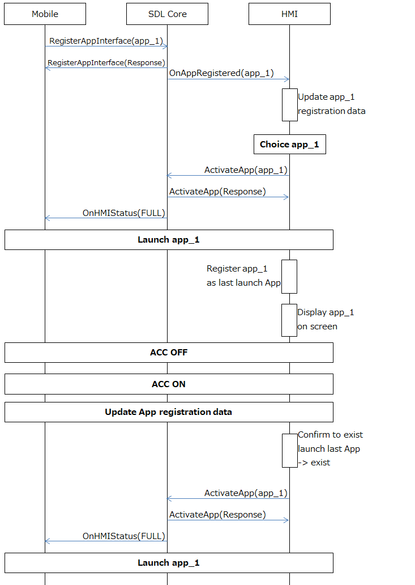

# 2.5. Behavior after ACC OFF/ON(Resume of last launched SDL App)

## 1. Overview
This chapter describes the behavior of the SDL App after ACC OFF/ON.

## 2. Function Details
### 2.1. Function Overview
When ACC is set to OFF, if an SDL Media App with the AppHMIType "MEDIA" such as the internet radio is being streamed on the HU,  the HU launches the same SDL Media App  to play and display in the next launch (ACC ON).
If an SDL App which AppHMIType is other than "MEDIA" is running when ACC OFF, even if it's running, the HU does not launch that the SDL App in the next launch.

### 2.2. Behavior after ACC OFF/ON
When the system is shut down by ACC OFF, if the last launched SDL App is Media (The AppHMIType is "MEDIA"), the HMI stores the SDL App infromation to memory.
The information that is needed to re-start playing on the SDL App, for example the SDL App name(App ID), the current playing music information (title, playtime, etc) should be stored.
The HU must finish to store the information until the shutdown sequence is complete. During the next ACC ON, the HMI must confirm whether there is an existing last launched SDL App.
And if it exists, the HMI launches the targeted SDL App and plays the music.Then, the HMI Level should be set to "FULL".

## 3. Differences from the SDL standard specification
The behavior of SDL App during ACC OFF/ON is not explicitly defined in the SDL standard specification, because it is processed in the HMI.
Therefore, all of the contents describe in "2. Function Detailts" differ from the existing SDL standard specification.

## 4. Sequence Diagrams
Figure1 below shows the behavior of SDL App when ACC OFF/ON (The last launched SDL App is Media).

 
**Figure1.** Behavior of the SDL App when ACC OFF/ON (The last launched SDL App is Media.)

## 5. Impacted Platforms
Changes impact the following platform/s:
 - HMI
