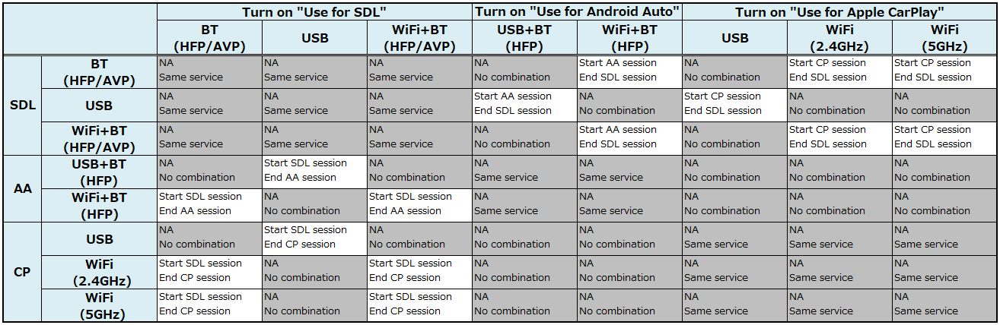

# 2.6. Change screen to SDL App from other smartphone linkage functions (CarPlay/Android Auto)

## 1. Overview
This chapter describes the method to switch between the SDL App and other smartphone linkage functions(CarPlay (CP)/ Android Auto(AA)).

## 2. Background/Purpose/Reason for Standardization
The SDL standard specification covers information about Apps that support SDL.
However, the switching screen with other smartphone linkage functions such as CP, AA(, Car Life and WeLink)) is not explicitly defined by the SDL standard specification, therefore, it is necessary for the OEMs to define it by themselves.
Hence, the purpose of this document is to standardize such cases/issues using the TOYOTA specification, in order to be able to contribute to the SDL Ecosystem.

## 3. Function Details
### 3.1. Function overview
Due to the competition of communication path such as USB, and the restrictions on CPU load depending on the system, the smartphone linkage functions including the SDL (, CP, AA (, Car Life, WeLink)) is mutually exclusive.
Therefore, since it can not be used at the same time, it is necessary to disable other smartphone linkage functions when using the SDL function.

### 3.2. Switching screen to the smartphone linkage functions
Enable/disable SDL is set.

- SDL set to ENABLE:CP/AA does NOT work
- SDL set to DISABLE:CP/AA works

## 4. Differences from the SDL standard specification
The switching smartphone linkage(CP, AA(, Car Life, WeLink)) is not explicitly defined in the SDL specification, because it is processed in the HMI.
Additionally, the switching between similar functions and related exclusive functions needs, that need to be desclibe in the HU specification, however, there is no definition about it in the SDL standard specification itself.
Therefore, all of the contents describe in "3. Function Details" differ from the existing SDL standard specification.

## 5. Sequence Diagrams
Table1 shows the behavior when each smartphone linkage functions are switched.

**Table1.** Switching behavior Matrix

## 6. Impacted Platforms
Changes impact the following platform/s:
- HMI