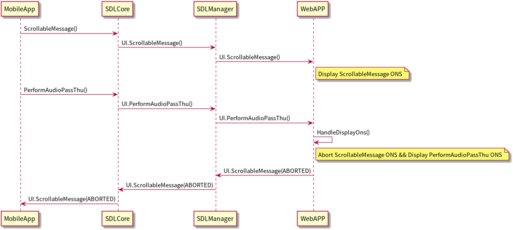
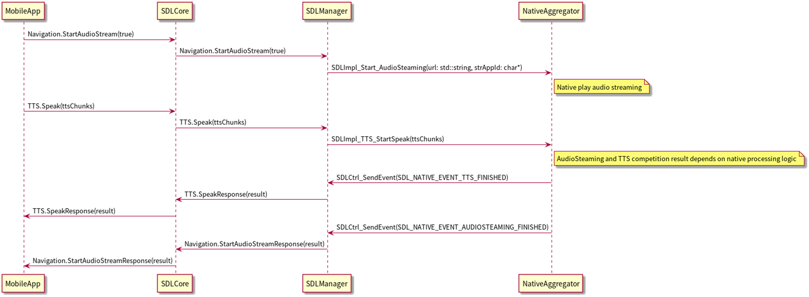
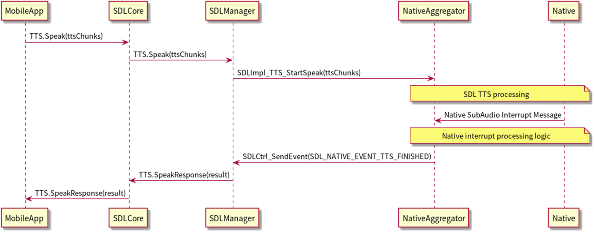
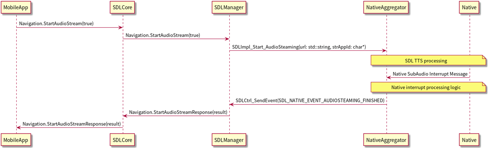

# 5. SDL App Interruption

## 1. Overview
This chapter describes the interruption of SDL App.
Listed below are three cases considered as kinds of interruption.
- Interruption from SDL App while SDL App is running
- Interruption from SDL App while Native is running
- Interruption from Native while SDL App is running

## 2. Background/Purpose/Reason for Standardization
Currently, there are various types of popup screen appearance, such as the RPC`Alert`, the RPC`PerformInteraction`, etc, in the SDL.
However, all of the interruptions are notified to the Native side in the SDL standard specification. Therefore, it is necessary for the OEMs to manage the interruptions by themselves.
Hence, the purpose of this document is to standardize such cases/issues using the TOYOTA specification, in order to be able to contribute to the SDL Ecosystem.

## 3. Function Detail
### 3.1. Interruption from SDL App while SDL App is running
In this case, running SDL App is stopped and interrupted by screen/voice process of launched SDL App.

### 3.2. Interruption from SDL App while Native App is running; Interruption from Native while SDL App is running
In this case, the priority order is decided by the Native side. Then, the interruptions are processed by following that rule (order).
The priority order of interruptions are specified by the OEMs themselves.

## 4. Differences from SDL standard specification
The interruptions between SDL Apps, and between Native and SDL App are not explicitly defined in the SDL official documents.
Therefore, all of the sequences in this chapter differ from the existing SDL Standard Specifications.

## 5. Sequence Diagrams
### 5.1. Interruption from SDL App while SDL App is running
Ex) The sequence below shows if an APT interruption occurs when ScrollableMessage is displayed on the screen.
In the TOYOTA specification, the HU closes the displayed ScrollableMessage screen and displays the APT screen.

|||
**Figure1.** Sequence of ATP interruption while the scrollableMessage screen is being displayed

|||

### 5.2.  Interruption from SDL App while Native is running
<b>5.2.1. When the interruption of SDL App screen occurs while Native screen is being displayed</b> 
In this case, you can refer to case of `Alert` in the SDL standard specification in the URL below:
 
<https://www.smartdevicelink.com/en/guides/hmi/ui/alert/>

<b>5.2.2. When the SDL app requests for (a) TTS playback while the Native voice is playing</b> 
When the SDL App requests for (a) TTS playback while the Native voice is playing, the SDL App notifies that request to the Native.
Then, the Native decides whether it can play the TTS (or not) on the Native side, and notifies the result to the SDL App.

|||
**Figure2.** Sequence of SDL App requesting for TTS playback while Native voice is playing

|||

### 5.3. Interruption from Native while SDL App is running
<b>5.3.1. When interruption of Native screen occurs while SDL App screen is being displayed</b> 
For the following cases, please refer to the SDL standard specification in the URL provided below:
 
Case of `OnEventChange` :
<https://www.smartdevicelink.com/en/guides/hmi/basiccommunication/oneventchanged/>
 
Case of `OnAppDeactivated` :
<https://www.smartdevicelink.com/en/guides/hmi/basiccommunication/onappdeactivated/>

<b>5.3.2. When interruption of Native SubAudio(TTS or voice guide) occurs while SDL App TTS is playing</b> 
The Native decides whether (a) playback (on the Native side) is possible or not, and notifies the result to the SDL App.

|||
**Figure3.** Sequence of Native SubAudio (TTS or voice guide, etc.) interruption while SDL App TTS is playing

|||

<b>5.3.3. When interruption of Native voice(TTS or voice guide, etc.) occurs while SDL AudioStreaming is running</b> 
The Native decides whether (a) playback (on the Native side) is possible or not, and it notifies the result to the SDL App.

|||
**Figure4.** Sequence of Native voice (TTS or voice guide, etc. ) interruption occurs while SDL App Audio is streaming

|||

## 6. Impacted Platforms
Changes impact the following platform/s:
- HMI