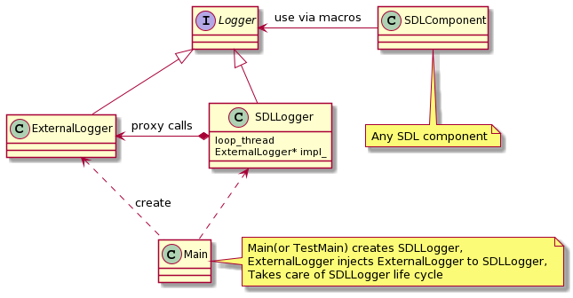
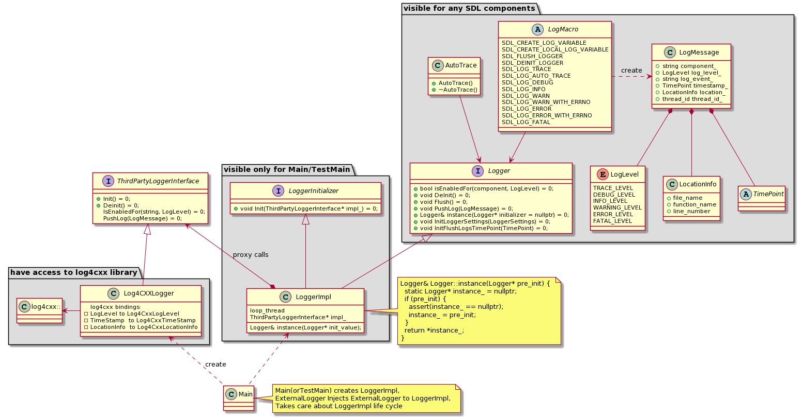

# SDL Logger

SDL Core uses [log4cxx](https://logging.apache.org/log4cxx/latest_stable/) for logging.
To provide flexibility SDL now provides the capability to replace the log4cxx logger with any other logging package such as boost or syslog.


 SDL implements Logger abstraction allowing for easy replacement of the logging library.

|||
High Level Design

|||


All components have access to the `Logger` interface and use it for logging.

### Logger interface 

Logger macros use the Logger interface for sending messages to the External Logger.
The logger interface contains only methods required by any SDL component to perform logging :

 * instance() - singleton access
 * PushLog(LogMessage)
 * IsEnabledFor(LogLevel)
 * DeInit()
 * Flush() 


## LoggerImpl

`Logger` interface is implemented by `LoggerImpl`. 

`LoggerImpl` uses the message loop thread to proxy log messages to a third party (external) logger.
`LoggerImpl` owns `ThirdPartyLoggerInterface` and controls it's lifetime. 
`LoggerImpl` provides implementation of the singleton pattern.


### Message loop thread in SDLLogger

Message loop thread is needed to avoid significant performance degradation at run time as logging calls are blocking calls and might take a significant amount of time.
`LoggerImpl::PushLog` is a non-blocking call. It will put the log message into the queue and returns immediately.


If `ThirdPartyLoggerInterface` supports non blocking threaded logging, minor changes in `LoggerImpl` can be created with `use_message_loop_thread = false`. 

## Logger singleton 

Logger is the only singleton class in SDL.
Singleton pattern required to have an access to logger from any component. 
`Logger::instance()` provides singleton by `Logger` interface.
So SDL components do not have information about the logger implementation and the specific external logger.

## Logger singleton with plugins 

SDL plugins are shared libraries, so `LoggerSingleton` could not be implemented with a Mayers singleton. 
A Mayers singleton would create own an SDL logger instance for each plugin.


The idea is to pass a singleton pointer to each plugin during creation, so that plugins can initialize the Logger::instance pointer with the instance received from SDL core.


Singleton Instance implementation : 
```cpp
// ilogger.h
static Logger& instance(Logger* pre_init = nullptr);

...
// logger_impl.cc
Logger& Logger::instance(Logger* pre_init) {
  static Logger* instance_ = nullptr;
  if (pre_init) {
    assert(instance_ == nullptr);
    instance_ = pre_init;
  }
  assert(instance_);
  return *instance_;
}
```

`pre_init` is `nullptr` by default, so all components will access instance_ static pointer for logging. 
`main()`  function need to create `SDLLogger` implementation and call `Logger::instance` (logger implementation);

Plugin implementation:
```cpp 
extern "C" PluginType* Create(Logger* logger_singleton_instance) {
  Logger::instance(logger_instance);
  return new PluginType();
}
```


SDL Core will pass a pointer to the logger singleton to the plugin so that the plugin shared lib can initialize `Logger::instance` with the same pointer as the core portion.

## Logger detailed design :

Each source file creates `logger_` variable via macro `SDL_CREATE_LOG_VARIABLE`. 
This variable is actually a string with the component name of the logger.
Some logger implementations (like log4cxx) may have separate severity or destination rules for each component. 


SDL implements all info required for log message :

 * LogLevel enum
 * Location info struct : location in the code
 * TimePoint 


|||
Detailed Design

|||


### LoggerInitializer interface 

LoggerInitializer specify interface required for Main to init logger but not required for any other SDL components

LoggerInitializer should take and own the third party implementation into `Init` method. 
 - Init(std::unique_ptr<ThirdPartyLoggerInterface>&& third_party)


### ThirdPartyLogger interface

ThirdPartyLogger interface describes interfaces that should be implemented by external logger adapter. 

This interface should be inherited by particular external logger implementation. 


## Another logger implementation. 


To use another (not log4cxx) logger, you should implement ThirdPartyLoggerInterface class 

```cpp
AnotherOneLoggerImpl : ThirdPartyLoggerInterface {
  void Init() override;
  void DeInit() override;
  void IsEnabledFor(LogLevel) override;
  void PushLog(const LogMessage& log_message) override;

  void SomeCustomMethod(parameters);
}
```


Next create `AnotherOneLoggerImpl` in main and setup it for `LoggerImpl`.
Note that `Logger::instance` does not own logger instance. The `main` function is responsible for the `sdl_logger_instance_` life-cycle.


```cpp
// main.cpp
int main(argc, argv) {
	auto external_logger_ = std::make_unique<AnotherOneLoggerImpl>();
	external_logger_->SomeCustomMethod(argv);
	auto sdl_logger_instance_ = new LoggerImpl(std::move(external_logger_));
	Logger::instance(sdl_logger_instance_);  
	sdl_logger_instance_->Init(std::move(external_logger_));
  // Futher application code may use Logger::instance() for logging 
	
	delete sdl_logger_instance_;
}

```
