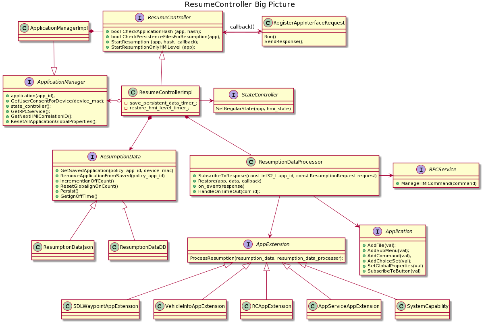
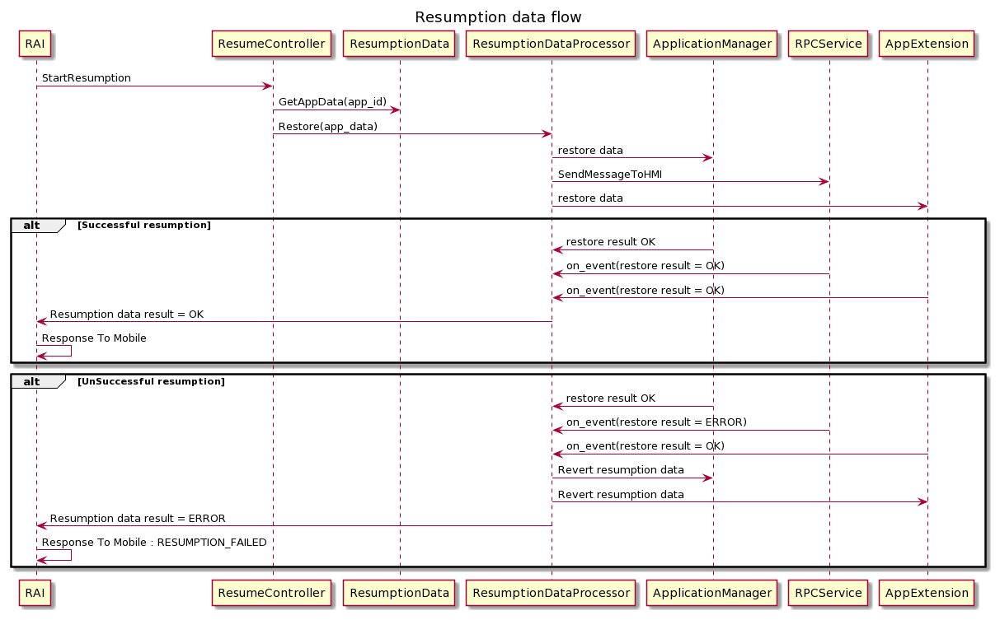
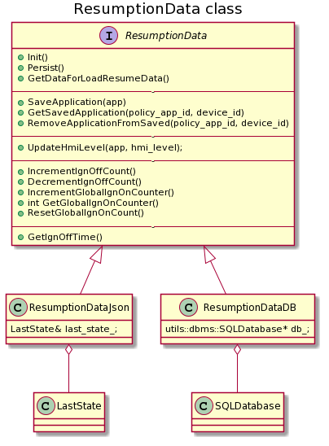
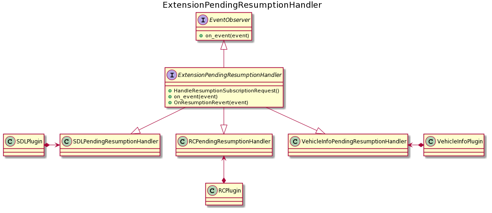
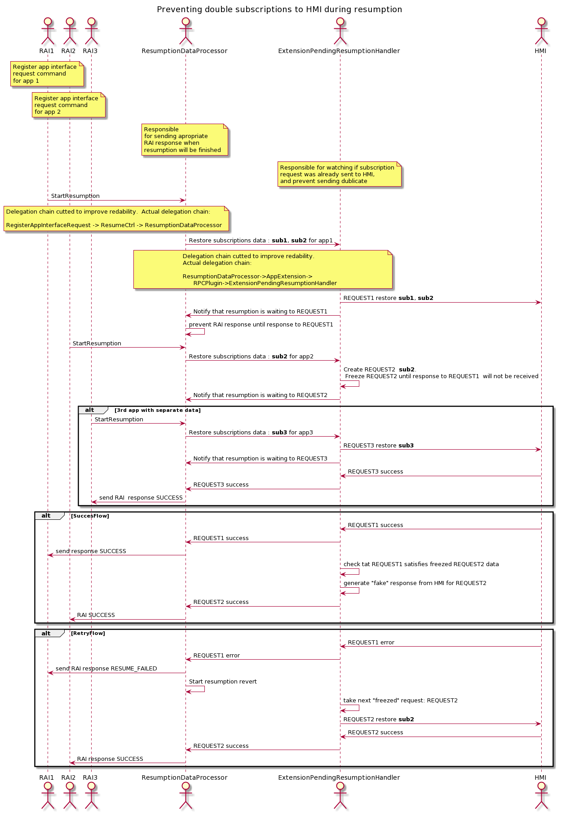

# Resume Controller

This page will describe internal structure and detailed design of Resume controller 

|||
Figure 1: ResumeController Overview

|||

!!! NOTE
Classes named like *Impl only _represent_ implementations of the abstract sub classes and may not be named the same in the SDL Core project.
UML Refresher

* Aggregation: Solid line with open diamond
* Composition: Solid line with filled diamond
* Inheritance: Dotted line with open arrow
* Dependency: Dotted line with two prong arrow
!!!

## Resume Controller

The resume controller's responsibility is to handle the resumption responsibilities of SDL.
There are 2 resumption types :

 * HMI state resumption
 * Data resumption

The resume controller does both.

### HMI state resumption

In the case of unexpected disconnect SDL should store an application's HMI state for the next 3 ignition cycles.
On next application registration SDL should restore last saved application HMI state.

ResumptionData is responsible for application data restoring.
ResumeCtrlImpl is responsible for HMI state restoring. 

ResumeCtrlImpl will remove application hmi_state info from resumption data after 3 ignition cycles. 
On each shutdown ResumeCtrlImpl will increment `ign_off_count` value for each application.

On App registration `ResumeCtrl::StartResumptionOnlyHMILevel` or `ResumeCtrlImpl::StartResumption` will put aplication in a queue for resumption. 
Internal timer in ResumeCtrlImpl will restore application hmi_state in several seconds (configured by `ApplicationManagerSettings::app_resuming_timeout`)
In the case where another application has already registered, the StateController will take care of resolving any HMI state conflicts. 

### Data resumption

SDL restores application data if an application sends the appropriate `hashID ` in the RegisterAppInterface request. This hash updates after each data change.
SDL stores resumption data either in json or in database, this option is configurable. 

ResumeControllerImpl requests app data from `ResumptionData` class and provides it to `ResumptionDataProcessor`

`ResumptionDataProcessor` is responsible for restoring application data and provides the result to RegisterAppInterface via a callback.

|||
Figure 2: Resumption data sequence Overview

|||

### ResumptionData

`ResumptionData` class is used to represent resumption data agnostic to data storage. 
`ResumptionData` provides app resumption data in the Smart Object representation. 

|||
Figure 2: Resumption data classes

|||

There are 2 implementations of resumption data : 
 * `ResumptionDataJson`
 * `ResumptionDataDB`

 `ResumptionData` does not contain active components : timers, reactions, callbacks, etc ...
 It is responsible fo data storage.

### ResumptionDataProcessor

`ResumptionDataProcessor` is responsible for restoring resumption data and tracking its status. 

Main public function for resumptions is `ResumptionDataProcessor::Restore` : 
```cpp
  /**
  * @brief Running resumption data process from saved_app to application.
  * @param application application which will be resumed
  * @param saved_app application specific section from backup file
  */
  void Restore(app_mngr::ApplicationSharedPtr application,
               smart_objects::SmartObject& saved_app,
               ResumeCtrl::ResumptionCallBack callback);
```

`ResumeCtrl::ResumptionCallBack callback` is a function that should be called after data resumption : 
```cpp
typedef std::function<void(mobile_apis::Result::eType result_code,
                             const std::string& info)> ResumptionCallBack;
```

 - Some resumption data should be restored in the `Application` class itself.
 - Some resumption data should be stored in plugins : ApplicationExtensions. 
 - Some resumption data requires sending HMI requests.

`ResumptionDataProcessor` is inherited from `EventObserver` to track responses. 

If all responses are successful `ResumptionDataProcessor` will call `callback(SUCCESS)`

If some of the data failed to restore, `ResumptionDataProcessor` will revert already restored data and call  `callback(ERROR_CODE, info)`.

The requirements are available in proposal 0190: [Handle response from HMI during resumption data](https://github.com/smartdevicelink/sdl_evolution/blob/master/proposals/0190-resumption-data-error-handling.md)

RegisterAppInterface will wait for the callback to send a response to a mobile application.

### AppExtension

Application extension contains follwowing methods for resumption : 
```cpp
  /**
   * @brief SaveResumptionData method called by SDL when it saves resumption
   * data.
   * @param resumption_data data reference to data, that will be appended by
   * plugin
   */
  virtual void SaveResumptionData(
      smart_objects::SmartObject& resumption_data) = 0;

  /**
   * @brief ProcessResumption Method called by SDL during resumption.
   * @param resumption_data list of resumption data
   * @param subscriber callbacks for subscribing
   */
  virtual void ProcessResumption(
      const smart_objects::SmartObject& resumption_data,
      resumption::Subscriber subscriber) = 0;

  /**
   * @brief RevertResumption Method called by SDL during revert resumption.
   * @param subscriptions Subscriptions from which must discard
   */
  virtual void RevertResumption(
      const smart_objects::SmartObject& subscriptions) = 0;
```

Only an application's extension have an access to active data, data send and data revert process. 
Each application extension uses its own plugin to manipulate with functionality. 

`SaveResumptionData` will fill passed `resumption_data` for saving to `ResumptionData`. 

|||
Example from VehicleInfoAppExtension: 
```cpp
SDLRPCPlugin& plugin_;
...
void VehicleInfoAppExtension::SaveResumptionData(
    smart_objects::SmartObject& resumption_data) {
  resumption_data[strings::application_vehicle_info] =
      smart_objects::SmartObject(smart_objects::SmartType_Array);
  int i = 0;
  for (const auto& subscription : subscribed_data_) {
    resumption_data[strings::application_vehicle_info][i++] = subscription;
  }
}
```
|||

`ProcessResumption` will send appropriate HMI requests, and change internal SDL state according to provided `resumption_data`. All HMI responses will be transferred to `subscriber`.

|||
Example from SDLAppExtension: 
```cpp
SDLRPCPlugin& plugin_;
...
void SDLAppExtension::ProcessResumption(
    const smart_objects::SmartObject& saved_app,
    resumption::Subscriber subscriber) {
  ...
  const bool subscribed_for_way_points =
      saved_app[strings::subscribed_for_way_points].asBool();
  if (subscribed_for_way_points_so) {
    plugin_.ProcessResumptionSubscription(app_, *this, subscriber);
  }
}
```

`resumption::Subscriber` is the function that will notify ResumptionDataProcessor about request sent to HMI by plugin in scope of resumption.
This will inform ResumptionDataProcessor that it should wait for a response before finishing resumption and sending RAI response to mobile.
|||

`RevertResumption` will send the appropriate HMI requests to revert provided `subscriptions`.


`ResumptionDataProcessor` goes through all `application->Extensions` to track responses and sets itself as `subscriber`: 

```cpp
void ResumptionDataProcessor::AddPluginsSubscriptions(
    ApplicationSharedPtr application,
    const smart_objects::SmartObject& saved_app) {
  LOG4CXX_AUTO_TRACE(logger_);

  for (auto& extension : application->Extensions()) {
    extension->ProcessResumption(
        saved_app,
        [this](const int32_t app_id, const ResumptionRequest request) {
          this->WaitForResponse(app_id, request);
        });
  }
}
```

## Resumption of Subscriptions

If multiple applications are trying to restore the same subscription, SDL should send the only first subscription to HMI. If the first subscription was failed and the application received `RESUME_FAILED` result code, for the second application SDL should also try to restore the subscription.

For the waiting subscription result, SDL uses the `ExtensionPendingResumptionHandler` class.
Each plugin contains its own ExtensionPendingResumptionHandler for subscriptions resumption.

|||
ExtensionPendingResumptionHandler overview

|||

For subscriptions resumption plugin calls `ExtensionPendingResumptionHandler::HandleResumptionSubscriptionRequest(app_extension,
subscriber, application)`

`subscriber` here is `ResumptionDataProcessor::WaitForResponse` function for `ResumptionDataProcessor`  for tracking list of sent requests to HMI and track if all requests have been processed before responding to the RegisterAppInterface request.

`ExtensionPendingResumptionHandler` sends requests to HMI for all subscriptions available in `app_extension` and tracks responses with the `on_event` method inherited from `EventObserver`.

In the case some subscription request to the HMI was already sent but the response was not received yet,`ExtensionPendingResumptionHandler` will not send an additional request to HMI but store internally that appropriate subscription resumption is "frozen". When the response is received from the HMI, SDL will manage both resumptions according to response data.
For "frozen" resumptions ExtensionPendingResumptionHandler will raise an event so that `subscriber` (ResumeDataProcessor) will receive this event and understand it as response from HMI. 

|||
Subscriptions restore sequence : 

|||


OnResumptionRevert is used to trigger the next frozen resumption if no requests are currently waiting for a response.
