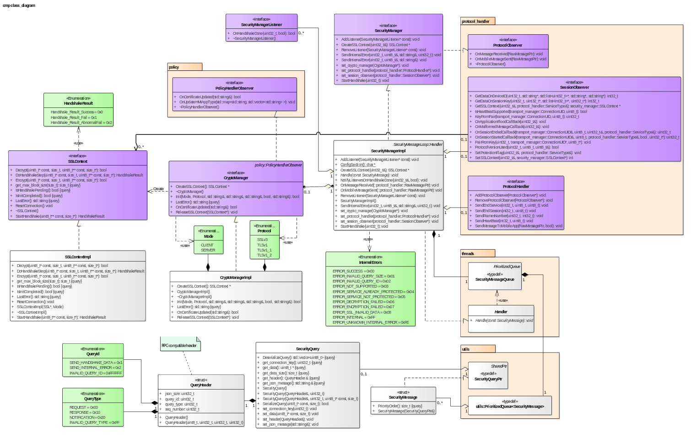
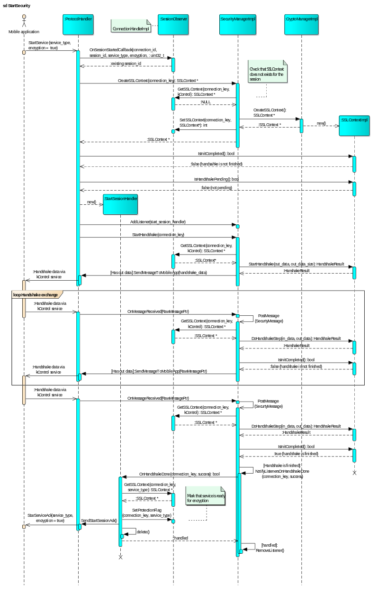
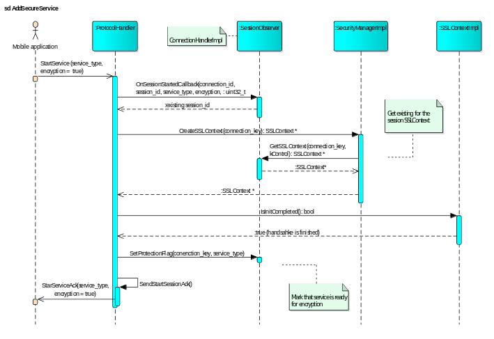
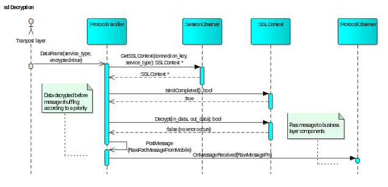
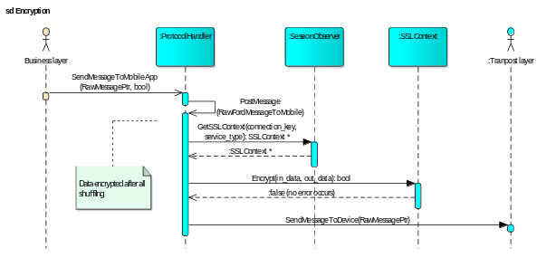

# Security Manager Guide

### What is the Security Manager?

Secure communication in SDL Core is provided by the Security Manager interface, implemented in Core as the [SecurityManagerImpl](https://github.com/smartdevicelink/sdl_core/blob/master/src/components/security_manager/src/security_manager_impl.cc).

Under the hood the Security Manager uses OpenSSL to complete handshakes and encrypt/decrypt data. All OpenSSL operations are abstracted away by the [Crypto Manager](https://github.com/smartdevicelink/sdl_core/blob/master/src/components/security_manager/src/crypto_manager_impl.cc) - which provides a factory for SSL Context objects, the ability to update certificates from Certificate Authorities and SSL error reporting. The SSL Context objects created by the Crypto Manager can be used to establish SSL connections, as well as to encrypt or decrypt data. Events within the Security Manager will be propagated to any Security Manager Listeners that register with the Security Manager. The [Protocol Handler implementation](https://github.com/smartdevicelink/sdl_core/blob/master/src/components/protocol_handler/src/protocol_handler_impl.cc) in Core implements the [SecurityManagerListener interface](https://github.com/smartdevicelink/sdl_core/blob/master/src/components/include/security_manager/security_manager_listener.h) in order to send protocol layer responses to handshakes.

### What events are generated?

#### OnHandshakeDone

When a handshake has been completed, the `OnHandshakeDone` is called on each registered `SecurityManagerListener`. This function is called with two parameters: the connection key, and a `HandshakeResult` enum value (one of Fail, Success, or CertExpired)

#### OnCertificateUpdateRequired

When a handshake is initiated and the connection does not have a valid certificate, `OnCertificateUpdateRequired` will be called on each registered [SecurityManagerListener](https://github.com/smartdevicelink/sdl_core/blob/master/src/components/include/security_manager/security_manager_listener.h). This could be either because no certificate was supplied for the connection or because the certificate is expired.

#### OnGetSystemTimeFailed

If the Security Manager fails to get the system time from the HMI, `OnGetSystemTimeFailed` will be called on each registered [SecurityManagerListener](https://github.com/smartdevicelink/sdl_core/blob/master/src/components/include/security_manager/security_manager_listener.h).

#### OnCertDecryptFailed

If the Security Manager fails to decrypt a certificate, `OnCertDecryptFailed` will be called on each registered [SecurityManagerListener](https://github.com/smartdevicelink/sdl_core/blob/master/src/components/include/security_manager/security_manager_listener.h).

#### OnPTUFailed

If a PTU fails, each registered `SecurityManagerListener` is notified with the OnPTUFailed event.

### Sequence Diagrams

#### Security Manager Component Hierarchy

To further understand the relationship between the components of the security manager, please take a look at this UML diagram.

|||
Security Manager UML

|||

#### Security Manager Initialization

To understand how the security manager is initialized, please take a look at this flow diagram.

|||
Security Manager Initialization

|||

#### Security Manager Add Encrypted Service

To understand what the security manager does to start an encrypted service after it has been initialized, please take a look at this flow diagram.

|||
Security Manager Add Encrypted Service

|||

#### Security Manager Decrypt

To understand how the Security Manager decrypts data, please take a look at this flow diagram.

|||
Security Manager Decryption

|||

#### Security Manager Encrypt

To understand how the Security Manager encrypts data, please take a look at this flow diagram.

|||
Security Manager Encryption

|||
