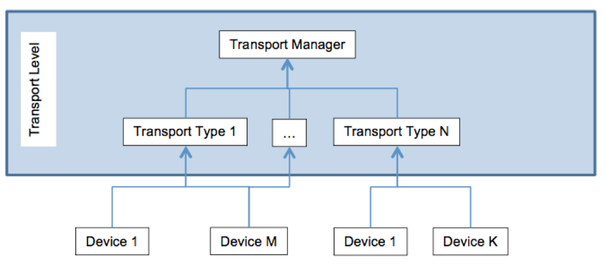
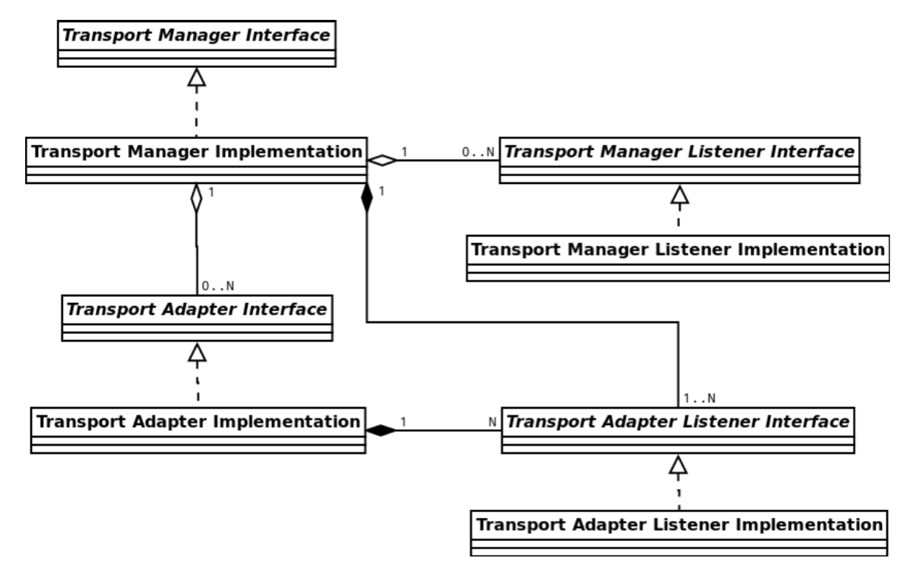
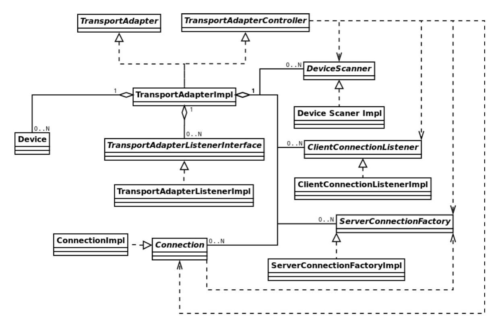
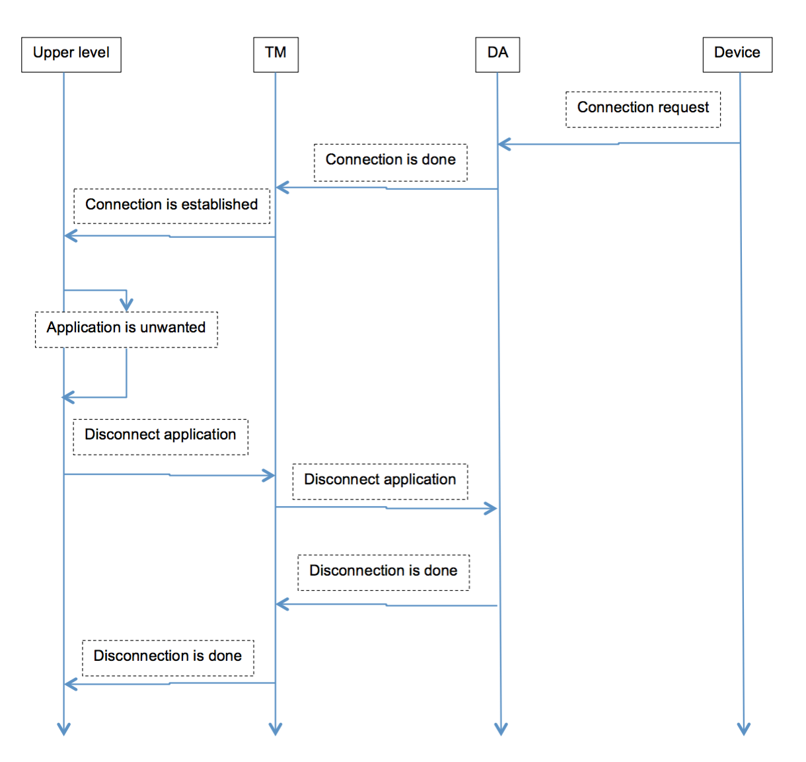
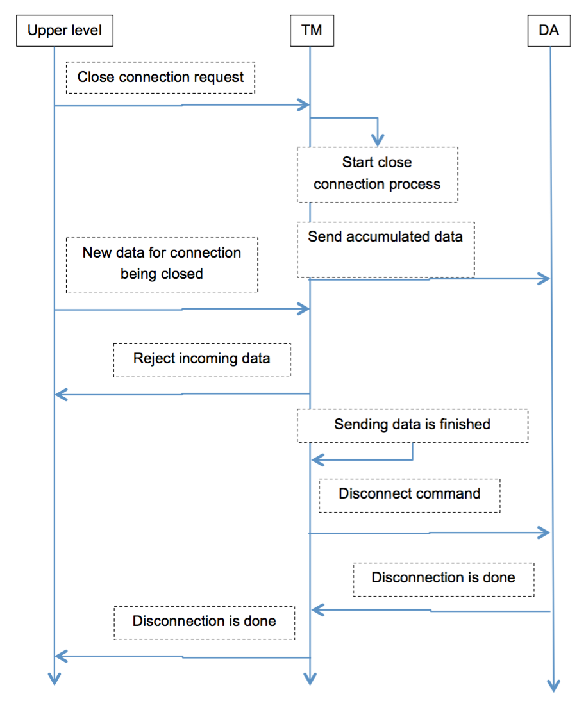

# Transport Programming Guide

This guide will explain how transports work in SDL Core. We will highlight the responsibilities of each interface as well as look at some examples of transports already implemented in SDL Core. First let's take a look at Figure 1, a diagram showing the hierarchy of the main transport components and then we will work our way down the diagram describing each component.

|||
Figure 1: Transport Overview

|||

## Transport Manager

The Transport Manager is responsible for routing commands and messages between the transport adapters and other major components in SDL Core. A Transport Manager can contain any number of Transport Adapters, each of which is responsible for handling communication via one type of transport, such as TCP or Bluetooth. The Transport Manager also contains data necessary to handle its responsibilities, such as a mapping of each device to the Transport Adapter it uses to communicate. Other components within SDL Core are also able to register a Transport Manager Listener with the manager, which will receive events from the Transport Manager. The default Transport Manager follows the singleton pattern, but this is not necessary if you would like to use a custom solution.

#### Transport Manager Inheritance Structure

|||
Figure 2: Transport Manager UML Diagram

|||

!!! NOTE
Classes named like *Impl only _represent_ implementations of the abstract sub classes and may not be named the same in the SDL Core project.

UML Refresher

* Aggregation: Solid line with open diamond
* Composition: Solid line with filled diamond
* Inheritance: Dotted line with open arrow
* Dependency: Dotted line with two prong arrow
!!!

## Transport Adapter

Each Transport Adapter is responsible for one specific type of connection, such as TCP or Bluetooth. Similar to Transport Managers, other components in Core are able to register a Transport Adapter Listener with a Transport Adapter to later receive events from the Adapter such as `OnConnectDone`. The Transport Adapter will contain the code to connect and disconnect devices, as well as send and receive data. Depending on the transport type, a transport adapter may implement sub-components, called workers, such as a Device Scanner, a Client Connection Listener, or a Server Connection Factory. Currently, Transport Adapters are registered with the Transport Manager within the [TransportManagerDefault::Init](https://github.com/smartdevicelink/sdl_core/blob/develop/src/components/transport_manager/src/transport_manager_default.cc#L62) method; you can add code here to include your custom Transport Adapter. Depending on your implementation, most of the functionality of the Transport Adapter will likely live in the workers. Two big functions that will for sure need to be implemented in a Transport Adapter are Store() and Restore() which are used to save and resume the state of the Adapter when there is an unexpected disconnect or SDL Core is restarted. In the case of the [TCP Transport Adapter](https://github.com/smartdevicelink/sdl_core/blob/master/src/components/transport_manager/src/tcp/tcp_transport_adapter.cc), the Store() function will save a list of devices' names and addresses, along with the applications each device was running and their corresponding port number. When resuming, Restore() will reconnect to the devices saved in the last state and resumes communication with the the applications on each device.

```
// tcp_transport_adapter.cc
// Code has been heavily simplified and whitespace has been added for readability.

void TcpTransportAdapter::Store() const {
  Json::Value devices_dictionary;

  for (Device* tcp_device : GetDeviceList()) {
    if (!tcp_device) { continue; } // device could have been disconnected

    Json::Value device_dictionary;
    device_dictionary["name"] = tcp_device->name();
    device_dictionary["address"] = tcp_device->in_addr();

    Json::Value applications_dictionary;
    for (ApplicationHandle app_handle : tcp_device->GetApplicationList()) {
      if (FindEstablishedConnection(tcp_device->unique_device_id(),
                                    app_handle)) {
        int port = tcp_device->GetApplicationPort(app_handle);
        if (port != -1) {  // don't want to store incoming applications
          applications_dictionary.append(std::string(port));
        }
      }
    }

    if (!applications_dictionary.empty()) {
      device_dictionary["applications"] = applications_dictionary;
      devices_dictionary.append(device_dictionary);
    }
  }

  Json::Value& dict = last_state().get_dictionary();
  dict["TransportManager"]["TcpAdapter"]["devices"] = devices_dictionary;
}
```

#### Transport Adapter Inheritance Structure

|||
Figure 3: Transport Adapter UML Diagram

|||

!!! NOTE
Classes named like *Impl only _represent_ implementations of the abstract sub classes and may not be named the same in the SDL Core project.

UML Refresher

* Aggregation: Solid line with open diamond
* Composition: Solid line with filled diamond
* Inheritance: Dotted line with open arrow
* Dependency: Dotted line with two prong arrow
!!!

### Transport Adapter Workers

The Client Connection Listener implements receiving a connection that is originated by a device. This will typically wait for connection from a device, then establish that connection, finally alerting the Transport Manager via the Transport Manager Listener of the newly connected device and app IDs. The TCP transport adapter has a good [example implementation](https://github.com/smartdevicelink/sdl_core/blob/master/src/components/transport_manager/src/tcp/tcp_client_listener.cc) of a Client Connection Listener.

The Server Connection Factory implements a connection that is originated from Core. For example, Core reaches out to a predefined web address to start a cloud websocket application. This type of communication requires that the Transport Adapter knows of the device and application in advance. When this connection is created, the Transport Adapter will alert the Transport Manager of the new devices and applications in a similar fashion to other workers. [USB](https://github.com/smartdevicelink/sdl_core/blob/master/src/components/transport_manager/src/usb/usb_connection_factory.cc) and [Bluetooth](https://github.com/smartdevicelink/sdl_core/blob/master/src/components/transport_manager/src/bluetooth/bluetooth_connection_factory.cc) are additional examples that implement this sub-component.

The Device Scanner is responsible for scanning for new devices to connect with. When a device is found, this worker is responsible for alerting the Transport Adapter, as well as alerting the Transport Manager via the Transport Adapter Listener. Next, the Transport Manager will instruct the Transport Adapter to connect with the devices. The Bluetooth Transport Adapter has a great [example implementation](https://github.com/smartdevicelink/sdl_core/blob/master/src/components/transport_manager/src/bluetooth/bluetooth_device_scanner.cc) of the Device Scanner that search for bluetooth services advertising the SDL bluetooth UUID.

Depending on what your type of transport is, whether Core will be the server or the client, you will likely implement either the Client Connection Listener or the Server Connection Factory.

#### Client Connection Listener

Using the [TCP Transport Adapter](https://github.com/smartdevicelink/sdl_core/blob/master/src/components/transport_manager/src/tcp/tcp_client_listener.cc) as an example for a client connection listener implementation, let's take a look at `Init()`.

```
// tcp_client_listener.cc
// Code has been simplified and whitespace has been added for readability.
// Thank you to Sho Amano for the helpful comments.

TransportAdapter::Error TcpClientListener::Init() {
  thread_stop_requested_ = false;

  if (!IsListeningOnSpecificInterface()) {
    // Network interface is not specified. We will listen on all interfaces
    // using INADDR_ANY. If socket creation fails, we will treat it an error.
    socket_ = CreateIPv4ServerSocket(port_);
    if (-1 == socket_) {
      LOG("Failed to create TCP socket");
      return TransportAdapter::FAIL;
    }
  } else {
    // Network interface is specified and we will listen only on the interface.
    // In this case, the server socket will be created once
    // NetworkInterfaceListener notifies the interface's IP address.
    LOG("TCP server socket will listen on " << designated_interface_
                     << " once it has an IPv4 address.");
  }

  if (!interface_listener_->Init()) {
    if (socket_ >= 0) {
      close(socket_);
      socket_ = -1;
    }
    return TransportAdapter::FAIL;
  }

  initialized_ = true;
  return TransportAdapter::OK;
}
```

The Init() function is called one time to prepare the Transport Adapter for its work. If the initialization work within this function succeeds, `initialized_` should be set to true. In the case of the TCP Client Listener, the Init() method will create the socket and initialize the interface listener. It is worth noting that the interface listener is specific to the TCP Client Listener and contains the lower level code to accept TCP connections such as the socket() and bind() syscalls. A similar component is not necessary. The opposite of Init() is the Terminate() method which handles shutting down the transport adapter. On the TCP Client Listener, this involves destroying the socket and de-initializing the interface listener.

```
// tcp_client_listener.cc
// Code has been simplified and whitespace has been added for readability.

TransportAdapter::Error TcpClientListener::StartListening() {
  if (started_) {
    LOG("TransportAdapter::BAD_STATE. Listener has already been started");
    return TransportAdapter::BAD_STATE;
  }

  if (!interface_listener_->Start()) {
    return TransportAdapter::FAIL;
  }

  if (!IsListeningOnSpecificInterface()) {
    TransportAdapter::Error ret = StartListeningThread();
    if (TransportAdapter::OK != ret) {
      LOG("Tcp client listener thread start failed");
      interface_listener_->Stop();
      return ret;
    }
  }

  started_ = true;
  LOG("Tcp client listener has started successfully");
  return TransportAdapter::OK;
}
```

The next set of functions to implement are StartListening() and ResumeListening(), which are fairly similar, both setting `started_` to true when they are ready to send and receive data. In the case of the TCP Client Listener, ResumeListening initializes the interface listener, and starts the listening thread. StartListening follows a very similar pattern of behavior but calls Start() on the interface listener instead of Init().

```
// tcp_client_listener.cc
// Code has been simplified and whitespace has been added for readability.

TransportAdapter::Error TcpClientListener::StopListening() {
  if (!started_) {
    LOG("TcpClientListener is not running now");
    return TransportAdapter::BAD_STATE;
  }

  interface_listener_->Stop();

  StopListeningThread();

  started_ = false;
  LOG("Tcp client listener was stopped successfully");
  return TransportAdapter::OK;
}
```

The StopListening() and SuspendListening() functions do about the opposite, both stop the TCP Client Listener delegate thread and then set `started_` to false. The difference between the two functions on the TCP Client Listener is that StopListening() will also stop the Platform Specific Network Interface Listener's delegate thread. When SuspendListening() is called, SDL will not be able to create new connections, but existing connections are still able to communicate data. StopListening() will also kill communication with existing connections.

#### Server Connection Factory

The Server Connection Factory has the method CreateConnection() which, provided with a device UID and application handle, creates a connection to the application, and then should call ConnectionCreated() on the Transport Adapter.

```
// bluetooth_connection_factory.cc
// Code has been simplified and whitespace has been added for readability.

TransportAdapter::Error BluetoothConnectionFactory::CreateConnection(
    const DeviceUID& device_uid, const ApplicationHandle& app_handle) {
  auto connection = std::make_shared<BluetoothSocketConnection>(
          device_uid, app_handle, controller_);
  controller_->ConnectionCreated(connection, device_uid, app_handle);

  TransportAdapter::Error error = connection->Start();
  if (TransportAdapter::OK != error) {
    LOG("Bluetooth connection::Start() failed with error: "
            << error);
  }

  return error;
}
```

#### Device Scanner

The TCP Transport Adapter does not use a device scanner because it waits for incoming connections. We will use the [Bluetooth Transport Adapter’s Device Scanner](https://github.com/smartdevicelink/sdl_core/blob/master/src/components/transport_manager/src/bluetooth/bluetooth_device_scanner.cc) as an example here.

The Init() function is called once and is responsible for preparing for the life-cycle of your device scanner. Here, the bluetooth device scanner will start the device scanner worker thread. This worker thread will either scan for devices repeatedly or only when requested via a conditional variable. This behavior is determined by the second and third parameters to the constructor, a boolean `auto_repeat_search` and an integer `auto_repeat_pause_sec`. If `auto_repeat_search` is set to false, the device scanner will only scan when instructed to, otherwise it will scan every `auto_repeat_pause_sec` seconds.

```
// bluetooth_device_scanner.cc
// Code has been simplified and whitespace has been added for readability.

void BluetoothDeviceScanner::Terminate() {
  shutdown_requested_ = true;

  if (thread_) {
    {
      sync_primitives::AutoLock auto_lock(device_scan_requested_lock_);
      device_scan_requested_ = false;
      device_scan_requested_cv_.NotifyOne();
    }

    LOG("Waiting for bluetooth device scanner thread termination");
    thread_->stop();
    LOG("Bluetooth device scanner thread stopped");
  }
}
```

The Terminate() function is called when Core begins shutting down. It will be responsible for telling the worker thread to finish up.
In the case of the bluetooth device scanner, the destructor will join the thread that was started in Init() and cleanup after it.

```
// bluetooth_device_scanner.cc
// Code has been simplified and whitespace has been added for readability.

TransportAdapter::Error BluetoothDeviceScanner::Scan() {
  if (!IsInitialised() || shutdown_requested_) {
    LOG("BAD_STATE");
    return TransportAdapter::BAD_STATE;
  }

  if (auto_repeat_pause_sec_ == 0) {
    return TransportAdapter::OK;
  }

  sync_primitives::AutoLock auto_lock(device_scan_requested_lock_);
  if (!device_scan_requested_) {
    LOG("Requesting device Scan");
    device_scan_requested_ = true;
    device_scan_requested_cv_.NotifyOne();
  } else {
    return TransportAdapter::BAD_STATE;
  }

  return TransportAdapter::OK;
}
```

```
// bluetooth_device_scanner.cc
// Code has been simplified and whitespace has been added for readability.

void BluetoothDeviceScanner::UpdateTotalDeviceList() {
  std::vector<Device*> devices;
  devices.insert(devices.end(),
    paired_devices_with_sdl_.begin(), paired_devices_with_sdl_.end());
  devices.insert(devices.end(),
    found_devices_with_sdl_.begin(), found_devices_with_sdl_.end());

  controller_->SearchDeviceDone(devices);
}
```

The Scan() function returns an error code, not the actual results of the scan. When the scanning is complete, all devices (existing and newly found) will be passed to the Transport Adapter via the function SearchDeviceDone(). In the Bluetooth device scanner, the Scan() function will signal to the scanning thread that a device scan was requested.

## Operation Examples

|||
New Device Connection

|||

|||
Connection Close Command

|||

## Creating a Connection

### Core as the Server

Creating a connection with Core acting as the server means that the connection is initiated by a device trying to connect to Core. In the case of the TCP Transport Adapter, this all begins with a device connecting to Core on port 12345. The TCP Connection Listener's loop waits for a new connection to it's socket before adding that device to the device list (if it doesn't already exist) and adding the new application to the app list. Once the application has registered and the HMI has received the updated app list, selecting the TCP application in the HMI shall prompt it to activate.

### Core as the Client

Creating a connection with Core acting as the client means that the connection is initiated by Core. This means that Core must know in advance how to create the connection. In the case of Cloud applications, their endpoints and names are stored in the policy table enabling them to immediately be included in the app list. When a user activates an application in the HMI, Core will open a web socket connection to the endpoint defined in the policy table and the app may start the RPC service.

## Sending and Receiving Data

### Sending

Sending data to a device is initiated by the `SendMessageToMobile` method on the RPC Service. This method will post the message to the Protocol Handler and end up in `SendMessageToMobileApp`. This method will, depending on the size of the message, call `SendSingleFrameMessage` or `SendMultiFrameMessage` which will place the messages in the _messages to mobile_ queue. Another thread within the Protocol Handler processes messages from this queue and eventually passes them to `SendMessageToDevice` on the transport manager. This again adds the messages to a queue that another thread on the Transport Manager drains, passing the message to the Transport Adapter corresponding to the active Connection. Finally, `SendData` on the Transport Adapter which does the actual sending of the raw data. It is good to note that in some of the existing Transport Adapters, the code to actually transmit data is in `SendData` on the Connection object, and the Transport Adapter `SendData` call will be forwarded to `SendData` on the Connection object.

### Receiving

The code to receive data will vary depending on the method of transport; in the case of the TCP Transport Adapter, the Socket Connection thread loops checking if data bas been sent to it's socket before calling `recv` and converting the read buffer to a raw message. When a Transport Adapter finishes receiving incoming message(s) it will emit the event OnReceivedDone. This event will be propagated to the Transport Manager Listeners including the Protocol Handler who will add the message(s) to the _messages from mobile_ queue which is processed by another thread within the Protocol Handler.

## Events

### Transport Adapter Events

These events are generated by a Transport Adapter and forwarded to a Transport Adapter Listener who will in turn post the event to the Transport Manager who will finally raise the event to the Transport Manager Listeners. The only exception is OnSendFail, which is not forwarded from the Transport Manager to the Transport Manager Listeners.

**OnSearchDone**

Indicates that a device search has completed. In the case of the USB Transport Adapter, this event is emitted by the Device Scanner after a scan has completed.

**OnSearchFail**

Indicates that a device search has encountered an error. In the case of the Bluetooth Transport Adapter, this event is emitted by the Device Scanner when Core fails to correctly interact with the bluetooth hardware.

**OnDeviceListUpdated**

Indicates that the list of connected devices has been updated. This event will be emitted when `AddDevice`, `RemoveDevice` or `SearchDeviceDone` is called on the transport adapter.

**OnFindNewApplicationsRequest**

Indicates that SDL Core should begin to check for new applications on newly connected devices. This event is emitted by the Bluetooth Device Scanner once it has connected to new devices and updated the device list.

**OnConnectDone**

Indicates that a connection has been established. The Transport Manager will then add the connection to the connection list if it has not already been added. In the case of the cloud websocket transport adapter, this event is emitted once the connection handshake is completed.

**OnDisconnectDone**

Indicates that disconnecting from an application has completed and prompts the Transport Manager to remove the connection from the connection list. In the case of the websocket Transport Adapter, this event is emitted after the delegate threads for the connection have been stopped.

**OnSendDone**

Indicates that a Transport Adapter has finished sending the messages in it's queue. Upon receipt of this event the Transport Manager will check if the connection is slated for shutdown and disconnect it if so.

**OnSendFail**

Indicates that a Transport Adapter failed to send a message properly. This could prompt the transport manager to take action that would reconcile the errors. This event is not currently raised to the Transport Manager Listeners.

**OnReceivedDone**

Indicates that a Transport Adapter has successfully received a message. The received data is eventually passed to Transport Manager Listeners which will process that data.

**OnReceivedFail**

Indicates that a Transport Adapter has failed to properly receive a message.

**OnUnexpectedDisconnect**

Indicates that a device has been unexpectedly disconnected. This event could be emitted in the case of a device being disconnected or a connection being aborted. This event will prompt the Transport Manager to remove the disconnected connection.

**OnTransportSwitchRequested**

Indicates that a transport switch has been requested. This will prompt the Transport Manager to begin transport switching.

**OnTransportConfigUpdated**

Indicates that the Transport Config has been updated. This will prompt the Protocol Handler (a Transport Manager Listener) to check for updates to things like the TCP listening address and port.

**OnConnectPending**

Indicates that a connection is pending. The Transport Manager will then add the connection to the connection list if it has not already been added. In the case of the cloud websocket transport adapter, this event is emitted once a connection configuration is known to SDL Core, but before the connection is actually established.

**OnConnectionStatusUpdated**

Indicates that the status of one or more connections has been updated, and SDL Core should send an `UpdateAppList` RPC to the HMI. This will be emitted by the Transport Adapter during device connection and also when a device is disconnected.


### Transport Manager Listener Events

These events are created in the Transport Manager and only raised to the Transport Manager Listeners.

**OnDeviceAdded** and **OnDeviceRemoved**

These two events are fired when `UpdateDeviceList` is called on the Transport Manager. One OnDeviceAdded event will be dispatched for each new device in the list and one OnDeviceRemoved will be dispatched for each device that is no longer in the list.

**OnDeviceFound**

When `UpdateDeviceMapping` is called on the Transport Manager, it ensures all devices from a Transport Adapter's device list are accounted for in the device to adapter map. OnDeviceFound will be raised for any new devices that weren't previously in the device to adapter map.

**OnDeviceSwitchingStart**

When `TryDeviceSwitch` is called on the Transport Manager following an OnTransportSwitchRequested event, the OnDeviceSwitchingStart event is raised with both the bluetooth and USB device UIDs.
