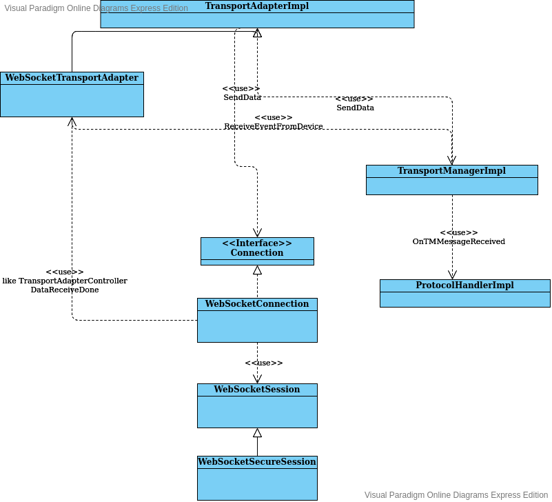
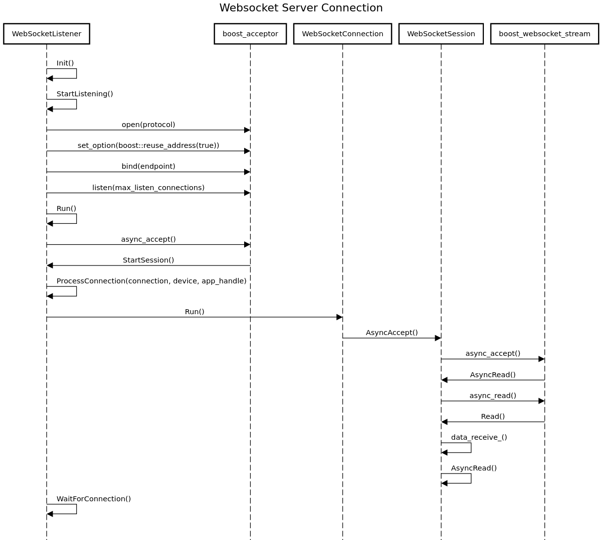

# Web Engine Application Guide

- What is a web engine app?
- What is the new transport that web engine apps use?

## Web Engine Apps

A web engine app is a web application that runs within the vehicle. This is made possible by an OEM hosted "app store" which distributes approved "app bundles." The HMI will decompress these app bundles and launch the entrypoint which will use the SDL JavaScript (JS) library to interact with SDL Core.

App bundles are zip compressed archives containing the following files:

#### manifest.js
manifest.js is a javascript file that exports the following application properties:

- `entrypoint`
    - A relative path within the bundle to the HTML file that will be launched by the HMI
    - This HTML file must include the manifest.js file as a script
- `appIcon`
    - A relative path to the app icon within the app bundle
- `appId`
    - The `policyAppId` of this application
- `appName`
    - The app name that should be displayed in the app store or in the app list
- `category`
    - The primary `appHMIType` of the web engine application
- `additionalCategories`
    - Additional `appHMIType`s of the web engine application
- `locales`
    - A map of other languages to alternate names and icons
- `appVersion`
    - The current version of the application
- `minRpcVersion`
    - The minimum supported RPC spec version
- `minProtocolVersion`
    - The minimum supported protocol spec version

#### sdl.js
sdl.js contains the SDL JS library used to interact with SDL Core.

#### Other supporting javascript files
All other HTML / JS files used to run the application.

### Example Application

To see an example web engine application, take a look at [the example in the javascript suite on GitHub](https://github.com/smartdevicelink/sdl_javascript_suite/tree/develop/examples/webengine/hello-sdl).

### Launching a Webengine App

In order for a Web Engine application to appear on the SDL app list, the HMI must notify SDL Core about newly installed Web Engine applications by sending a `BasicCommunication.SetAppProperties`. The properties sent in this request will be stored in Core's policy table and the information will stay persistent between ignition cycles. 

!!! note
Not all parameters in the `AppProperties` struct apply to Web Engine Apps. Web Engine Apps should omit `endpoint` and `authToken`.
!!!

When the user activates a Web Engine application, the HMI will use information from the manifest.js to launch the entrypoint HTML (our development HMIs do this by creating an invisible iframe). Here, the app will begin execution on the head unit and eventually call `RegisterAppInterface`. When the HMI receives an `OnAppRegistered` notification signalling that the web engine app has successfully registered, the HMI should then send Core an `ActivateApp` request.

## WebSocket Server Transport

In order to support the Webengine feature, a websocket server transport was added to SDL Core. This contrasts to the websocket client transport in SDL Core that is used by Java Cloud applications. When the HMI launches a web engine application, it will provide Core's hostname and port as query parameters to the entrypoint of the web engine application. This transport supports both secure and non-secure websocket communication, which is also determined by a query parameter passed to the entrypoint HTML file of the web engine application.

These are the accepted values for the sdl-transport-role parameter:

- ws-server
- ws-client
- wss-server
- wss-client
- tcp-server
- tcp-client

Example URL with query parameters: `file://somewhere/HelloSDL/index.html?sdl-host=localhost&sdl-port=12345&sdl-transport-role=wss-server`

#### Secured Websocket Connections

Websocket server transport will only run if either all three of these are valid or if none are provided:

- WSServerCertificatePath (path to websocket server certificate)
- WSServerKeyPath (path to websocket server private key path)
- WSServerCACertificatePath (path to CA certificate)

If all three are provided, SDL Core will use WebSocket Secure, otherwise, Core will use regular WebSocket communication. These values can be set in the smartDeviceLink.ini configuration file.

#### Websocket Server Component Hierarchy

Please refer to the following digram which describes the hierarchy of transport components for the Websocket Server transport adapter.

|||
Websocket Server Hierarchy

|||

#### Websocket Server Init Sequence

Please refer to the following diagram that describes the initialization sequence when SDL Core is started.

|||
Websocket Server Connection Sequence

|||

