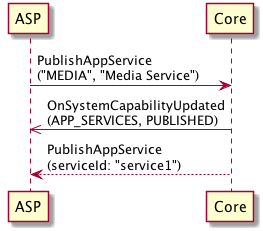
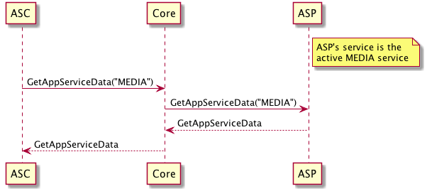
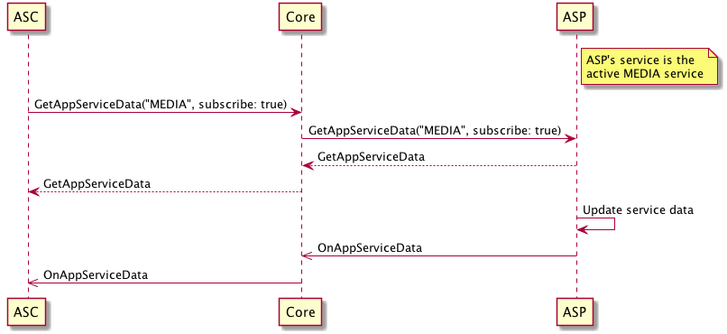
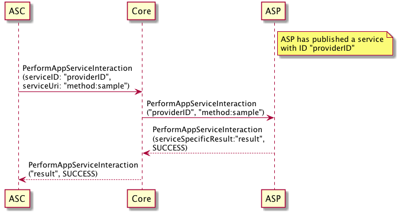

# App Service Guidelines

This page gives a detailed look at the App Service feature in SDL Core, as well as how applications and IVI systems can integrate with the feature. For a general overview of App Services, see the [App Services Overview Guide](https://smartdevicelink.com/en/guides/sdl-overview-guides/app-services/).

## Terms and Abbreviations

|Abbreviation|Meaning|
|:-----------|:------|
|ASP|App Service Provider|
|ASC|App Service Consumer|
|RPC|Remote Procedure Call|

## App Service RPCs

There are currently four RPCs related to app services which are available to ASCs and must be supported by every ASP. This section will describe the function of each of these RPCs, as well as the responsibilities of the ASP when they are used.

### PublishAppService

**Direction:** *ASP -> Core*

This request is sent by the ASP to initially create the service. This is where the service's manifest is defined, which includes the type of data provided by the service as well as what RPCs can be handled by the service.

|||
PublishAppService

|||

### GetAppServiceData

**Direction:** *ASC -> Core -> ASP*

!!! NOTE
An ASP can receive this message _only_ when its service is active.
!!!

The ASC can send this request to retrieve the latest app service data for a specific service type, Core will forward this request to the active service of the specified type. The ASP receiving this message is expected to respond to this message with its most recent service data. 

|||
GetAppServiceData

|||

### OnAppServiceData

**Direction:** *ASP -> Core -> ASC*

!!! MUST
An ASP must send this message _only_ when its service is active.
!!!

This notification is used to communicate updates in the app service data for a service to any ASC subscribers. The message is sent by an ASP any time that there are any significant changes to its service data while it is active _or_ when its service becomes active. Core will forward this message to any ASCs that have subscribed to data for this service type.

|||
OnAppServiceData

|||

### PerformAppServiceInteraction

**Direction:** *ASC -> Core -> ASP*

!!! NOTE
An ASP can receive this message regardless of whether its service is active, since it is directed at a specific service.
!!!

This request can be sent by an ASC to perform a service-specific function on an ASP (using the ASP's specific service ID). The API for such interactions must be defined by the ASP separately.

!!! MUST
The ASP receiving this message must either process it and respond with `SUCCESS` or return an error response if the interaction was not successful.
!!!

|||
PerformAppServiceInteraction

|||

## IVI App Service Integration

The App Services feature was designed to offer the same capabilities to the embedded IVI systems that are available to mobile devices. For example, the IVI's built-in radio could publish a `MEDIA` type App Service, and the embedded navigation system could publish a `NAVIGATION` type App Service. 

The HMI may also act as an ASC. For example, the HMI could create a "weather widget" that subscribes to the published `WEATHER` App Service. The "weather widget" could then display weather information from the user's preferred weather service. See the [App Services Overview Guide](https://smartdevicelink.com/en/guides/sdl-overview-guides/app-services/#consuming-app-service-data-on-the-module) for more details on how app service data can be integrated in the IVI system by acting as an ASC.

The IVI can be configured as an ASC or ASP using a set of RPCs in the HMI API's `AppService` interface (which mirror the APIs used for mobile app services):

- `AppService.PublishAppService`
- `AppService.UnpublishAppService`
- `AppService.GetAppServiceData`
- `AppService.OnAppServiceData`
- `AppService.PerformAppServiceInteraction`

### Embedded Navigation Guidelines

It is recommended that an OEM integrates App Services with their embedded navigation system to allow for a better SDL navigation experience with 3rd party applications. 

If a 3rd party navigation app and the embedded navigation system are registered as navigation app services, SDL Core will be able to notify the different navigation solutions which system is activated by the user. This will prevent the possibility of two or more navigation solutions from giving the driver instructions at the same time. 

!!! MUST
A navigation ASP must stop its "in-progress" trip (if applicable) when it is notified by SDL Core that their navigation service is no longer active.
!!!

### IVI-Specific RPC Messages

There are a few additional RPCs in the `AppService` interface which are needed to integrate an IVI system with the App Services feature, regardless of whether the system acts as an ASP or ASC (more information available in the [HMI Integration Guidelines](https://smartdevicelink.com/en/guides/hmi/appservice/getactiveserviceconsent/)):

- `AppService.GetAppServiceRecords`
    - This message can be sent by the embedded IVI system to retrieve the App Service records for all published services, similar to the `GetSystemCapability(APP_SERVICES)` message available in the Mobile API. The system is expected to use this information for populating any menus within the HMI relating to App Services.
- `AppService.AppServiceActivation`
    - This message can be sent by the embedded IVI system to activate a specific service or set it as the default service for its type (usually by request of the user).
- `AppService.GetActiveServiceConsent`
    - This message is sent to the embedded IVI system whenever an ASC tries to activate an App Service (generally through `PerformAppServiceInteraction`). The system is expected to display a prompt in the HMI for the user to provide consent to activate this service, and must respond with the `activate` field populated by the user's response to this prompt.


## RPC Passing

There are a number of existing RPCs which are allowed to be handled by an ASP based on service type. This feature does not apply to embedded ASPs, as messages are routed to the embedded system by default.

**MEDIA**

* `ButtonPress` with the following values for `buttonName`
    * `OK`
    * `PLAY_PAUSE`
    * `SEEKLEFT`
    * `SEEKRIGHT`
    * `TUNEUP`
    * `TUNEDOWN`
    * `SHUFFLE`
    * `REPEAT`

**WEATHER**

N/A

**NAVIGATION**

* `SendLocation`
* `GetWayPoints`

### Flow

When RPC passing is performed with a request which relates to several components (such as ButtonPress), not all uses of this RPC will be intended for a given app service. As such, an ASP must indicate when they are unable to process a specific instance of an RPC by responding with an `UNSUPPORTED_REQUEST` response code. This informs Core that it should pass this specific request to another component or app service that handles this RPC.

This "Waterfall" flow used by Core during RPC passing is defined as follows:

1. App1 sends an RPC request to Core
2. Core checks if there is an active service which handles this RPC's function ID (ignoring any services which have already received this message)
    * If found, go to step 3
    * If not found, go to step 4
3. Core passes the raw message to the chosen ASP, waits for a response
    * If the request times out before receiving a response, return to step 2
    * If the ASP responds with result code `UNSUPPORTED_REQUEST` (indicating that it cannot handle some part of the request), return to step 2
    * If the ASP responds with a normal result code, go to step 5
4. Core handles the RPC normally, generates a response
5. Core sends the RPC response to App1

### Validation

When Core passes an RPC to an ASP according to its `handledRPCs` list, it performs no additional processing on the message. This means that there is no guarantee that this message is valid according to the RPC Spec. This approach is taken specifically for forward-compatibility reasons, in case the ASP supports a newer version of the RPC Spec than Core (which could include breaking changes). As a consequence, the ASP will need to perform validation on this message itself.

Validation steps for existing passthrough RPCs:

1. Validate bounds and types of existing parameters against the RPC spec
2. Verify that mandatory parameters are present 
3. For ButtonPress, verify that the `buttonName` is correctly tied to the `moduleType`

### Policies

With regards to permission handling during RPC passing:

* For RPCs which are known to Core (determined by its RPC spec version), they are checked normally against the policy table. As such, the ASP can assume in this case that the app specifically has permissions to use the this RPC in its current HMI level.
* For RPCs unknown to Core, an ASC needs to be granted specific permissions by the OEM (more details [here](https://smartdevicelink.com/en/guides/sdl-overview-guides/policies/app-policies/#app-service-fields)) to send this message, even if it is handled by the ASP.

### Example Use Case - Sending a POI to a Navigation Provider

Before App Services were introduced, SDL applications could only send points of interest to the vehicle's embedded navigation by using the `SendLocation` RPC. The App Services feature allows an SDL app to send this same information to the active SDL navigation app instead.

Through RPC Passing, a `SendLocation` RPC request can be handled by a navigation application instead of the vehicle's navigation system. Specifically, if there is an navigation app (ASP) which can handle `SendLocation` and another SDL app (ASC) sends this message to SDL Core, it will be routed to the navigation app automatically.

#### ASP Prerequisites

1. Proper permissions must be granted to the navigation ASP in SDL Core's policy table.
    
    - The application acting as the ASP must have permissions to send a `PublishAppService` RPC.
    - The application's permissions must have a "NAVIGATION" object key in the "app_services" object.
    - The "NAVIGATION" object must have the functionID of `SendLocation` listed as a handled RPC.
```JSON
{ // example sdl_preloaded_pt.json entry
    ...
    "app_policies": {
        "<provider_app_id>": {
            "keep_context": false,
            "steal_focus": false,
            "priority": "NONE",
            "default_hmi": "NONE",
            "groups": [
                "Base-4", "AppServiceProvider"
            ],
            "RequestType": [],
            "RequestSubType": [],
            "app_services:": {
                "NAVIGATION": {
                    "handled_rpcs": [{"function_id": 39}]
                }
            }
        }
    }
}
```
2. The application acting as the navigation ASP must register its navigation capabilities as an app service with SDL Core via the `PublishAppService` RPC. The `AppServiceManifest` included in the request must include the function ID for `SendLocation` (39) in the `handledRPCs` array.

3. The ASP's app service must be active. This can happen a number of different ways.

    - If there is no other active navigation service, SDL Core will make an app service active when it is published.
    - If there are multiple navigation app services, SDL Core will set an app's navigation service to active whenever the app is in `HMI_LEVEL::FULL`.
    - An ASC can request to make a specific service active via the `PerformAppServiceInteraction` RPC.

#### ASC Prerequisites

Proper `SendLocation` permissions must be granted to the ASC in SDL Core's policy table.

Example sdl_preloaded_pt.json entry:
```JSON
{
    ...
    "app_policies": {
        "<consumer_app_id>": {
            "keep_context": false,
            "steal_focus": false,
            "priority": "NONE",
            "default_hmi": "NONE",
            "groups": [
                "Base-4", "SendLocation"
            ],
            "RequestType": [],
            "RequestSubType": [],
        }
    }
}
```

#### Use Case Solution RPC Flow

- An ASC sends a `SendLocation` RPC request to SDL Core.
- SDL Core checks if there is an active ASP that can handle the `SendLocation` RPC.
- SDL Core sends an outgoing `SendLocation` request to the active navigation ASP.
- The ASP handles the request, sets its navigation destination to the requested POI, and responds with a success to SDL Core.
- SDL Core receives the response and recognizes the message is part of an RPC Passing action. SDL Core passes the response to the navigation ASC that originated the `SendLocation` request.

|||
Example SendLocation RPC Passing

|||
