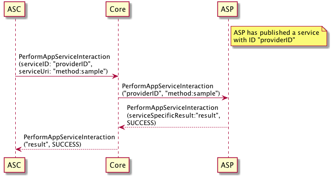

# App Service Provider Guide

## Terms and Abbreviations

|Abbreviation|Meaning|
|:-----------|:------|
|ASP|App Service Provider|
|ASC|App Service Consumer|
|RPC|Remote Procedure Call|

## App Service RPCs

There are currently four RPCs related to app services which must be supported by every ASP:

### PublishAppService

**Direction:** *ASP -> Core*

This request is sent by the ASP to initially create the service. This is where the service's manifest is defined, which includes the type of data provided by the service as well as what RPCs can be handled by the service.

|||
PublishAppService

|||

### GetAppServiceData

**Direction:** *ASC -> Core -> ASP*

!!! NOTE
The ASP can receive this message _only_ when its service is active.
!!!

This request is sent to the ASP when an ASC sends this message. The ASP is expected to respond to this message with its most recent service data. 

|||
GetAppServiceData

|||

### OnAppServiceData

**Direction:** *ASP -> Core -> ASC*

!!! NOTE
The ASP is expected to send this message _only_ when its service is active.
!!!

This notification is expected to be sent by the ASP whenever there are any significant changes to its service data _or_ if its service becomes active. Core will forward this message to any ASCs that have subscribed to data for this service type.

|||
OnAppServiceData

|||

### PerformAppServiceInteraction

**Direction:** *ASC -> Core -> ASP*

!!! NOTE
This ASP can receive this message regardless of whether its service is active, since it is directed at a specific service.
!!!

This request is sent to the ASP when an ASC sends this message with the ASP's specific service ID. This indicates that the ASC wishes to perform a service-specific function on the ASP. The API for such interactions must be defined by the ASP separately. The ASP is expected to process this message and respond with `SUCCESS` or return an error response if the interaction was not successful.

|||
PerformAppServiceInteraction

|||

## RPC Passing

There are a number of existing RPCs which are allowed to be handled by the ASP based on service type:

#### MEDIA

* `ButtonPress` with the following values for `buttonName`
    * `OK`
    * `PLAY_PAUSE`
    * `SEEKLEFT`
    * `SEEKRIGHT`
    * `TUNEUP`
    * `TUNEDOWN`
    * `SHUFFLE`
    * `REPEAT`

#### WEATHER

N/A

#### NAVIGATION

* `SendLocation`
* `GetWayPoints`

### Flow

When RPC passing is performed with a request which relates to several components (such as ButtonPress), not all uses of this RPC will be intended for this service. As such, it is expected that the ASP will indicate when they are unable to process a specific instance of an RPC by responding with an `UNSUPPORTED_REQUEST` response code. This informs Core that it should pass this specific request to another component or app service that handles this RPC.

This "Waterfall" flow used by Core during RPC passing is defined as follows:

1. App1 sends an RPC request to Core
2. Core checks if there is an active service which handles this RPC's function ID (ignoring any services which have already received this message)
    * If found, go to step 3
    * If not found, go to step 4
3. Core passes the raw message to the ASP, waits for a response
    * If the request times out before receiving a response, return to step 2
    * If the ASP responds with result code `UNSUPPORTED_REQUEST` (indicating that it cannot handle some part of the request), return to step 2
    * If the ASP responds with a normal result code, go to step 5
4. Core handles the RPC normally, generates a response
5. Core sends the RPC response to App1

### Validation

When Core passes an RPC to a ASP according to its `handledRPCs` list, it performs no additional processing on the message. This means that there is no guarantee that this message is valid according to the RPC Spec. This approach is taken specifically for forward-compatibility reasons, in case the ASP supports a newer version of the RPC Spec than Core (which could include breaking changes). As a consequence, the ASP will need to perform validation on this message itself.

Validation steps for existing passthrough RPCs:

1. Validate bounds and types of existing parameters against the RPC spec
2. Verify that mandatory parameters are present 
3. For ButtonPress, verify that the `buttonName` is correctly tied to the `moduleType`

### Policies

With regards to permission handling during RPC passing:

* For RPCs which are known to Core (determined by its RPC spec version), they are checked normally against the policy table. As such, the ASP can assume in this case that the app specifically has permissions to use the this RPC in its current HMI level.
* For RPCs unknown to Core, an ASC needs to be granted specific permissions by the OEM (controlled by the `allow_unknown_rpc_passthrough` policy field) to send this message, even if it is handled by the ASP.

## Example Use Case

### Sending a POI to a Navigation Provider

Before the implementation of App Services, SDL applications could only send points of interest to the vehicle's embedded navigation by using the `SendLocation` RPC. The App Services feature was created as a generalized solution to answer the problem question: "How can my SDL application send a point of interest to the active SDL navigation application?". 

Through RPC Passing, the App Services feature allows a non-navigation SDL application (App Service Consumer) to send a `SendLocation` RPC request to SDL Core. If there is an active navigation service, SDL Core will route the request to the SDL navigation application (App Service Provider) instead of the vehicle's navigation system.

#### App Service Provider Prerequisites

1. Proper permissions must be granted to the navigation provider in SDL Core's policy table.
    
    - The application acting as the provider must have permissions to send a `PublishAppService` RPC.
    - The application's permissions must have a "NAVIGATION" object key in the "app_services" object.
    - The "NAVIGATION" object must have the functionID of `SendLocation` listed as a handled RPC.
```JSON
{ // example sdl_preloaded_pt.json entry
    ...
    "app_policies": {
        "<provider_app_id>": {
            "keep_context": false,
            "steal_focus": false,
            "priority": "NONE",
            "default_hmi": "NONE",
            "groups": [
                "Base-4", "AppServiceProvider"
            ],
            "RequestType": [],
            "RequestSubType": [],
            "app_services:": {
                "NAVIGATION": {
                    "handled_rpcs": [{"function_id": 39}]
                }
            }
        }
    }
}
```
2. The application acting as the navigation service provider must register its navigation capabilities as an app service with SDL Core via the `PublishAppService` RPC. The `AppServiceManifest` included in the request must include the function ID for `SendLocation` (39) in the `handledRPCs` array.

3. The navigation application's app service must be active. This will happen a number of different ways.

    - If there is no other active navigation service, SDL Core will make an app service active when it is published.
    - If there are multiple navigation app services, SDL Core will set an app's navigation service to active when the app is in `HMI_LEVEL::FULL`.
    - An App Service Consumer can request a specific navigation provider to become active via the `PerformAppServiceInteraction` RPC.

#### App Service Consumer Prerequisites

Proper `SendLocation` permissions must be granted to the navigation consumer in SDL Core's policy table.

```JSON
{ // example sdl_preloaded_pt.json entry
    ...
    "app_policies": {
        "<consumer_app_id>": {
            "keep_context": false,
            "steal_focus": false,
            "priority": "NONE",
            "default_hmi": "NONE",
            "groups": [
                "Base-4", "SendLocation"
            ],
            "RequestType": [],
            "RequestSubType": [],
        }
    }
}
```

#### Use Case Solution RPC Flow

- Navigation consumer application sends `SendLocation` RPC request to SDL Core.
- SDL Core checks if there is an active App Service Provider that can handle the `SendLocation` RPC.
- SDL Core sends an outgoing `SendLocation` request to the active navigation provider.
- The navigation provider handles the request, sets its navigation destination to the requested POI, and responds with a success to SDL Core.
- SDL Core receives the response and recognizes the message is part of an RPC Passing action. SDL Core passes the response to the navigation consumer that originated the `SendLocation` request.

|||
Example SendLocation RPC Passing

|||

#### Embedded Navigation Best Practice

The embedded navigation system on the IVI can be configured to be a navigation service provider. This feature is not limited to mobile applications.

It is recommended that an OEM integrates App Services with their embedded navigation system to allow for a better SDL navigation experience with 3rd party applications. 

If a 3rd party navigation app and the embedded navigation system are registered as navigation app services, SDL Core will be able to notify the different navigation solutions which system is activated by the user. This will prevent the possibility of two or more navigation solutions from giving the driver instructions at the same time. 

A navigation service provider should stop an "in-progress" trip if the provider is notified by SDL Core that their navigation service is no longer active.


