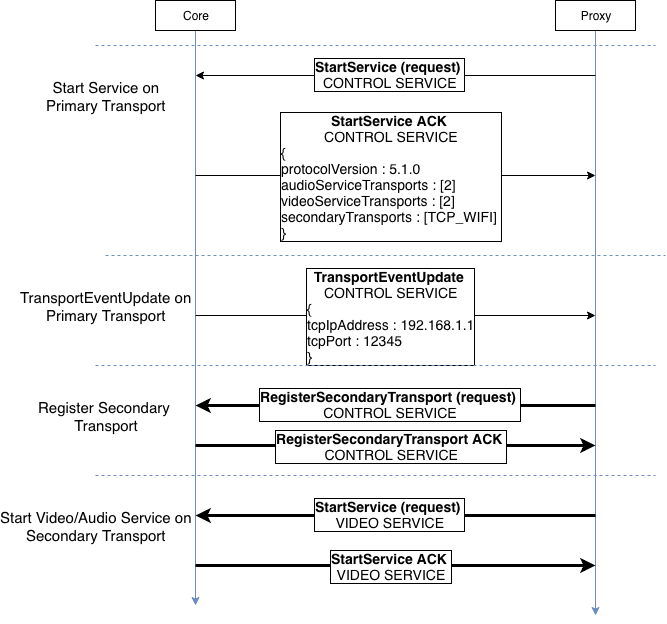

# General Description

The Multiple Transports feature allows apps connected to Core to start another connection over a different transport for certain services (for example, an app connected over bluetooth using WiFi as a secondary transport for video streaming). This guide will give an overview of the process which is used to establish a secondary transport connection. See [SDL-0141](https://github.com/smartdevicelink/sdl_evolution/blob/master/proposals/0141-multiple-transports.md) for more details on the original feature proposal.

## Implementation
- After the proxy is connected to Core, it initiates another connection over a different transport.
- Core tells the proxy which transport can be used as Secondary Transport.
- The services that are allowed on the Secondary Transport are specified by Core.

!!! Note

RPC and Hybrid services only run on the Primary transport

!!!

There are three protocol control frames which are used in the implementation of multiple transports

### StartService ACK
```
{
    "audioServiceTransports" : [1, 2],
    "videoServiceTransports" : [1, 2],
    "secondaryTransports" : ["TCP_WIFI"]
}
```

Core responds to the proxy's `StartService` request with additional parameters audioServiceTransports, videoServiceTransports and secondaryTransports.   

- The `secondaryTransports` contains an array of the allowed secondary transports for the current Primary transport. 
- `audioServiceTransports` and `videoServiceTransports` describe which services are allowed to run on which transports (Primary=1, Secondary=2, or both). The proxy uses this information and starts services only on allowed transports.
- This response is constructed by Core using the configurations defined in the SDL INI file, described in [this guide](../../getting-started/multiple-transports-configuration).
- Since RPC and Hybrid services always run on Primary transport, only Video and Audio services are configurable.

### TransportEventUpdate
```
{
    "tcpIpAddress" : "192.168.1.1",
    "tcpPort" : 12345
}
```

Core sends a TransportEventUpdate to the proxy to provide additional information required to connect over the TCP transport when it is available.

- If the `tcpIpAddress` field is empty, the secondary transport is unavailable and the proxy will not send a RegisterSecondaryTransport request 

### RegisterSecondaryTransport

Using the information in the StartService ACK and TransportEventUpdate frames, the proxy sends a RegisterSecondaryTransport request over the secondary transport with the same session ID as the Primary transport.  

- If Core sends back a RegisterSecondaryTransport ACK, the proxy can start services over the secondary transport

## Operation Examples

|||
Start Service (WiFi as secondary transport)

|||

|||
Start Video/Audio service (Over secondary transport)

|||
  
|||
Start Video/Audio service (No transport available)

|||  

|||
Backwards Compatibility (New Proxy/Old Core)

|||  

|||
Backwards Compatibility (Old Proxy/New Core)

|||  

|||
TransportEventUpdate (Secondary Transport unavailable)

|||
