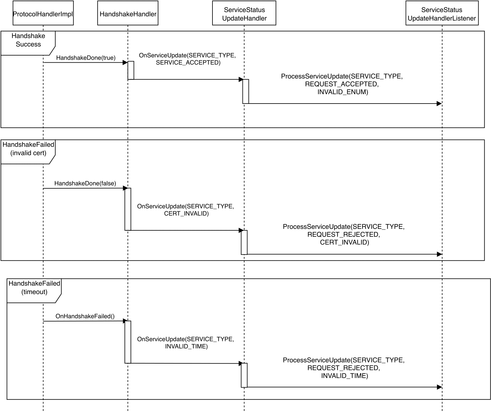
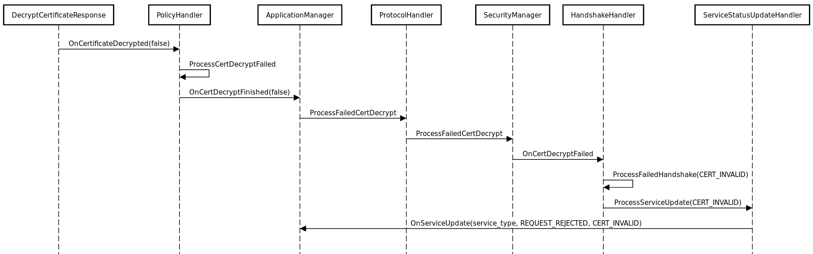
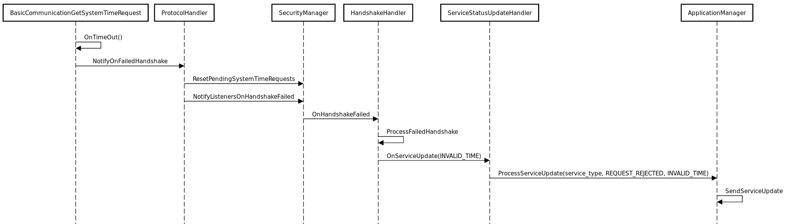
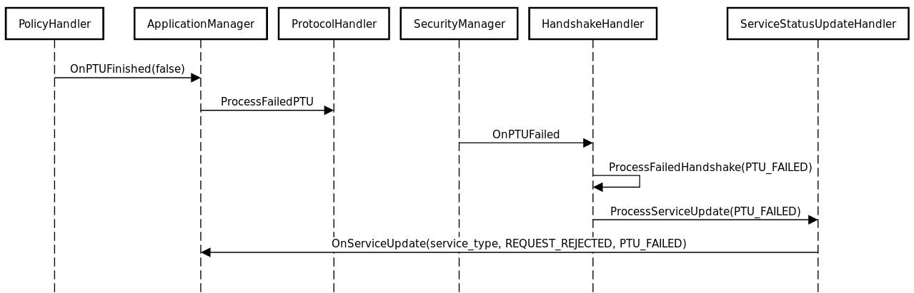
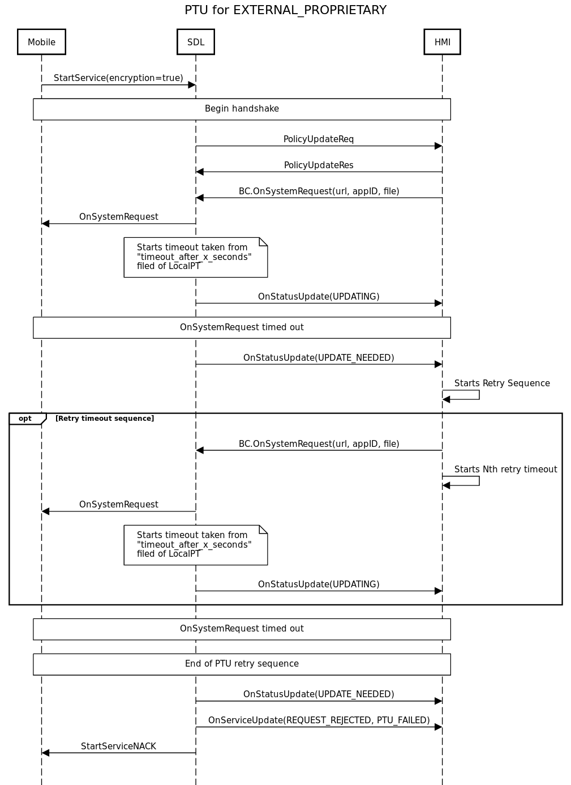

# Service Status Update

## General Description

This guide will explain how the `OnServiceUpdate` RPC is used within SDL Core. At a high level, this RPC is used by SDL Core to inform the HMI of the status of the system or what steps to take in case of an error. For example, when a mobile navigation application is activated and sends a request for the Video Service, a series of steps is taken: getting the system time, performing a policy table update, and finally decrypting and validating certificates. SDL Core sends OnServiceUpdate notifications to the HMI throughout these steps to provide feedback on the status of the system. These notifications may cause the HMI to display a popup providing feedback on the status of the system to the user, or informing the user of what steps to take in case of an error.

## Parameters

The `OnServiceUpdate` notification has three parameters:

### serviceType

This parameter is mandatory and will be a value from the `ServiceType` enum:

- VIDEO
- AUDIO
- RPC

### serviceEvent

This parameter is not mandatory and will be a value from the `ServiceEvent` enum:

- REQUEST_RECEIVED
- REQUEST_ACCEPTED
- REQUEST_REJECTED

### reason

This parameter is not mandatory and will be a member of the `ServiceStatusUpdateReason` enum:

- PTU_FAILED
    - the system was unable to get a required Policy Table Update
- INVALID_CERT
    - the security certificate was invalid or expired
- INVALID_TIME
    - the system was unable to get a valid `SystemTime` from the HMI
- PROTECTION_ENFORCED
    - the system configuration (ini file) requires a service to be protected, but the app attempted to start an unprotected service
- PROTECTION_DISABLED
    - the system started an unprotected service when the app requested a protected service

### appID

This parameter is not mandatory but will be included with each request after `RegisterAppInterface` has completed.

## Flow Diagrams

To better understand how the `OnServiceUpdate` notification is propagated within SDL Core, please take a look at the following Sequence Diagrams:

|||
OnServiceUpdate Handshake Flow

|||

|||
OnServiceUpdate Invalid Certificate

|||

|||
OnServiceUpdate GetSystemTime Failed

|||

|||
OnServiceUpdate Policy Table Update Failed

|||

|||
OnServiceUpdate Policy Table Update Failed (External Proprietary Mode)

|||