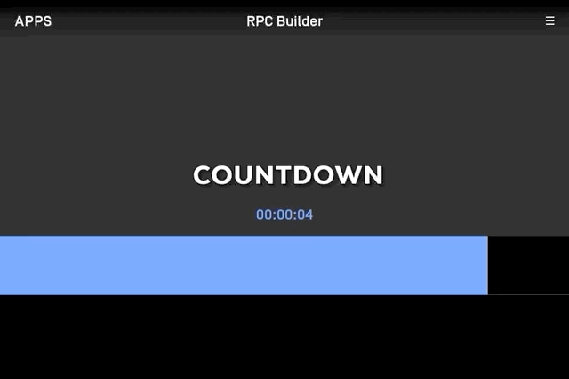
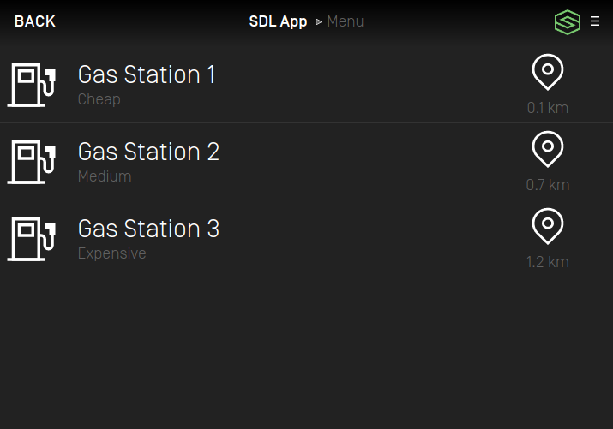
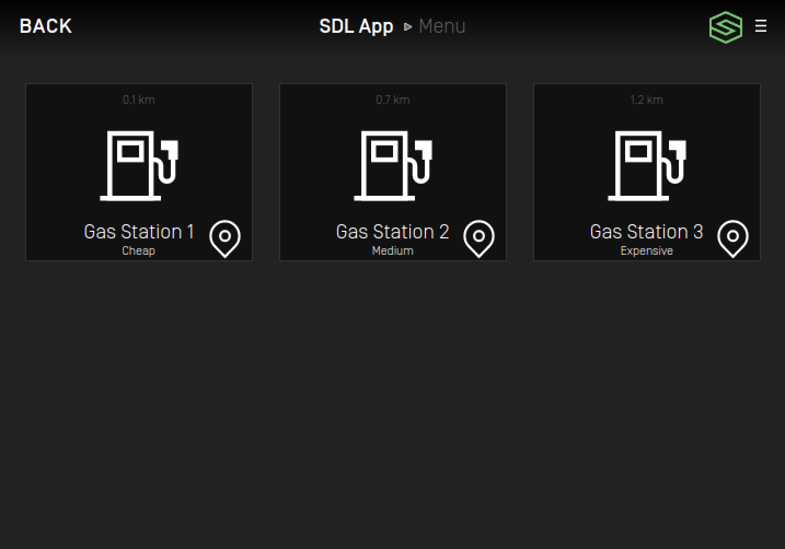
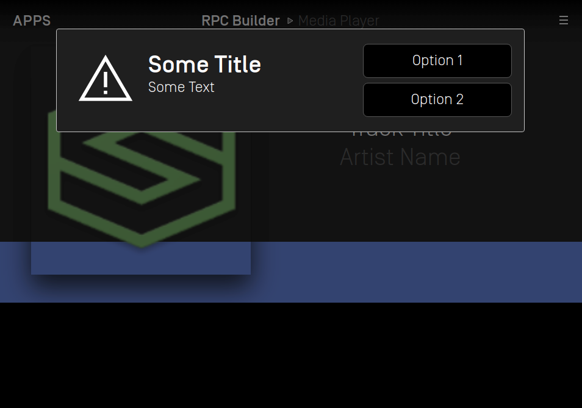
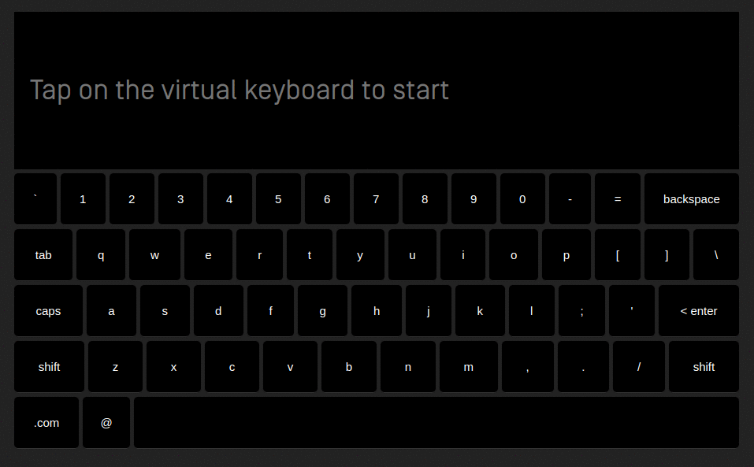

# Creating the HMI UI Component

Before starting the development of the SDL HMI user interface, there are a few RPC prerequisites that are required.

The minimum prerequisites to connect your SDL compatible user interface are:

1. Establish an HMI websocket connection to SDL Core.
2. Register the following components: BasicCommunication, Buttons, and UI.
3. Send the `BasicCommunication.OnReady` notification to SDL Core.
4. Respond to the `IsReady` request for each registered component.
5. Subscribe to the following Core notifications: 
    - `BasicCommunication.OnAppRegistered`
    - `BasicCommunication.OnAppUnregistered`
    - `BasicCommunication.OnPutFile`
    - `Buttons.OnButtonSubscription`

## Creating the App List

When there are changes to the list of registered apps, Core will send a `BasicCommunication.UpdateAppList` RPC request to the HMI. This request contains an array of information for all connected and pending applications. The HMI should use the information provided in this request to update its internal app list state and app list display.

For each app listed in the `UpdateAppList` request, the HMI's app list view should show a button that includes the app's name and icon.


If an app is disconnected or unregistered, Core will send an `UpdateAppList` request to the HMI with that application omitted from the app list array. The HMI should make sure its app list is always up to date, and only show applications that were included in the most recent `UpdateAppList` request.

## Activating an Application

### User Selection

When the user selects an application from the app list, a request should be made to bring this app to the foreground (this is called "activating" the application). The first step required by the HMI when an application is selected is to send a `SDL.ActivateApp` request to Core. When Core responds with a successful `SDL.ActivateApp` response, the HMI can switch views from the app list to the app's default template.


!!! NOTE
The default template for an app should be used if the app has not requested to use a specific template via the `UI.Show.templateConfiguration` parameter or `UI.SetDisplayLayout` RPC (deprecated).

The default template for media apps is `MEDIA`, and the default template for all other apps is `NON-MEDIA`.

You can check if a given app is a media application using that app's `isMediaApplication` parameter, sent in the `BasicCommunication.UpdateAppList` request.
!!!

### User Consent

If the `SDL.ActivateApp` response returns with the parameter `isPermissionsConsentNeeded = true`, the HMI should send a `SDL.GetListOfPermissions` request. This happens when the activating app requires permissions that the user must provide consent for. For example, if an app wants to access vehicle data, an SDL policy configuration might require the user to provide consent before the app can collect this information.

After receiving the list of permissions for the app, the HMI should show the user the `PermissionItem` name and status for each requested permission. If available, the HMI should also show a consent prompt that contains a user friendly message describing what the user is agreeing to. The user should have the ability to enable or disable each permission item. If any permission changes are made by the user, these updates should be communicated to Core via the `SDL.OnAppPermissionConsent` notification.

!!! NOTE
Permissions are managed by SDL Core's policy table. Refer to the [SDL Overview Policy Guide](https://smartdevicelink.com/en/guides/sdl-overview-guides/policies/overview/).

[OEM defined consent prompts](https://smartdevicelink.com/en/guides/sdl-overview-guides/policies/policy-fields/#consumer-friendly-messages) can be retrieved from the policy table via a `BasicCommunication.GetUserFriendlyMessage` RPC.
!!!

### Resumption

If an app is disconnected from SDL Core and reconnects within a specified time limit, Core will try to resume the app into the same HMI state the app was in before it was disconnected. The HMI should be prepared to handle a `BasicCommunication.ActivateApp` request from SDL Core, in which case the HMI should return the app into the requested state (or respond with an error if unable to). For example, if the requested HMI level is `FULL`, the HMI should activate the app and put that app's template into view.

Refer to the following resumption sequence diagram

|||
Resumption after ignition cycle

|||

!!! NOTE
`BasicCommunication.ActivateApp` is used differently than the previously described `SDL.ActivateApp`, but the two can be easily confused.

`SDL.ActivateApp` is a request originating from the HMI and should be sent when the user selects an app to activate.

`BasicCommunication.ActivateApp` is a request originating from SDL Core to move an app into a specific state. It is generally received by the HMI during app resumption.
!!!

## Displaying Information

When an app wants to display information on the head unit, the HMI will receive a `UI.Show` request. The `UI.Show` request provides the HMI with the text, soft button information, and images an app has requested to display. The HMI should store the information in these requests for when an app is activated and put into full. `UI.Show` requests are not always sent when an app is activated and in view.

The following graphic shows what should happen when the HMI receives new text field and graphic information:


!!! NOTE

The HMI should merge the information in `UI.Show` requests with existing show information received for an app. 

For example, if the HMI receives a request with the text parameter `mainfield1` and a second request with the text parameter `mainfield2`, the HMI should display both `mainfield1` and `mainfield2`.

If an app wants to clear a text field that it sent in a previous `UI.Show` request, SDL Core will send the HMI a request with that parameter's value set to an empty string ("").

!!!

### Media Layout Elements

Apps which use the `MEDIA` template have access to a few specific UI elements that are not available to non-media apps. 

The following buttons can only be subscribed to by media apps and and are generally only available in the `MEDIA` template layout:

  - `PLAY_PAUSE`
  - `SEEKLEFT`
  - `SEEKRIGHT`
  - `TUNEUP`
  - `TUNEDOWN`

!!! NOTE
Prior to RPC Spec version 5.0, the `OK` button name (which is available to all apps) was used by media apps for play/pause toggling.
With the release of version 5.0, the `PLAY_PAUSE` button name was introduced, allowing the HMI to have a separate `OK` and `PLAY_PAUSE` button for media apps.
!!!

Media apps have access to the media timer UI element via the `UI.SetMediaClockTimer` request. Similar to the `UI.Show` request, the HMI should keep track of the timer state for each app separately and display the appropriate state of the timer when the app is brought to the foreground. The HMI should react to the `UI.SetMediaClockTimer` depending on the value of the `updateMode` parameter:

  - `COUNTUP`: Begin counting up from `startTime` at the specified `countRate`, stopping at `endTime` if provided
  - `COUNTDOWN`: Begin counting down from `startTime` at the specified `countRate`, stopping at `endTime` if provided
  - `PAUSE`: Pause the existing timer at the current state, if running
  - `RESUME`: Resume the previously paused timer starting from its paused state, counting at the specified `countRate`
  - `CLEAR`: Clear the existing timer state, displaying the element as it was before the media timer was first set

The following graphic shows what should happen when the HMI receives a `UI.SetMediaClockTimer` request with each of these `updateMode` values:



## Implementing Soft Buttons

A `Softbutton` received from a `UI.Show` request should be displayed when the app is displaying a template. A template can have a max of 8 `Softbuttons`. These buttons can be of type `TEXT`, `IMAGE`, or `BOTH`.

The following graphic displays how `Softbuttons` in a `UI.Show` request can be displayed:


The HMI should keep an internal state of `SoftButtons` received by `UI.Show` requests, similar to how text fields and graphics are stored. Each `SoftButton` has a unique ID which must be saved by the HMI. These IDs are used in any messages sent to SDL Core when a user interacts with a `SoftButton`.

The actions expected of the HMI when the user selects a `SoftButton` are:

 - HMI sends a notification `UI.OnButtonEvent` with buttonEventMode = `DOWN` when the user presses a button.
 - HMI sends a notification `UI.OnButtonEvent` with buttonEventMode = `UP` when the user releases a button.
 - HMI sends a notification `UI.OnButtonPress` with buttonPressMode = `SHORT` or `LONG`, depending on how long the user holds the button in a down state.

!!! NOTE
Not all HMIs support the ability to detect a button press duration, or differentiate between an up and down button event. In this case the HMI should make sure its ButtonCapabilities are accurately sent to Core via the `ButtonCapabilities` parameter in `UI.GetCapabilities`. 

[More on HMI capabilities](#defining-the-ui-capabilities).
!!!

## Switching Templates

SDL Core can request the HMI to change an app's template using a `UI.Show` request, or the deprecated RPC `UI.SetDisplayLayout`.

The following graphic demonstrates switching templates while maintaining the same text, buttons, and graphic:


In order to specify the template to be displayed, the `UI.Show` request uses the `templateConfiguration` parameter, which includes a string for the requested layout.

For `UI.SetDisplayLayout`, the `displayLayout` string parameter is used for the same purpose.

Using `UI.Show` is the preferred method because the request can be used to change the layout of the screen and the screen contents in a single request. This helps prevent lag and screen flashing when an app wants to change an app template.

An SDL app should only request to view templates that are supported in the HMI Capabilities. The HMI may return a failed response to Core in the event an unsupported template is requested. 

[More on HMI capabilities](#defining-the-ui-capabilities).

## Supported Template Views

A reference list for all supported template views can be found [here](https://smartdevicelink.com/en/guides/sdl-overview-guides/user-interface/supported-templates/). This list shows screenshots of the 15 supported template views and how their text, graphic, and soft button components are arranged.

The defined strings for each template can be found in the [PredefinedLayout enum](https://smartdevicelink.com/en/guides/sdl-overview-guides/rpc-spec/#predefinedlayout) in the Mobile API RPC Specification. 

## Creating the App Menu

Each application is able to maintain a list of menu commands through SDL. This in-app menu should be made accessible from an app's template view. Please note the example placement of the menu icon in the top right of the screenshot below.


!!! NOTE
If the user chooses to open the menu, the HMI must send a `UI.OnSystemContext` notification with the `SystemContext` enum: `MENU`. After the user exits the menu, another `UI.OnSystemContext` notification must be sent with the `SystemContext` value: `MAIN`.
!!!

The contents of the app's menu are populated by the RPC `UI.AddCommand`. Each `UI.AddCommand` received corresponds to an individual menu item. When the user selects a menu item via the UI, the HMI should send a `UI.OnCommand` notification. It is best practice to exit the menu after a user makes a selection from the list of commands.

There are some minor customization options available for the app menu. An HMI can choose to implement the app menu in a tile view, list view, or both. If an app has a preference for a type of menu layout, the HMI will receive a `UI.SetGlobalProperties` request from SDL Core containing this preference in the `menuLayout` field.

SDL also supports nested submenus which can be created using the RPC `UI.AddSubMenu`. If this request does not contain a `parentID` parameter (or `parentID` is 0) then the submenu should be made accessible by the top level menu. If the request contains a `parentID`, the new submenu should be added as an item to the submenu who's `menuID` matches the incoming `parentID`.

Menu commands that are populated by `UI.AddCommand` with a `parentID` value should be added as a menu item to the submenu who's `menuID` matches the incoming `parentID`.

!!! NOTE
If the HMI is in a driver distraction mode, the HMI should show a maximum of "N" menu items in a given menu, as defined by the value of the `menuLength` driver distraction capability.

If the HMI is in a driver distraction mode, the HMI must restrict the user from accessing nested submenus beyond "N" levels deep, as defined by the value of the `subMenuDepth` driver distraction capability.
!!!

#### List Menu Example



#### Tiles Menu Example



### Dynamic Menu Updating

SDL enables the ability to dynamically load menu items and icons to improve system performance. In some cases an app may submit a large number of menu commands, sub menus, and icons. Processing these assets can use a large amount of system resources. To help mitigate performance issues, the HMI can choose when to request resources, at which time the app can update SDL Core with the missing menu contents.

`UI.OnUpdateFile` is used to request missing menu icons, and `UI.OnUpdateSubMenu` is used to request missing sub menu contents. These notifications can be sent to SDL Core when the user is in close proximity to the menu items. For example, if the user opens a menu that contains a list of submenus, the HMI may then request those submenus are populated via `AddCommand` requests from mobile. Additionally, if the HMI implements a paginated menu, the HMI may request all icons for the menu items that are on the next page.

The HMI is free to manage these resources and delete them in case of memory issues. If the commands or icons are needed in the future, the HMI can send the appropriate notifications to request the menu contents be updated repeatedly from the SDL application.

## Implementing Popups

There are several RPCs which are used to display a popup or an overlay to the user.

### UI.Alert

`Alert` is used to display a simple popup that can contain an image, text, and buttons.


### UI.SubtleAlert

`SubtleAlert` is used to display a notification-style popup that can contain an image, text, and buttons.



### UI.PerformInteraction

`PerformInteraction` is used to display a popup with contents which are displayed in a similar way to the app menu.


`PerformInteraction` has multiple layout types, including an on screen keyboard. SDL currently supports the following keyboard layouts: 

- QWERTY
- QWERTZ
- AZERTY
- NUMERIC

The on screen keyboard may be configured by the app to allow masking inputs and allow an app to configure special characters. These keyboard capabilities are optional and the HMI should communicate its capabilities to SDL Core via the `KeyboardCapabilities` Struct.



### UI.Slider

`Slider` is used to display a popup that allows the user to enter a value via a slider input.


### UI.ScrollableMessage

`ScrollableMessage` is used to display a popup which shows a long message to the user that requires scrolling.


!!! NOTE

It is important that the HMI sends SDL Core a `UI.OnSystemContext` notification when displaying and closing a popup. A `systemContext` value of `ALERT` is used when `UI.Alert` or `UI.SubtleAlert` is active, `HMI_OBSCURED` is used for all other popups.

!!!

## Navigating Through the IVI

It is common for an SDL UI to be integrated into an existing OEM's UI. In order for SDL Core to work well with a head unit that has other embedded components, the HMI should make use of the `BasicCommunication.OnEventChanged` notification. This notification allows connected SDL applications to receive updates about their HMI status when a user interacts with other components like the embedded navigation or radio.

For example, if an SDL media application is active and is playing audio, then the user switches the audio source to the embedded radio, the HMI should send SDL Core a `BasicCommunication.OnEventChanged` notification with `eventName = AUDIO_SOURCE` and `isActive = true`. This HMI notification will let the media application know that it no longer has control of the audio source.

If the user selects the media app as the audio source again, the HMI should send the same `BasicCommunication.OnEventChanged` notification, but with `isActive = false`. This will indicate to SDL Core that the application has regained control of the audio.

The following gif and sequence diagram demonstrate the behavior of switching between an SDL media app and the embedded IVI audio.

|||
OnEventChanged Sequence Diagram

|||

## Defining the UI Capabilities

There are several ways that the HMI should communicate its UI capabilities to SDL Core. When first connecting the HMI to SDL Core, SDL Core will send a `UI.GetCapabilities` request (a similar GetCapabilities request is sent for every interface). The HMI's response should include accurate information relating to its supported display capabilities, audio pass through capabilities, soft button capabilities, and various other system capabilities (See [UI.GetCapabilities](https://smartdevicelink.com/en/docs/hmi/master/ui/getcapabilities/#parameters_1)).

It is likely that the UI capabilities will be different for each template view, therefore it is important for the HMI to send updates about its capabilities to SDL Core. For example, if an app requests a new template configuration, after switching to that view the HMI must send an `OnSystemCapabilityUpdated` notification for `"systemCapabilityType": "DISPLAYS"`.

!!! NOTE
Even though `UI.SetDisplayLayout` is deprecated, the HMI can still receive requests to change layouts from this RPC from older applications. It is important that the response for `UI.SetDisplayLayout` includes accurate display capabilities for the new layout as well.
!!!

As an example, if SDL Core requests to change the layout to the `MEDIA` template, the `OnSystemCapabilitiesUpdated` notification parameters may look something like this (taken from the [Generic HMI](https://github.com/smartdevicelink/generic_hmi)):
```JSON
{
  "appID":"1234",
  "systemCapability":{
    "systemCapabilityType":"DISPLAYS",
    "displayCapabilities":{
      "displayName":"GENERIC_HMI",
      "windowTypeSupported":[
        {
          "type":"MAIN",
          "maximumNumberOfWindows":1
        }
      ],
      "windowCapabilities":[
        {
          "windowID":0,
          "textFields":[
            {
              "name":"mainField1",
              "characterSet":"UTF_8",
              "width":500,
              "rows":1
            },
            {
              "name":"mainField2",
              "characterSet":"UTF_8",
              "width":500,
              "rows":1
            },
            {
              "name":"mainField3",
              "characterSet":"UTF_8",
              "width":500,
              "rows":1
            },
            {
              "name":"statusBar",
              "characterSet":"UTF_8",
              "width":500,
              "rows":1
            },
            {
              "name":"mediaClock",
              "characterSet":"UTF_8",
              "width":500,
              "rows":1
            },
            {
              "name":"mediaTrack",
              "characterSet":"UTF_8",
              "width":500,
              "rows":1
            },
            {
              "name":"templateTitle",
              "characterSet":"UTF_8",
              "width":50,
              "rows":1
            },
            {
              "name":"alertText1",
              "characterSet":"UTF_8",
              "width":500,
              "rows":1
            },
            {
              "name":"alertText2",
              "characterSet":"UTF_8",
              "width":500,
              "rows":1
            },
            {
              "name":"alertText3",
              "characterSet":"UTF_8",
              "width":500,
              "rows":1
            },
            {
              "name":"subtleAlertText1",
              "characterSet":"TYPE2SET",
              "width":500,
              "rows":1
            },
            {
              "name":"subtleAlertText2",
              "characterSet":"TYPE2SET",
              "width":500,
              "rows":1
            },
            {
              "name":"subtleAlertSoftButtonText",
              "characterSet":"TYPE2SET",
              "width":50,
              "rows":1
            },
            {
              "name":"menuName",
              "characterSet":"UTF_8",
              "width":500,
              "rows":1
            },
            {
              "name":"secondaryText",
              "characterSet":"UTF_8",
              "width":500,
              "rows":1
            },
            {
              "name":"tertiaryText",
              "characterSet":"UTF_8",
              "width":500,
              "rows":1
            },
            {
              "name":"menuTitle",
              "characterSet":"UTF_8",
              "width":500,
              "rows":1
            }
          ],
          "imageFields":[
            {
              "name":"choiceImage",
              "imageTypeSupported":[
                "GRAPHIC_PNG"
              ],
              "imageResolution":{
                "resolutionWidth":40,
                "resolutionHeight":40
              }
            },
            {
              "name":"softButtonImage",
              "imageTypeSupported":[
                "GRAPHIC_PNG"
              ],
              "imageResolution":{
                "resolutionWidth":50,
                "resolutionHeight":50
              }
            },
            {
              "name":"softButtonImage",
              "imageTypeSupported":[
                "GRAPHIC_PNG"
              ],
              "imageResolution":{
                "resolutionWidth":50,
                "resolutionHeight":50
              }
            },
            {
              "name":"menuIcon",
              "imageTypeSupported":[
                "GRAPHIC_PNG"
              ],
              "imageResolution":{
                "resolutionWidth":40,
                "resolutionHeight":40
              }
            },
            {
              "name":"cmdIcon",
              "imageTypeSupported":[
                "GRAPHIC_PNG"
              ],
              "imageResolution":{
                "resolutionWidth":150,
                "resolutionHeight":150
              }
            },
            {
              "name":"appIcon",
              "imageTypeSupported":[
                "GRAPHIC_PNG"
              ],
              "imageResolution":{
                "resolutionWidth":50,
                "resolutionHeight":50
              }
            },
            {
              "name":"graphic",
              "imageTypeSupported":[
                "GRAPHIC_PNG"
              ],
              "imageResolution":{
                "resolutionWidth":360,
                "resolutionHeight":360
              }
            },
            {
              "name":"alertIcon",
              "imageTypeSupported":[
                "GRAPHIC_PNG"
              ],
              "imageResolution":{
                "resolutionWidth":225,
                "resolutionHeight":225
              }
            },
            {
              "name":"subtleAlertIcon",
              "imageTypeSupported":[
                "GRAPHIC_PNG"
              ],
              "imageResolution":{
                "resolutionWidth":40,
                "resolutionHeight":40
              }
            }
          ],
          "imageTypeSupported":[
            "DYNAMIC",
            "STATIC"
          ],
          "templatesAvailable":[
            "DEFAULT",
            "MEDIA",
            "NON-MEDIA",
            "LARGE_GRAPHIC_WITH_SOFTBUTTONS",
            "LARGE_GRAPHIC_ONLY",
            "GRAPHIC_WITH_TEXTBUTTONS",
            "TEXTBUTTONS_WITH_GRAPHIC",
            "TEXTBUTTONS_ONLY",
            "TEXT_WITH_GRAPHIC",
            "GRAPHIC_WITH_TEXT",
            "DOUBLE_GRAPHIC_WITH_SOFTBUTTONS"
          ],
          "buttonCapabilities":[
            {
              "shortPressAvailable":true,
              "longPressAvailable":false,
              "upDownAvailable":false,
              "name":"OK"
            },
            {
              "shortPressAvailable":true,
              "longPressAvailable":false,
              "upDownAvailable":false,
              "name":"PLAY_PAUSE"
            },
            {
              "shortPressAvailable":true,
              "longPressAvailable":false,
              "upDownAvailable":false,
              "name":"SEEKLEFT"
            },
            {
              "shortPressAvailable":true,
              "longPressAvailable":false,
              "upDownAvailable":false,
              "name":"SEEKRIGHT"
            }
          ],
          "softButtonsCapabilities":[
            {
              "shortPressAvailable":true,
              "longPressAvailable":false,
              "upDownAvailable":false,
              "imageSupported":true,
              "textSupported":true
            },
            {
              "shortPressAvailable":true,
              "longPressAvailable":false,
              "upDownAvailable":false,
              "imageSupported":true,
              "textSupported":true
            }
          ],
          "menuLayoutsAvailable":[
            "LIST",
            "TILES"
          ],
          "keyboardCapabilities": {
            "maskInputCharactersSupported": true,
            "supportedKeyboardLayouts": [
              "QWERTY","QWERTZ","AZERTY","NUMERIC"
            ],
            "configurableKeys": [
              {
                "keyboardLayout": "QWERTY",
                "numConfigurableKeys": 10
              },
              {
                "keyboardLayout": "QWERTZ",
                "numConfigurableKeys": 10
              },
              {
                "keyboardLayout": "AZERTY",
                "numConfigurableKeys": 10
              },
              {
                "keyboardLayout": "NUMERIC",
                "numConfigurableKeys": 0
              }
            ]
          }
        }
      ]
    }
  }
}
```
