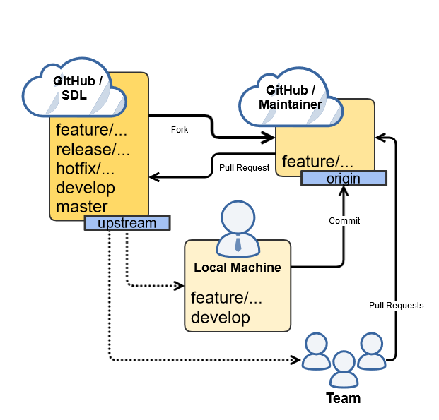

# **SDL Contribution**
SDL development is based on two principles: 
- [A successful Git branching model][GitFlowModel]
- ["Fork & Pull" model][ForkAndPull]

## **Scope**
In SDL we support followng types of branches: 
- Feature
- Hotfix
- Release

**Feature branches** 
Naming convention: *feature/...* 
These branches are used to implemented requests which are changing requirements of the SDL.

**Hotfix branches** 
Naming convention: *hotfix/...* 
Hotfix branches are used to incorporate severe defect fixes which brake crutial requirements.

**Release branches** 
Naming convention: *release/...* 
Upon *Stakeholders* requests [CCB][CCB-LINK] creates release branch which contain certain set of incorporated features.
Afterwards this release branch is used in [SDL Release][SDL-REL-LINK] process.

## **Contribution process**
As long as SDL support fork and pull model, all *Maintainers* should also stick to the same practice. Following picture shows how *Maintainers* can align local repositories with requested model. 
 

Following is usual scenario for SDL contribution process:
1. Get implementation request from *Stakeholders* or [CCB][CCB-LINK] with list of requirements, technical tasks or defects which have to be released
2. Consult [CCB][CCB-LINK] for branch and CI configurations
3. Fork respective SDL repository
4. Commit your changes to forked repository
5. Sync forked repository with upstream repository
6. Send pull request to respective branch in upstream repository
7. Send request for review to [CCB][CCB-LINK], specifying pull request number
8. Provide feedback and make necessary changes basing on review comments

Approved pull request will be merged into respective branch and eventualy into develop branch by [CCB][CCB-LINK] member.

## **Usefull links**
[Fork & Pull model][ForkAndPull] 
[Change Control Board][CCB-LINK] 
[SDL Release][SDL-REL-LINK] 
[Collaborating with issues and pull requests][GH-COL-LINK] 

[ForkAndPull]: https://help.github.com/articles/fork-a-repo/ "Fork & Pull model"
[CCB-LINK]: ChangeControlBoard.md "Change Control Board"
[SDL-REL-LINK]: SDLRelease.md "SDL Release"
[GH-COL-LINK]: https://help.github.com/categories/collaborating-with-issues-and-pull-requests/ "Collaborating with issues and pull requests"
