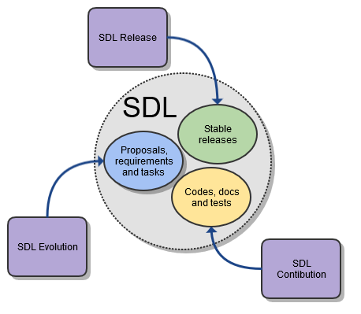

# **SDL Development Lifecycle**

You are welcome to participate in the evolution of SDL.
Because of high quality expectation of SDL community, every contribution has to pass certain processing before it becomes an SDL evolutionary step.

To make introduction of new ideas into SDL transparent and manageable, we outline in this document major stages of development lifecycle.

We would like to emphasize that every contribution has to conform to agreed upon [definition of done (DoD)][DOD-LINK].

## **Scope**

SDL is a large product with multiple repositories.
Some of them contains source codes for features and tests others mainly dedicated to documentation and some R&D experiments.
The ones which do not strictly dedicated to documentation or R&D form set of product parts like SDL Core, ATF, ATF Scripts, HMI etc.
Later in documentation those repositories are mentioned in generic manner: "product parts".

## **Lifecycle processes**

SDL lifecycle is based on three major processes:
- SDL Evolution
- SDL Contribution
- SDL Release

Each one of them might be executed in parallel.  
Next picture emphasize processes and their impact on SDL.  

## **Roles**

SDL lifecycle considers interactions of following groups:

- Stakeholders (primary responsible role SDL Project Manager)
- [Change Control Board (CCB)][CCB-LINK] (primary responsible role CCB Group Manager)
- Maintainers (primary responsible role is **Task Assignee**)
- Community (primary responsible role for propsal review is **Proposal Author**)

### Stakeholders

Primary owners of SDL.
Group responsbilities:
1. Assign responcible for proposal processing
2. Assign responsible for tasks realisation (*Maintainers*)
3. Approve potential contributors
4. Define priorities/business value of approved proposals
5. Delegate, by need, responcibility 1. and/or 2. to [CCB][CCB-LINK]

### Change Control Board

CCB is group of technical specialists gathered and approved by Stakeholders.
Their primary respocibility is to control state of the product.
Detailed description on group duties available in [here][CCB-LINK].

### Maintainers

Approved by Stakeholders potential contributors.
Their primary responsibility is providing delivery according SDL Contribution or SDL Release process.
For each task contributor must be assigned by Stakeholder or CCB.
Relations between Stakeholders and MAintainers are not part of this description.

### Community

Consumers of new SDL releases.
Generators of ideas and proposals for improvement in SDL project.
People which delivery most of the innovations in SDL through SDL Evolution process.

## **Processes**

This chapter alines important, for product quality, activities in a production chain.
All processes are built around GitHub and therefore presented as set of GitHub issues and wiki pages.

### SDL Evolution

Change managemenet is important part of production chain. 
*Community* should propose improvements in the scope of [SDL Evolution Process][SDL-EP-LINK]. 
Other groups which are involved in this process: *Stakeholders* and *[CCB][CCB-LINK]*. 
Usually Stakeholders define responcible for proposal processing, and [CCB][CCB-LINK] helps in clarifcation of specifications and impact. 
For proposals which recieved status **Accepted** after [review][SDL-EP-LINK] respective *proposal statement of work* will be deliniated. 
Statemenet of work for proposal includes set of GitHub issues created in repositories of affected parts of product. 
In the confines of OpenSDL lifecycle generic GitHub issues recieve certain meaning like: 
- Requirements
- Tasks
- Defects

Outcome: 
- Issue in [SDL Evolution repository][SDL-EP-LINK] for approved proposal (mandatory for accepted proposals only)
- Set of issues in respective repositories of product parts with requirements (mandatory for accepted proposals only)
- Set of issues in respective repositories of product parts with technical tasks (mandatory for accepted proposals only)
- Set of issues in respective repositories of product parts with defects (optional)

### SDL Contribution

### SDL Release

## **Artifacts**

#### Requirements
These issues are high level description of expected outcome.
More or less they answer first basic question: **What has to be done?**.
They form basis of acceptance criteria for future contribution.
Requirements issue can be created by Stakeholders or CCB and have specific namings and template.
Maximum two level of requirements are allowed.

**How to create requirement issue**
1. Select naming (title). 
Title tempalte: *R\<number\>:\<summary\>* 
2. Writing of the description. 
Description template: 
> **Priority** 
> Severity: *\<High|Medium|Low\>* 
> Business value: *\<0..100\>*
> 
> **Description** 
> *\<Hihg level description of what is required to be done and acceptance criteria or link to the document in repository.\>*
3. Establish links. 
Following links have to be established: 
- To related proposal issue (should be only one)
- To parent requirement issue (only one, if applicable)

#### Technical tasks
These issues are high level description of technical task.
Basically they should answer second basic question: **How requirements have to be implemented?**.
They form basis of acceptance criteria for future contribution.
TEcnical tasks issue can be created by Stakeholders or CCB and have specific namings and template.
Maximum two level of technical tasks are allowed.

**How to create technical issue**
1. Select naming (title). 
Title tempalte: *T\<number\>:\<summary\>* 
2. Writing of the description. 
Description template: 
> **Priority** 
> Severity: *\<High|Medium|Low\>* 
> Business value: *\<0..100\>*
> 
> **Description** 
> *\<Hihg level description of how requirements have to be implemented.\>*
> Parts of [DOD-LINK] expected to be delievered:
- [] Source code updates
- [] Code comments
- [] UTs add/update
- [] Integration tests add/update
- [] SDD updates
- [] SAD updates
Other guidelines updates
- [] Guideline 1
- [] Guideline 2
- [] Guideline 3
...

3. Establish links. 
Following links have to be established: 
- To related requirement issues (one or many)
- To parent technical task issue (only one, if applicable)

#### Defects

[SDL-EP-LINK]: https://github.com/smartdevicelink/sdl_evolution/blob/master/process.md "SDL Evolution"
[DOD-LINK]: DefinitionOfDone.md "Definition Of Done"
[CCB-LINK]: ChangeControlBoard.md "Change Control Board"
