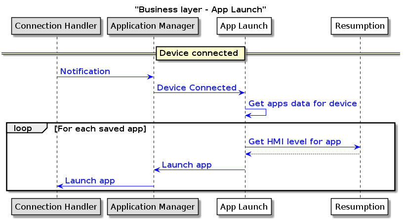
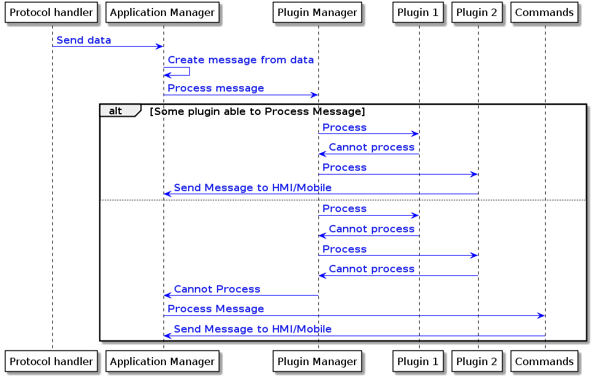

## 4.3. Component Interaction View

According to layer architectural approach (see chapter 6.1), Component Interaction View could be split to Transport, Protocol and Business layer diagrams.

### 4.3.1. Transport layer

**Behavior**:
	All device notifications are transferred through the Transport Adapter, accumulated by Transport Manger and provided for the upper levels with an unique device and connection identifier.

|||
### Transport layer notification and data transferring diagram 

|||

### 4.3.2. Protocol layer
**Behavior**:
Protocol layer is responsible for transferring Transport and Protocol events to the Business layer.

|||
### Protocol Layer - transport notifications processing diagram

|||

|||
### Protocol Layer - data transferring diagram

|||

### 4.3.3. Business layer
**Behavior**:
	Business layer is responsible for processing all income and outcome RPC data and media data streaming.

|||
### Business layer - media data transferring diagram

|||

|||
### Business layer - RPC processing diagram

|||

|||
### Business layer - App Launch

|||

|||
### Business layer - Plugin Manager 

|||
