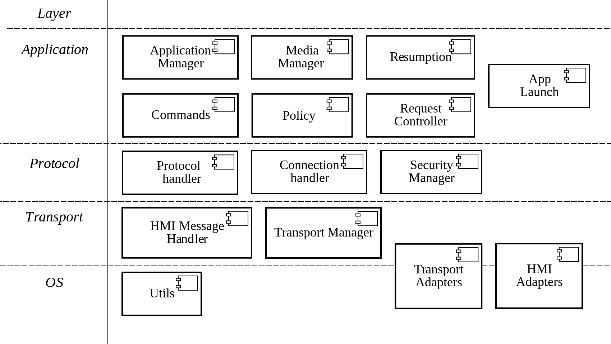

## 4.7. Development View

### 4.7.1. Implementation Technologies

- C++98 language is selected as a programming language for SmartDeviceLink as a OS and CPU architecture independent.
- [*CMake*](https://cmake.org/documentation/) tool-chain selected as a cross-platform building tools.
- [Google Test](https://github.com/google/googletest/blob/master/googletest/docs/Documentation.md) with [Google Mock](https://github.com/google/googletest/blob/master/googlemock/docs/Documentation.md) extension is chosen as an opensource C++ test framework.

### 4.7.2. Modules and Code Base Organization

Development view organizes SmartDeviceLink components into logical and abstract groups called layers. The layers describe the major tasks that the components perform. The layers have different responsibilities and different providers

##### Development View Diagram

***Elements description***

#### OS Layer
  - *Responsibility*
    - Providing high-level interface for OS and hardware resource manipulation.
  - *Relations:*
    - Used by all other layers 
  - *Interfaces:*
    - Provides threads, timers, synchronization, data, time, file and logging interfaces  
  - *Behavior:*
    - Wrapping all OS-system-specific API to C++ Objects.
  - *Constraints:*
    - N/A 
 
#### Transport Layer
  - *Responsibility*
    - Encapsulates mobile and HMI transports usage 
  - *Relations:*
    - Protocol layer 
  - *Interfaces:*
    - TransportManager
    - HMIMessageHandler 
  - *Behavior:*
    - Opens connection
    - Performs device discovery
    - Sends / receives messages 
  - *Constraints:*
    - [Transport Manager Programming guide](../../Transport Manager Programming/index.md)
 
#### Protocol Layer
  - *Responsibility:*
    - Encapsulates protocol manipulation. 
  - *Relations:*
    - Application layer
    - Transport layer 
  - *Interfaces:*
    - ProtocolHandler
    - ConnectionHandler 
    - SecurityManager 
  - *Behavior:*
    - Parses and handles messages from transport layer according to Protocol 
    - Notify upper level about new transport and protocol layer events
    - Provides Transport Layer manipulation by upper layers 
  - *Constraints:*
    - [SmartDeviceLink Protocol specification](https://github.com/smartdevicelink/protocol_spec/blob/master/README.md)
 
#### Application Layer
  - *Responsibility:*
    - Represents main business logic implementation 
  - *Relations:*
    - Protocol Layer 
  - *Interfaces:*
    - ApplicationManager
    - MediaManager
    - Command
    - RequestController
    - Resumption
    - Policy
   - *Behavior:*
     - Main business logic functionality. 
  - *Constraints:*
    - [FORD Mobile API Spec](https://github.com/smartdevicelink/sdl_core/blob/master/src/components/interfaces/MOBILE_API.xml)
    - [FORD HMI API Spec](https://github.com/smartdevicelink/sdl_core/blob/master/src/components/interfaces/HMI_API.xml)

### 4.7.3. Development Environment and Standards
-   Development and testing environment for Ubuntu 14.04 LTS x32/x64
    -   Debug Environment: Ubuntu 14.04 LTS x32/x64, Qt 5.3
    -   Compiler: GCC 4.9.3 (OS Ubuntu), Lua 5.2
    -   Build system: Cmake 2.8.12.2
-   Development and testing environment for SDL Windows x64:
    -   Build system: Windows 7 x64, CMake
    -   Compiler: Microsoft Visual Studio Express Edition 2013 x64
-   Development and testing environment for SDL Qt for Windows x32:
    -   Build system: Windows 7 x32, Qt 5.5, CMake, QT Creator
    -   Compiler: Microsoft Visual Studio Express Edition 2010 x32 
-   Requirements Management system: LuxProject (JIRA, Confluence)
-   Source Control System: GitHub
-   Issue Tracking System: LuxProject (JIRA)
-   Document Management System: LuxProject (JIRA, Confluence, SVN)
-   Coding style: [*Google C++ Style Guide*](https://google.github.io/styleguide/cppguide.html)
