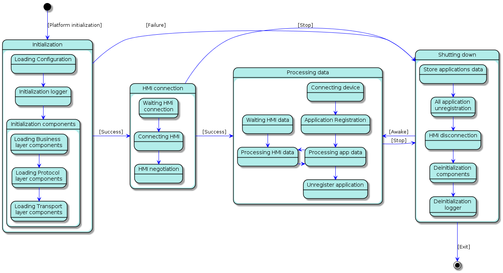

## 4.6. Process State View

The process State view shows the global SmartDeviceLink states according to system life cycle.

|||
##### Life cycle states diagram

|||

***Elements description***

#### Initialization
  - *Behaviour:*
    - SDL creates and initializes component according to configuration file. 
  - *Relations:*
    - If all SDL subsystems successfully started, SDL starts waiting HMI and mobile connections.
    - If failed, SmartDeviceLink is ***shutting down***. 

#### HMI connection
  - *Behaviour:*
    - SDL waits for an HMI connection. 
  - *Relations:*
    - If HMI successfully connected, SDL starts ***processing*** all mobile ***data***.
    - On receiving stop signal SmartDeviceLink is ***shutting down***.
 
#### Processing data
  - *Behaviour:*
    - SDL handles HMI and mobile data and proceed according to business requirements. 
  - *Relations:*
    - SDL starts shutdown procedure on getting stop signal from HMI or OS.

#### Shutting down
  - *Behaviour:*
    - SDL stores all resumption data, unregisters all mobile applications,  disconnects from HMI and denitializes all components.
  - *Relations:*
    - Finish SDL life cycle,
    - Continue processing data on getting Awake command from HMI. 
