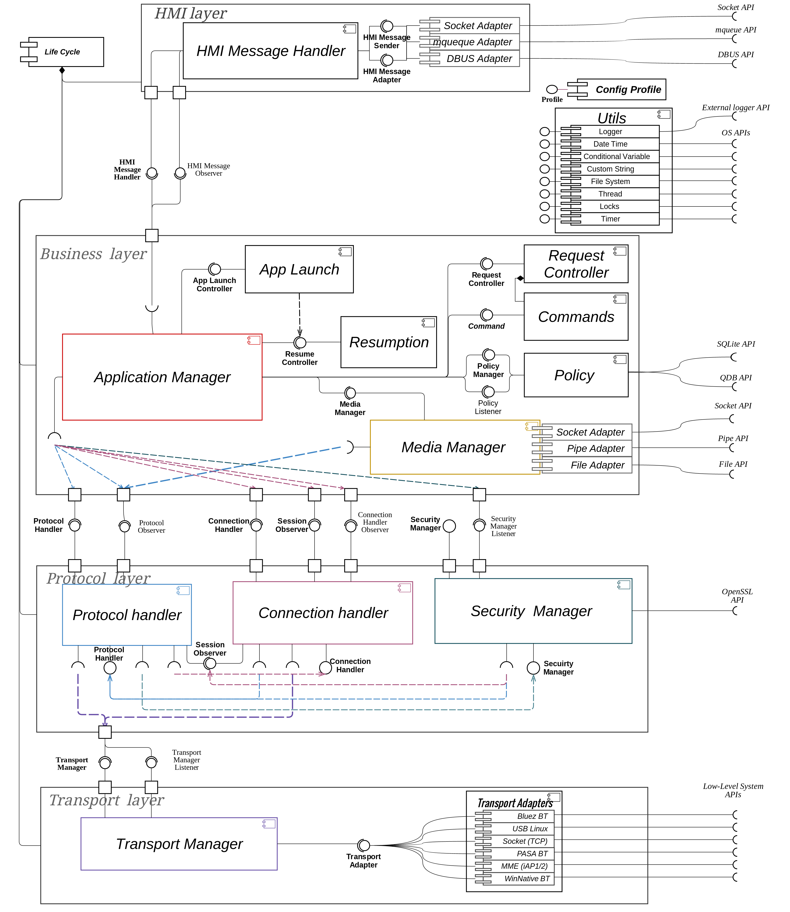

### 7.  References

1. SmartDeviceLink Protocol specification - [*https://github.com/smartdevicelink/protocol\_spec/blob/master/README.md*](https://github.com/smartdevicelink/protocol_spec/blob/master/README.md)
2. Cmake documentation - <https://cmake.org/documentation/>
3. Google Test documentation - <https://github.com/google/googletest/blob/master/googletest/docs/Documentation.md>
4. Google Mock documentation - <https://github.com/google/googletest/blob/master/googlemock/docs/Documentation.md>
5. Google C++ Style Guide - <https://google.github.io/styleguide/cppguide.html> 

### 8.  List of Figures

|||
### Overview Use Case Diagram

|||
|||
### Disconnect Use Case diagram

|||
|||
### Connection Use Case diagram

|||
|||
### Service data transferring Use Case diagram

|||
|||
### Encryption Use Case diagram

|||
|||
### Data verification Use Case diagram

|||
|||
### RPC Use Case diagram

|||
|||
### Mobile to HMI RPC processing Use Case diagram

|||
|||
### HMI to Mobile RPC processing Use Case diagram

|||
|||
### Resumption Use Case diagram

|||
|||
### Application data resumption Use Case diagram

|||
|||
### HMI level resumption Use Case diagram

|||
|||
### Solution overview

|||
|||
#### Component View diagram

|||
|||
### Transport layer notification and data transferring diagram 

|||
|||
### Protocol Layer - transport notifications processing diagram

|||
|||
### Protocol Layer - data transferring diagram

|||
|||
### Business layer - media data transferring diagram

|||
|||
### Business layer - RPC processing diagram

|||
|||
#### Data flow diagram

|||
|||
#### Life cycle states diagram

|||
|||
#### Development View Diagram

|||
|||
#### Deployment View Diagram

|||

### 9.  Appendices

None
