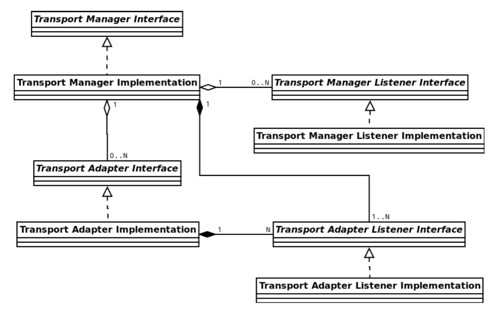
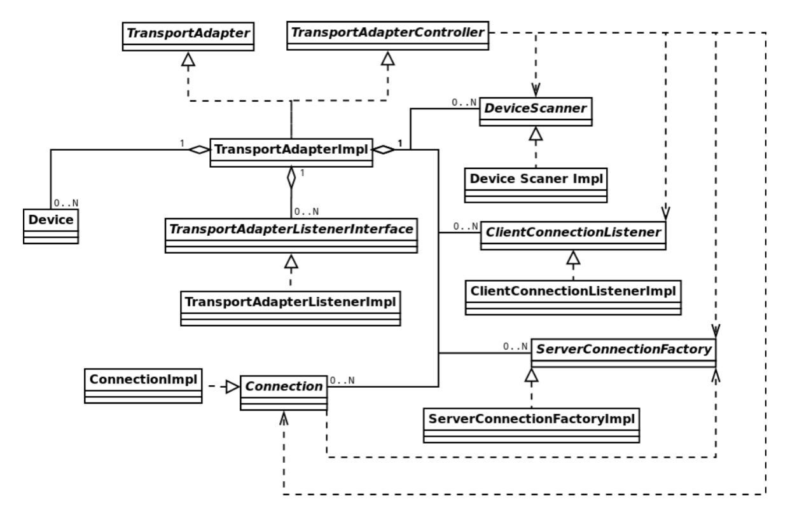
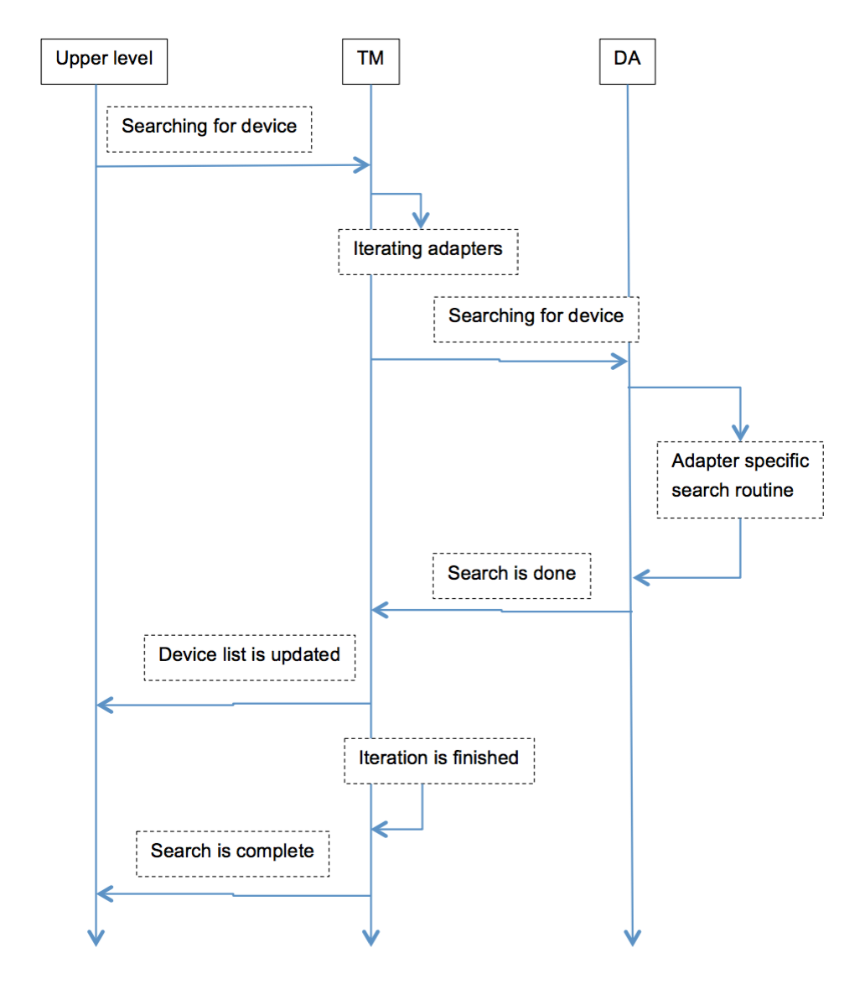
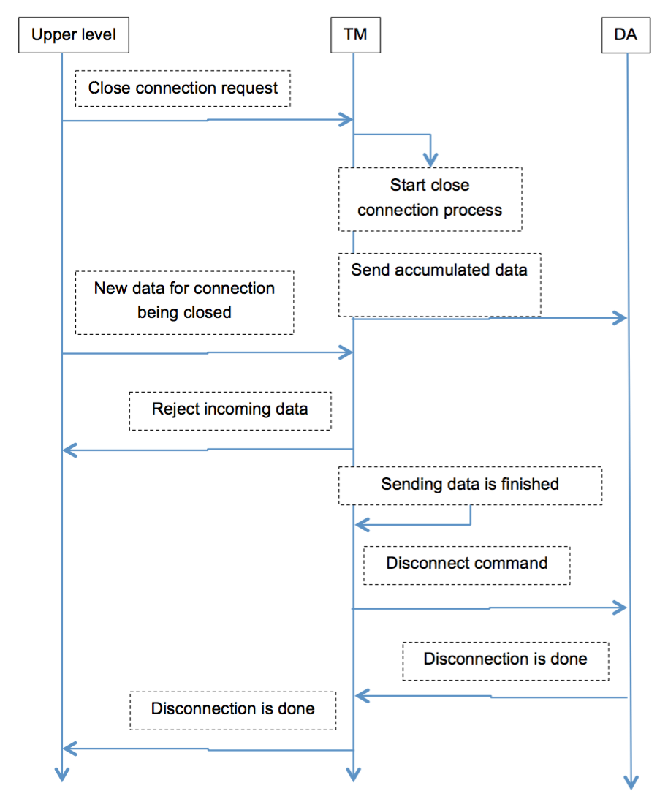

# General Description

As a developer implementing SDL Core into a vehicle, you may need to create new transport adapters to support custom transport implementations and libraries for Bluetooth, USB, etc. connectivity. This guide will walk you through how to create those implementations.

## Terms and Abbreviations

ID
: Identifier

SDL
: SmartDeviceLink

TA
: Transport Adapter

TCP
: Transmission Control Protocol

TM
: Transport Manager

UID
: Unique Identifier

## Transport Layer Features

!!! Note

"Connection Establishing" with the application or device:

  * Means that the transport layer creates a physical connection for sending and receiving "handshake" data
  * Does not mean that this application or device shall be marked as "connected" for the user
  * May be a one time connection with which data related to the device is cleared after disconnection
  * May be a persistent connection with which information about the device is stored in a powered off state

"Connection Closing":

  * Means that connection is not terminated until final 'goodbye' data transmission has completed
  * Physical disconnection happens when there is no more data left for transmission

!!!

## Transport Level Structure

Figure 1 demonstrates the structure of the Transport Level

!!! note

  * The transport manager has no limitations on the number of transports
  * Each transport has no limitation on the number of devices
  * Any device may be connected through any number of transports. In this case each connection established between the application on a device and the transport manager has a unique identifier

!!!

|||
Figure 1

|||

### Transport Manager Structure

Figure 2 represents the structure of the Transport Manager

|||
Figure 2

|||

### Transport Adapter Structure

Figure 3 represents the structure of a Transport Adapter

|||
Figure 3

|||

## Operation Examples

|||
New Device Search

|||

|||
New Device Connection

|||

|||
Connection Close Command

|||

# Transport Manager Usage

## General Processing Description

### TM Initialization

  * Every time SDL starts working it calls the creation and initialization of the TM
  * The TM uses a singleton pattern and the instance of the TM is created and initialized while being retrieved. The pointer to the TM is provided to the developer.
  * If TM is initialized once it must not be initialized again.
  * The developer may initialize the customized TM by calling the appropriate ‘init()’ function:
    * If the customized TM is based on default implementation, ‘init()’ must NOT be called twice for one and the same TM
    * If the customized TM is created from scratch, it is up to developer to choose the initialization mechanism.
  * During the initialization process TM creates two threads:
    * For processing the message queue of commands from the upper level
    * For processing the events coming from devices.
  * Also TM creates and initializes all available Transport Adapters (the default and/or customized ones).
  * If appropriately configured TM may load the information about previous state and perform necessary actions (e.g. reconnect the last connected application).
  * TM becomes initialized:
    * When its internal threads are created and are ready for working (i.e. the ‘init()’ function is serial and if it returns the control, the initialization has completed successfully and TM is ready for working).
    * And it does not watch whether the Transport Adapter(s) has initialized by this time:
      * If any of TAs failed to initialize, this is informed into the log file. TM answers with erroneous messages to the requests related to such TA.
      * If there are NO TAs (either not initialized or not defined), TM answers with the error messages to all of the requests.

### TM Structure

  * TM Core: it is a TransportManagerImpl class. It contains the processing mechanisms (e.g., for procedures of sending/receiving the data, for connecting/disconnecting procedures, etc.).It does not have the embedded default Adapters and Listeners. And it would not work apart of the Wrapper.
  * TM Wrapper: it is implemented in TransportManagerDefault class. It adds the default Transport Adapter(s) and Listener to the Core completing the fully-featured functionality.

### TA Initialization

  * The default Adapters are created and initialized by the default TM Wrapper.
  * The customized Adapters should be initialized by the developer himself:
    * TM is initialized first
    * Then the init() function for the custom Adapter is called
    * Then the initialized custom TA and the Listener are added to the initialized TM.
  * Transport adapter in its turn creates and initializes all available workers.
    * ‘Search Device’ worker creates a separate thread and waits for the ‘Start’ command.
    * ‘Client Listener’ creates a separate thread and waits for connections from devices.
    * ‘Server Connection’ worker executes all actions on caller’s thread (does not create a thread).

### Getting Started

  * When the initialization is complete, TM starts waiting for:
    * The user`s command
    * The device connection.
    * Resumption from “last state” singleton (if such resumption is specified via profile)
  * When one of the above happens, TA:
    * Creates a separate thread for each connection with device’ application(s)
    * Notifies TM on connection created.
  * When the connection is established, the Upper Level:
    * May start a handshake routine with the application and then notify the user about the application is connected.
    * May close the connection by sending an appropriate command to TM if the application or device is unwanted.

### Errors in TM

  * ‘Immediate’ error:
    * When TM is not able to execute any command it will immediately return the appropriate error code. For example: when connect(app_id) is called and TM is not initialized yet this type of error occurs.
  * ‘Postponed’ error:
    * TM is able to execute a command and there is some error occurred in downstream.
    * The component, where the error has occurred, sends the appropriate information to TM.
    * Then TM provides a notification to the Upper Level.

### Messages in TM

  * TM is ready to send and receive data after the connection is opened
  * Sending messages:
    * Each message destined for the device is posted into the message queue.
    * The message is removed from the queue after it is successfully sent to the device.
    * The message(s) is returned to the caller if for some reason TM is not able to send it (e.g., unexpected device disconnection),
  * Receiving messages:
    * TM redirects messages from the Transport Adapter to the Upper Level via notification mechanism.

### Connection Identifiers

  * TM uses the pair “Device ID” and “Application ID” for accessing the application on a device and internally for connection establishing.
  * Device ID:
    * Stands for global unique identifier based on MAC address for network adapters and MAC address like for BT.
    * In the default implementation Device ID is logically split into two parts:
      * Internal device ID – that is a MAC address string
      * External device ID – that is an integer value.
    * When the new MAC address is found, the integer value is assigned to it correspondingly (starting from 1 and incremented with every new assignment).
    * For persistent connection
      * When the device is marked as “known”, the correspondence of internal and external IDs is stored (even after power off) until the user explicitly asks to “forget about <this> device”.
      * When the user requests to ‘forget’ the known device, the MAC address may be assigned with the new integer value on being connected for the next time.
    * For one-time connection this correspondence is not saved in long term storage. And if connected later the same MAC address may get the new integer value in correspondence.
    * It is not defined what happens if two devices with the same MAC address would connect.
  * Application ID: is the application unique identifier. It is the incremental integer value assigned and used internally in TM.
  * Connection ID:
    * Connection is represented with a unique pair of “Device ID” and “Application ID”.
    * Connection ID is a system wide unique identifier (incremented integer value) assigned to each new connection.
    * This ID is used for sending/receiving data and for closing the connection.
    * There are no certain rules to define how exactly this ID is assigned.


### Connection Closing

  * When TM receives ‘close connection’ or ‘disconnect’ commands it tries to finish sending accumulated messages and then closes the connection.
  * If connection is lost TM will drain all accumulated messages and confirm connection closure.

### SDL Shutting Down

  * When SDL is going to shutdown, TM clears all objects which it has created (e.g. default transport adapters).
  * Objects created by developer (e.g. developer’s transport adapter or listener) are not removed by TM. The developer must take care of destructing his customized objects by himself.

## Default TM Instance

For creating the instance of the TM with the default configuration it is necessary to use the following code

```
#include "transport_manager.h"
#include "transport_manager_default.h"
{
    TransportManager *transport_manager = TransportManagerDefault::instance();
}
```

Initialization of TM may take some time due to thread creation. After the initilization is complete, the Transport Manager is ready to be used. Any commands sent before the transport manager is ready will be rejected with error code `NOT_INITIALIZED` in the return value.  The TM uses the singelton pattern, thus only one instance of a TM can exist at any one time. This rule can be changed in a custom TM implementation if necessary.

## Adding Custom Listeners to the TM

  1. A listener allows monitoring events that take place in the TM
  2. The number of Listeners is not limited and can be zero
  3. The listeners are provided to the TM and are used by any module that needs to receive notifications from the TM
  4. The list of Listeners is stored by the TM
  5. The TM does not create any Listeners by default
  6. A custom Listener should be related with the implementation of the module that uses the listener and should implement the Transport Manager Listener Interface

```
#include "transport_manager.h"
#include "transport_manager_default.h"

class MyTransportManagerListenerImpl: public TransportManagerListener
{
    // Implement interface
}
{
    TransportManager *tm_impl = TransportManagerDefault::instance();
    TransportManagerListener *my_tm_listener = new MyTransportManagerListenerImpl();
    tm_impl->addEventListener(my_tm_listener)
}
```

## Adding Custom Transport Adapters to the Default TM

!!! note

About Transport Adapters in general:

  * TM may contain zero to N Transport Adapters (a TM with 0 TAs does not do anything)
  * Each adapter corresponds to a specific type of transport (Bluetooth, USB, TCP, etc.)
  * TA implements transport specific search, connect, disconnect, and data transfer routines

!!!

!!! note

Several instances of TA:

  * Several TAs of the same type can exist in the TM
  * The results of using several instances of the default TAs is not defined
  * It is the developer's responsibility to create a custom Adapter that operates well under these conditions

!!!

!!! note

Custom TA

The simplest way to add a custom TA is to derive it from the existing implementation of the TCP or BT adapter and add it to the TM

!!!

```
#include "transport_manager.h"
#include "transport_manager_default.h"

{
    // The default implementation of TCP adapter is used in this example
    // The developer is free to create their own implementation
    TransportAdapter *my_transport_adapter = static_cast<TransportAdapter*>(new TcpTransportAdapter);
    my_transport_adapter->init(); // note: TA must be initialized before getting an instance of TM
    TransportManager *tm_impl = TransportManagerDefault::instance(); // note: When custom TA is added to the TM, the default listener will be assigned to it automatically
    tm_impl->addTransportAdapter(my_transport_adapter)
}

```

### Initialization

By default, the TA is initialized during TM initialization. If the TA needs to be added to a TM which has already been initialized, the TA should be initialized before it is added the TM

!!! note

The TM has a TCP adapter by default. Adding the new instance of the same Adapter may result in unexpected behavior. The developer must change the standard behavior of the TCP adapter to elinatate any potential problems.

!!!

### Custom Transport Adapter Implementations

If the default implementation of TAs is not suitable, you can create a transport adapter from scratch.

  * Create a custom class that implements the transport adapter interface. The custom TA should use the defined interface TransportAdapterListener for notifying the Transport Manager
  * The instance of TA listener will be set by the TM automatically when a custom TA is added. If the custom TA does not store its listener then the adapter will not be able to notify the TM about events such as OnDataReceiveDone or OnConnectDone

```
#include "transport_adapter.h"

class MyTransportAdapterImpl : public TransportAdapter
{
    // Implement all interface functions here
    // use TransportAdapterListener interface to notify TM about events
}
```

The following code should be added where the TM is initialized

```
#include "transport_manager.h"
#include "my_transport_adapter_impl.h"

{
    TransportAdapter *my_transport_adapter = static_cast<MyTransportAdapterImpl *>(new MyTransportAdapterImpl);
    my_transport_adapter->init();
    transportManager *tm_impl = TransportManagerDefault::instance();
    tm_impl->addTransportAdapter(my_transport_adapter);

}

```

All internal logic is up to the developer. The developer is responsible for implementing:

  * Communication with the device
  * Notification of state changes
  * Error handling

## Adding a New Listener to the transport Adapter

  1. A listener allows monitoring the events that take place in the TA
  2. The number of TA listeners is not limited
  3. The list of Listeners that are called on any event that occurs in a TA is stored in the TA
  4. A custom TA listener:
    * The developer can add the Listener to the TA through the customization procedure only. The developer needs to create his own TA on the base of the default one, and then add the Listener to it.
    * should implement the Transport Manager Listener Interface

!!! note

Working with the TA Listener by-passing the TM is dangerous and may lead to asynchronous behavior that is undefined. The custom Listener should be added only together with the new custom Adapter and/or custom TM

!!!

Set up a Listener as follows

```

#include "transport_manager.h"
#include "transport_manager_default.h"

class MyTransportAdapterListener : public TransportAdapterListenerImpl
{
    // customize listener
}

...

{
    // The default implementation of TCP adapter and the default implementation of adapter listener are used in this example
    // Developer is free to create his own implementation from scratch
    TransportAdapter *my_transport_adapter = static_cast<TransportAdapter*>(new TcpTransportAdapter);
    my_transport_adapter->init();
    TransportManager *tm_impl = TransportManagerDefault::instance();
    TransportAdapterListener *my_ta_listener = new MyTransportAdapterListener(tm_impl);
    my_transport_adapter->addListener(my_ta_listener);
    tm_impl->addTransportAdapter(my_transport_adapter);
}

```

## Creating a TM with custom TAs only

If for some reason the default adapters are not a good fit they can be completely replaced with developer defined adapters. To do this the developer

  1. Must implement the TA logic
  2. Provide the new TA to the TM

```

#include "transport_manager.h"
#include "transport_manager_impl.h"

class MyTransportManager : public TransportManagerImpl {
    virtual int init();
    virtual ~MyTransportManager();

    MyTransportAdapter *my_adapter_;
    explicit MyTransportManager(const TransportManagerAttr &config) : TransportManagerImpl(config), my_adapter_ (nullptr) {
    }

public:
    static MyTransportManager *instance();

};

// note: the implementation of all methods above are not defined here to make the code look simpler

{
    TransportManager *tm_impl = MyTransportManagerImpl::instance();
}

```

## Transport Manager Customization

  1. Basic Information
    * TM is responsible for all complex logic and decisions, while TA is a primitive entity that operates only with transport sepcifics
    * Communication interface between TM and TA
      * TM sends a command to TA
      * If TA is unable to execute this command it returns the proper error code
      * Otherwise, TA starts executing the command. The TA notifies the TM by using the appropriate callback function
  2. Two queues are used as a fundamental of the TM
    * Message Queue for commands coming from the upper level
    * Event Queue for events coming from devices
  3. Customizing the TM, the Developer
    * Should implement transport manager interface
    * Should use the transport adapter interface and the transport listener interface for making the implementation work with the default adapters and listeners
    * Has two options:
      * Creating the TM from scratch
      * Deriving from the default implementation
        * If not particularly changed, the default Adapters and Listeners will be used.

## Transport Adapter Customizing

  1. Basic information
    * TA is highly adaptable to any specific of a real transport
    * TA consists of
      * Worker Classes that perform a single operation (e.g., device search)
      * Controller that
        * Accumulates event handling from all worker classes
        * Controls the state of all internal data and
        * Notifies the upper level via callbacks
      * Internal data structures that contain the information about the device, the connection and other necessary information
  2. Workers of TA
    * Device Scanner:
      * Implements transporet dependent search procedure initiated by the appropriate command from the Transport Manager
      * It is the developer's responsibility to implement this worker
      * It may be absent for transport types that do not support searching.
      * When the device is found the worker:
        * Creates a notification and directs this notification to the Controller
        * The Controller notifies TM using the TA Listener
        * TM receives the notification and sends a command to TA for connecting all available applications
        * TM and TA perform a chain of notifications
        * TM notifies the upper level using TM Listener with the information on each application connected; the connection ID, the application name, the device name
    * Client Connection Listener:
      * Implements the transport dependent connection that was originated by the device
      * It is the developer's responsbility to implement this worker
      * If the transport does not support such ability the worker may be absent
      * Working procedure:
        * The worker waits for the connection of a mobile device
        * When the connection request from any of the mobile devices arrives, TA establishes a connection (creates the data path) with this device and the connectoin listener sends a notification through the controller to the upper level with the device and application IDS
    * Server Connection Factory
      * Implements transport dependent connection that was originated by the user
      * It is the developer's responbility to implement this worker
      * If the transport does not support this ability, the worker may be absent
      * Creates a connection with the device and the application specified by the user
        * Both the device and the application must already be known to the TA at this moment
        * TA may know about the device after the 'search' routine or after the 'restore previous state' routine
        * If device is not known the Transport Adapter returns the error immediately
      * When the connection is created the TA sends a notifications through the controller to the upper level
  * Connection
    * The main responsibility of the client and server connection works is to create a Connection
    * Connection is the entity that is responsible for data transmitting between Core and the device
    * Works and Connection are closely related
    * Customing the connection
      * Custom implementation of Connection must be used in custom worker(s) only
      * It is not possible to use other types of data exchange in default workers
      * It is possible to use the default Connection implementation in custom workers
    * The default Connection implementation is based on sockets isolated in a separate thread
    * Each transport specific worker shall use transport dependent initialization of the threaded socket connection
    * If the default implementation is not convenient the developer can create his own Connection
      * In this case custom workers shall also be created
  * The Descriptor is used for manipulating devices and connections inside of the adapter

#### Custom Transport Adapter creation

Create a class that is derived from `TransportAdapterImpl` and add the implementation of necessary virtual methods.

```
#include "transport_adapter_impl.h"
class MyTransportAdapter : public TransportAdapterImpl
{
protected:
    virtual DeviceType getDeviceType() const;
}

```

Create a connection class deriving `ThreadedSocketConnection` and implement virtual methods

```
#include "transport_adapter_impl.h"

class MySocketConnection : public ThreadedSocketConnection
{
    virtual ~MySocketConnection();
protected:
    virtual bool establish(ConnectError **error);
}

```

Create a class for the device that will be used by Controller to manage devices and implement all virtual methods

```
#include "transport_adapter_impl.h"

class Mydevice : public Device
{
    virtual ~Device();
    virtual bool isSameAs(const Device *other_device) const;
    virtual ApplicationList getApplicationList() const;
}

```

Create the necessary worker classes by deriving the appropriate basic worker and fill in the necessary functionality

```
#include "transport_adapter_impl.h"
class MyDeviceScanner : public DeviceScanner
{

}
class MyServerConnectionFactory : public ServerConnectionFactory
{

}
class MyClientListener : public ClientConnectionListener
{

}

```

These workers should use Connection and Device which were created in previous steps. For instance, scanner should add a list of devices to controller. This list will be used later when the `connect` request is received. To create a data path the connection class should be used. When the connection starts it will update Controller with the pointer to this connection.

When everything is created it is time to combine everything.

```
#include "transport_adapter_impl.h"

MyTransportAdapter::MyTransportAdapter() : Transport AdapterImpl(
    new MyDeviceScanner(),
    new MyServerConnectionFactory(),
    new MyClientListener()
)
{
}
```

Create an instance of the new adapter and provide it to the Transport Manager

```
#include "transport_manager.h"
#include "transport_manager_impl.h"
#include "my_transport_adapter_impl.h"
{
    TransportAdapter *my_transport_adapter = static_cast<TransportAdapter *>(new MyTransportAdapter);
    TransportManager *tm_impl = TransportManagerDefault::instance();
    tm_impl->addTransportAdapter(my_transport_adapter);
}
```

This adapter will use the default connection implementation and default Adapter Listener but three worker classes will implement developer's logic. Also, the Transport Adapter will provide device type in the developer's own way.  `TransportAdapterImpl` virtual (but not pure) methods `Store()` and `Restore()` can be reimplemented to provide resumption mechanism. Default implementations for both methods do nothing.